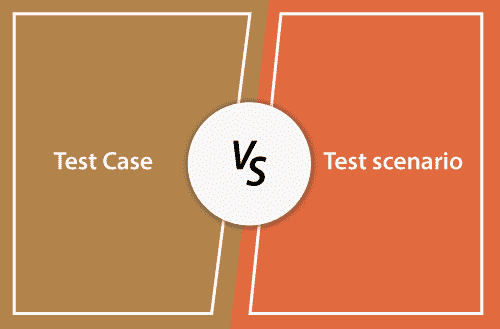

# 测试用例与测试场景

> 原文：<https://www.javatpoint.com/test-case-vs-test-scenarios>

在本节中，我们将讨论**测试用例和测试场景**之间的区别，因为我们知道**测试用例和测试场景**都是测试文档的一部分。

作为测试工程师，我们必须知道这两个测试术语，因为它们在[软件测试生命周期的](https://www.javatpoint.com/software-testing-life-cycle) **测试设计和测试执行**阶段起着重要作用。

但是在我们看到**测试用例和测试场景**的区别之前，首先，**我们将了解测试用例和测试场景的定义。**

## 什么是测试用例？

[测试用例](https://www.javatpoint.com/test-case)是一个详细文档，包括**所有可能的输入**，如**正和负**，以及**导航步骤。**这些在测试过程中实现，以检查软件应用是否正在执行它被开发的任务。

## 什么是测试场景？

它是一个测试用例的详细文档，在 liner 语句中涵盖了软件应用的**端到端功能**。[测试场景](https://www.javatpoint.com/test-scenario)是可测试需求的高级分类。在执行测试场景之前，测试工程师需要考虑每个场景的测试用例。

## 测试用例和测试场景的区别

在下表中，我们列出了**测试用例和测试场景的一些重要区别:**

| S.NO | 判例案件 | 测试场景 |
| 1. | 测试用例是一个详细的文档，它提供了关于**测试策略、测试过程、前提条件和预期输出**的信息。 | 测试场景是从**用例**中派生出来的，并且给**关于测试什么的单行信息**。 |
| 2. | 它包括所有的**正负输入、导航步骤、预期结果、前后条件等**。 | 测试场景是一行语句，但它与几个测试用例相联系。 |
| 3. | 这些都是**低级动作**。 | 这些都是**高层动作**。 |
| 4. | 编写测试用例的主要目的是通过实现步骤来验证测试场景。 | 编写测试场景的主要目标是**覆盖软件应用的端到端功能**。 |
| 5. | 与测试场景相比，**需要更多的时间**。 | 与测试用例相比，**花费的时间更少**。 |
| 6. | 测试用例很难维护。 | 测试场景由于其高层次的设计使得**易于维护**。 |
| 7. | 测试用例将有助于我们对应用的深入测试。 | 测试场景将帮助我们以敏捷的方式测试整个功能。 |
| 8. | 测试用例是在**“如何被测试”**的基础上工作。 | 测试场景是对**“要测试什么”**的基础工作。 |
| 9. | 为了编写测试，我们需要额外的资源来创建和执行测试用例。 | 与测试用例相比，更少的资源足以编写测试场景。 |
| 10. | 在一个测试案例中，**我们主要关注文档细节**。 | 在测试场景中，**我们将重点思考和讨论细节**。 |
| 11. | 可以从**测试场景**中获取。 | 可以从**用例**中获取。 |
| 12. | 如果测试工程师越位工作，那么测试用例的创建就很重要。 | 如果测试人员特别擅长敏捷方法，那么创建测试场景可以在时间敏感的情况下帮助我们。 |
| 13. | 编写测试用例是一次性的尝试，可以在将来的回归测试中使用。 | 测试场景是一个节省时间的过程；这就是为什么它被新一代软件测试社区所偏爱。 |

## 结论

在这一节中，我们已经理解了**测试用例和测试场景的本质区别和无能。**

同时使用**测试用例和测试场景**确保了**的健壮性和高覆盖率测试创造力。**

如果我们先编写**测试场景**，然后再编写**测试用例**，这是最好的练习，因为大多数 It 公司更喜欢当今敏捷时代的测试场景。在敏捷时代，为了节省时间，测试用例被测试场景所取代。

* * *