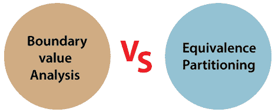

# 边界值分析和等价划分的区别

> 原文：<https://www.javatpoint.com/boundary-value-analysis-vs-equivalence-partitioning>

在本节中，我们将讨论**边界值分析**和**等价划分**之间的一些重要区别。

我们已经知道和 **[等价划分技术](https://www.javatpoint.com/equivalence-partitioning-technique-in-black-box-testing)** 都是黑盒测试中**测试用例设计技术**的一部分。

但是在我们看到**边界值分析**和**等价划分的区别之前，**首先，**我们将简单地理解这两个术语。**

## 什么是边界值分析？

是**黑盒测试**广泛使用的测试用例设计技术之一。在这种情况下，我们将测试边界值，因为边界附近的输入值出错的几率更高。它适用于测试过程的所有级别。

每当我们执行边界值分析技术时，测试工程师都专注于输入边界值，不管软件是否产生正确的输出。

## 什么是等价划分？

另一个[测试用例](https://www.javatpoint.com/test-case)设计技术是等价划分，它是从软件的需求和规范中派生出来的。为了覆盖最大的需求，等价划分使用最少的测试用例。

在这种情况下，**测试用例**应该被设计为至少覆盖每个分区一次。每个相等分区的每个值必须显示与另一个相同的行为。

## 边界值分析与等价划分

在下表中，我们列出了

边界值分析和等价划分:

| 没有 | 边界值分析 | 等价划分 |
| 1. | 这是一种技术，我们通过识别输入数据边界的错误来发现输入中心的错误。 | 这是一种将输入数据划分为有效和无效值的技术。 |
| 2. | 边界值是包含变量上限和下限的值。 | 在这种情况下，软件或应用程序的输入被分成预期显示类似行为的组。 |
| 3. | 边界值分析是测试分区之间的边界。 | 它允许我们将一组测试条件划分为一个应该被认为相同的分区。 |
| 4. | 由于从无限到有限的测试用例数量较少，这将有助于减少测试时间。 | 等价划分将把测试用例的数量减少到覆盖最大可能性的可测试测试用例的有限列表。 |
| 5. | 边界值分析通常被称为压力和阴性测试的一部分。 | 等价划分可以适用于所有软件测试级别，如单元、集成、系统。 |
| 6. | 有时，边界值分析也称为范围检查。 | 等价划分也称为等价类划分。 |

## 结论

在看到**边界值分析**和**等价划分**之间的所有主要差异之后，我们必须得出结论，边界值分析是比等价划分更好的方法。

假设在比较等价划分和边界值分析时重复测试值。在这种情况下，我们可以忽略等价划分，只执行边界值分析，因为它覆盖了所有的值。

因此，**边界值分析**被证明是在**等价划分**技术之后保证质量的一个好选择。

* * *