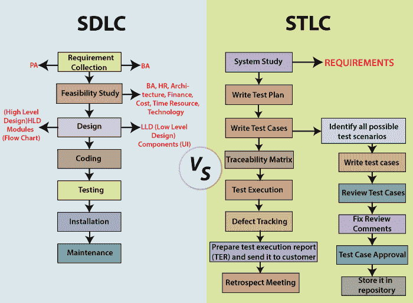

# SDLC 与 STLC

> 原文：<https://www.javatpoint.com/sdlc-vs-stlc>

在本节中，我们将讨论 **SDLC 和 STLC** 之间的区别，因为我们知道两者都是软件测试不可分割的一部分。

但是在看到 **SDLC 和 STLC** 的区别之前，我们先简单了解一下 **SDLC 和 STLC** 。

## 什么是 SDLC？

[软件开发生命周期【SDLC】](https://www.javatpoint.com/software-development-life-cycle)是对整个软件开发过程中执行的单个活动的分类。

SDLC 包括不同的阶段，每个阶段都有几个活动，帮助开发团队设计、创建和交付高质量的产品。

## 什么是 STLC？

[软件测试生命周期【STLC】](https://www.javatpoint.com/software-testing-life-cycle)是在整个[软件测试](https://www.javatpoint.com/software-testing-tutorial)过程中执行的不同活动的顺序。测试本身有许多称为 STLC 的阶段，每个活动都是为了提高软件产品的质量而进行的。

## SDLC 和 STLC 的区别

在下表中，我们列出了**软件开发生命周期**和**软件测试生命周期**之间的一些重要区别:

| S.NO | 比较基础 | SDLC | stcc！stcc |
| **1。** | **说明** | 它主要与软件开发相关，这意味着它是开发软件应用的过程。 | 它主要与软件测试相联系，这意味着它是一个包含测试过程各个阶段的软件测试过程。 |
| **2。** | **表示** | SDLC 代表 ***软件开发生命周期*** 。 | STLC 代表 ***软件测试生命周期*** 。 |
| **3。** | **资源** | 在执行 SDLC 过程时，我们需要更多的开发人员来完成开发过程。 | STLC 过程需要更少的测试人员来完成测试过程。 |
| **4。** | **聚焦** | 除了开发阶段，其他阶段如测试也包括在内。 | STLC 只专注于测试软件。 |
| **5。** | **目标** | **软件开发生命周期**的目标是成功完成软件的开发。 | **软件测试生命周期**的目标是成功完成软件的测试。 |
| **6。** | **帮助在** | SDLC 将帮助我们开发出高质量的软件产品。 | STLC 将有助于创建无缺陷的软件。 |
| **7。** | **不同相位** | **软件开发生命周期**中包含的各个阶段如下:

*   Demand collection
*   feasibility study
*   design
*   Programming or coding
*   test
*   fix
*   maintain

 | **软件测试生命周期**中包含的各个阶段如下:

*   Demand collection or systematic research
*   Test plan
*   Write test cases.
*   Traceability matrix
*   Defect tracking
*   Test execution report
*   Review meeting

 |
| **8。** | **需求收集阶段** | 在 SDLC 需求收集阶段，**BA【业务分析师】和 PA【产品分析师】**将收集需求并将业务语言解释为软件语言。 | 在 STLC 的需求分析阶段，**QA【质量保证】**
**团队**将研究需求文档并准备系统测试计划。 |
| **9。** | **设计阶段** | 基于需求理解，开发团队将开发软件的 **HLD【高层设计】和 LLD【低层设计】**。 | 通常，在 STLC 中，**测试架构师或测试主管**计划测试策略。
也找到了检测点。 |
| **10。** | **编码阶段** | 在 SDLC 编码阶段，开发人员将开始按照设计的文档编写代码，并开始构建软件。 | 在 STLC 中，质量保证团队编写测试场景来验证产品的质量。 |
| **11 时。** | **环境设置** | 编写完代码后，开发团队用开发的产品建立一个测试环境来验证代码。 | 基于先决条件，测试团队确认环境设置。并做一轮烟雾测试，确保产品环境稳定，准备测试。 |
| **12 时。** | **测试阶段** | 一旦设置好环境，测试工程师将执行各种类型的测试，如单元、集成、系统、**重新测试**、回归测试等等。
开发团队也参与了修复错误并向测试人员报告。 | 基于测试用例，测试人员将进行一轮集成和系统测试。
在执行测试时，如果他们遇到任何 bug，将在重新测试后报告并修复。 |
| **13。** | **部署/产品发布阶段** | 在 SDLC 部署阶段，当我们收到各种测试团队的签核时，应用被部署或安装在生产环境中，供真正的最终用户使用。 | 在 STLC 中，产品一部署，就在生产环境中执行冒烟和**健全性测试**。
测试团队将准备测试报告和矩阵来分析产品。 |
| **14。** | **维护阶段** | 一旦产品被部署，开发团队就包括支持和发布更新。 | 为了检查部署的维护代码，质量保证团队执行回归套件。 |
| **15。** | **已执行** | SDLC 阶段在 STLC 阶段之前完成。 | STLC 阶段在 SDLC 阶段之后完成。 |

## 结论

**SDLC 和 STLC** 为软件的**开发**和**测试**提供了一个结构。

一般测试工程师可能会觉得**软件开发生命周期**只适合开发人员。尽管如此，在理解了**开发和测试生命周期**的完整过程之后，我们可以说两个生命周期是相互依赖的，并且是时间对时间并行执行的。

因此，即使是测试工程师，如果他们理解带有 **STLC** 的 **SDLC 阶段**，也是有益的。

* * *