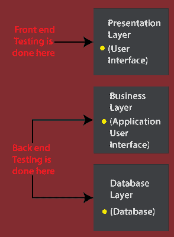

# 前端测试与后端测试

> 原文：<https://www.javatpoint.com/frontend-testing-vs-backend-testing>

在本节中，我们将看到**前端测试**和**后端测试**之间的区别。**前端和后端**大多是计算机行业使用的技术团队。

一般基于 web 的应用是**三层架构**应用。**第一层**是**表示层**称为**前端**，**第三层**是**数据库层**称为**后端**。

## 什么是前端测试？

这是一种[软件测试](https://www.javatpoint.com/software-testing-tutorial)类型，用于评估网络应用中**三层架构**的**表示层**。

在 web 应用中，前端测试将包括对多个组件的分析，例如:

*   **菜单**
*   **图表**
*   **表格**
*   **报表及相关 JavaScript。**

单词**前端测试**用于涵盖多种测试方法。

为了执行**前端测试**，测试工程师需要对业务需求有很好的了解。它既可以手动执行，也可以借助一些自动化工具来执行。

从根本上说，它是在 **UI(用户界面)**上执行的，在**三层架构**中也被称为**表示层**。

## 什么是后端测试？

软件测试的另一部分是**后端测试**，用于测试 web 应用中**三层架构**的**应用和数据库层**。

本质上，为了执行后端测试，我们不需要任何**图形用户界面**，因为它是在 **AUI(应用用户界面)**和数据库上实现的。

这就是为什么我们可以在浏览器的帮助和特定功能所需的参数下直接传递数据。并以几乎预定义的格式检索响应，如 [XML](https://www.javatpoint.com/xml-tutorial) 或 [JSON](https://www.javatpoint.com/json-tutorial) 。

我们也可以直接连接数据库，借助 [SQL](https://www.javatpoint.com/sql-tutorial) 命令验证数据。

为了测试后端和应用层，我们可以进行**后端测试。**

看完前端和后端测试的简要介绍，我们就明白它们之间的对比了。

## 前端测试和后端测试的区别

在下表中，我们列出了**前端和后端**测试之间的一些重要区别。

| S.NO | 前端测试 | 后端测试 |
| 1. | 它在 3 层架构的表示层上执行。 | 它在 3 层体系结构的应用和数据库层上执行。 |
| 2. | 它总是在图形用户界面上执行。 | 它总是在应用用户界面(AUI)上实现。 |
| 3. | 在执行前端测试时，我们不需要在数据库中存储任何信息。 | 在执行后端测试时，我们需要将数据存储在数据库中。 |
| 4. | 为了执行前端测试，理解需求是必要的。 | 对数据库的理解对于执行后端测试至关重要。 |
| 5. | 它将分析应用的整体功能。 | 它将分析死锁、数据损坏或数据丢失。 |
| 6. | 在基于图形用户界面的前端测试中，资源集中在云计算中实现。 | 在基于 AUI 的后端测试中，资源在网格计算的协作模式下执行。 |
| 7. | 了解自动化框架工具，如 QTP，Selenium是强制性的执行前端测试。 | 关于 SQL(结构化查询语言)语言概念的知识对于实现后端测试是必需的。 |
| 8. | 前端测试包括对应用的验证，并检查应用的性能是否按照要求工作。 | 后端测试执行确保数据继续，因为没有性能损失。 |
| 9. | 系统测试和验收测试、单元测试、可访问性测试和回归测试在前端测试下执行。 | 数据库测试(API测试和 SQL 测试)在后端测试下执行。 |
| 10. | 就像其他类型的测试一样，前端测试也包含一些工具，如下所示:

*   开发工具
*   因果报应
*   咕哝

 | 为了执行后端测试，我们在市场上有一些工具，如下所示:

*   [DTM data generator]
*   [Turbine data]
*   Data factory

 |

## 结论

在本教程中，我们对**前端和后端测试**进行了区分。我们可以得出结论，这两种测试在软件测试中都起着重要的作用。

前端测试包含 [HTML](https://www.javatpoint.com/html-tutorial) 、 [JS](https://www.javatpoint.com/javascript-tutorial) 、 [CSS](https://www.javatpoint.com/css-tutorial) 和图片，而后端测试包含业务逻辑测试和数据库测试。

前端和后端测试有不同的活动，由在生产线两端工作的开发人员实施。

最后，我们可以说前端指的是**浏览器**和**后端**，服务器，或者最近的云。

* * *