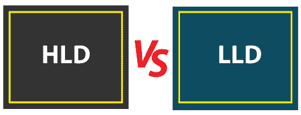

# 高脂血症和低脂血症的区别

> 原文：<https://www.javatpoint.com/hld-vs-lld>

本节我们将讨论 **HLD 和**LLD 的区别；并看他们之间的简介。

## 什么是 HLD？

HLD 代表**高级设计，**设计师只关注各种模型，比如:

*   **决策表**
*   **决策树**
*   **流程图**
*   **流程图**
*   **数据字典**

解决方案架构师开发高级设计，用于指定应用程序的完整描述或体系结构。

HLD 涉及**系统架构、数据库设计、系统、服务、平台的简要描述以及模块间的关系**。

HLD 也称为**宏观层面或系统设计**。它将业务或客户需求转变为**高级解决方案**。

高级设计是在低级设计之前创建的。

## 什么是 LLD？

**LLD** 代表**低层次设计，**设计师将专注于像**用户界面(UI)** 这样的组件。

低级设计由**开发经理和设计师**创建。

也称为**微观层面或细节设计**。LLD 可以将**高级解决方案**变为**详细解决方案**。

低级设计详述了所有模块的详细描述，这意味着 LLD 涉及所有系统组件的实际逻辑。它深入到每个模块的规范中。

低级设计是在高级设计之后创建的。

## 高密度与低密度

在下表中，我们讨论了高级设计和低级设计之间的一些重要比较。

| 没有 | 比较基础 | 肝豆状核变性 | 法学博士 |
| **1。** | **代表** | 它代表高级设计。 | 它代表低级设计。 |
| **2。** | **定义** | 它是一般的系统设计，也就是说它代表了整个系统的设计。 | 这就像描述高级设计，这意味着它表示组件级设计的过程。 |
| **3。** | **目的** | HLD 陈述了每个组件的简洁功能。 | LLD 陈述了组件的特定有效逻辑。 |
| **4。** | **又称** | HLD 也被称为系统或宏观设计。 | LLD 也叫细节或微层次设计。 |
| **5。** | **由**开发 | 解决方案架构师准备高级设计。 | 设计师和开发人员准备低级设计。 |
| **6。** | **设计阶段的顺序** | 它首先按顺序开发，这意味着 HLD 是在 LLD 之前创建的。 | 它是在高级设计之后开发的。 |
| **7。** | **目标受众** | 它由管理、计划和解决方案团队使用。 | 它被设计者、操作团队和实现者使用。 |
| **8。** | **转换** | HLD 将客户端或业务需求转变为高级解决方案。 | LLD 将高级解决方案更改为综合解决方案。 |
| **9。** | **可能输出** | 高级设计对于理解跨多个系统对象的流程是必要的。 | 创建配置和故障排除输入需要低级别设计。 |
| **10。** | **输入标准** | 高级设计中的输入度量是软件需求规格。 | 低级设计中的输入度量是评审的高级设计。 |
| **11 时。** | **输出标准** | HLD 中的输出度量是功能设计、数据库设计和评审记录。 | 低级设计中的输出基础是单元测试计划和程序规范。 |

## 结论

在这一节中，我们已经了解了**高级和低级设计之间的主要区别。**

我们可以得出结论:**高级设计**规定了特定软件产品或应用的完整报告和规划。另一方面，**底层设计**规定了所有模块的详细报告。

在 **[软件开发生命周期的](https://www.javatpoint.com/software-development-life-cycle)设计阶段**中，设计团队、客户团队和评审团队的成员都包括在高层设计中。另一方面，设计团队和运营团队将准备低级设计。

最后，我们可以说 **HLD 和**LLD 都是任何软件产品的 SDLC 过程中设计阶段必不可少的部分。

* * *