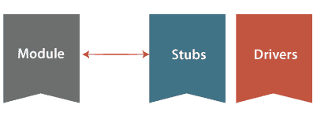

# 存根和驱动程序的区别

> 原文：<https://www.javatpoint.com/stubs-vs-drivers>

在本节中，我们将讨论存根和驱动程序之间的**差异；并查看对它们的简要介绍。**

存根和驱动程序是两种类型的测试工具，它们是软件和测试的集合，这意味着它们被设计在一起，通过加速情况的变化来测试程序的一个单元，同时定期检查其性能和结果。

在软件测试过程中，存根和驱动程序是那些被用作模块短期替代的组件。

软件测试生命周期中有几个要素，它们在测试过程中起着至关重要的作用，以便更加精确和无故障。

所有与测试相关的组件都努力提高质量，帮助我们提供准确和可预测的结果，并有助于满足指定的规格。

## 描述软件测试中的存根和驱动程序？

在[软件测试](https://www.javatpoint.com/software-testing-tutorial)中，**存根和驱动程序**被描述为作为新的或缺失的模块的替代模块的复制品。

存根主要用于**自上而下[集成测试](https://www.javatpoint.com/integration-testing)**；另一方面，驱动程序主要用于**自下而上的集成测试**单独和设计的增强测试过程。

为了满足无法访问的模块或组件的基本需求，我们精确地建立了存根和驱动器。并且非常有利于获得预期的结果。

存根和驱动程序都是基本软件开发和软件测试过程中必不可少的部分。因此，为了帮助我们理解软件测试中存根和驱动程序的实质，我们将看到一个详尽的讨论。

## 什么是 Stubs？

*   **存根**是收集数据并开发许多可能数据的模块的副本。但是，它像实际模块一样执行，主要用于测试模块。
*   一般来说，存根是由软件开发人员创建的，以便在特定模块缺失或尚未开发时使用它们来代替模块。
*   通过使用这些测试存根，测试工程师可以模拟低级模块的性能，这些模块还没有与软件结合。此外，它有助于我们加速缺失模块的活动。

### 存根的类型

在增量集成测试的**自顶向下方法中，存根分为四个基本部分，如下所示:**

*   演示跟踪消息。
*   显示参数值。
*   返回由模块或组件处理的一致值。
*   返回测试组件或模块时使用的特定参数的值。

## 什么是驱动程序？

*   **驱动程序**建立测试环境并负责通信、估计结果，还发送报告。
*   这些就像存根一样，被软件测试工程师用来完成缺失或不完整的模块/组件需求。
*   驱动程序主要在**增量集成测试的**自下而上方法**中开发。**
*   通常，与存根相比，驱动程序有点复杂。
*   当上层模块或代码没有开发或缺失时，这些可以测试代码的下层。
*   换句话说，我们可以说驱动程序执行为**伪代码**，主要在存根模块完成时使用；但是，初始模块/组件尚未准备好。

## 存根和驱动程序示例

让我们看一个存根和驱动程序的例子，这有助于我们增强对存根和驱动程序的了解。

假设我们有一个 web 应用，它包含**四个不同的模块**，例如:

*   **模块-P**
*   **模块-Q**
*   **模块-R**
*   **模块-S**

如前所述，所有模块都负责一些单独的活动或功能，如下表所示:

| 不同的模块 | 个人活动 |
| **模块-P** | web 应用的登录页面 |
| **模块-Q** | web 应用的主页 |
| **模块-R** | 打印设置 |
| **模块-S** | 注销页面 |

#### 注意:模块 P、Q、R 和 S 包含了每个模块之间的依赖关系。

等效地实现所有模块的测试或开发总是更好的方法。每一个被开发出来的时候，它们都可以根据它们与一个模块的相似依赖关系进行组合和测试。

一旦**模块-P** 开发出来，就要经过测试过程。但是，为了执行和验证关于**模块-P** 的测试方法，他们需要**模块-Q** ，该模块尚未完全开发，仍在开发过程中。

并且无法在缺少**模块-Q** 的情况下测试**模块-P** 。因此，在这样的场景下，我们将在**软件测试过程中借助**存根和驱动程序**。**

存根和驱动程序将复制真实**模块-Q** 显示的所有基本功能和特性。随后，它与**模块-P** 相结合，以便有效地执行测试过程。

现在，我们可以验证**模块-P** 中的**登录页面**的估计功能，前提是根据正确有效的输入，它将转到**主页**，这是**模块-Q** 的活动。

同样地，**存根和驱动程序**用于完成其他模块的需求，例如**注销页面**，它位于模块-S 下，需要在从特定应用有效注销后针对**登录页面** ( **模块-P** )。

同样，如果模块-R 和**模块-S** 不可用，我们也可以使用存根或驱动程序来代替它们。

由于**模块-P** 不可访问，存根和驱动程序将作为其执行**模块-s**测试的替代

**但是在这里，问题出现了，驱动程序和 Stubs 都提供相同的功能吗？**

让我们找到上述问题的答案:

是的，我们可以说存根和驱动程序都执行相似的特性和目标。两者都可以作为缺失模块的替代。但是，它们之间的变化可以在整个集成测试过程中描绘出来。

## 存根和驱动程序的主要区别

以下事实解释了集成测试过程中**存根和驱动程序**之间的关键差异。

*   **存根和驱动程序**设计为缺失或不可访问模块或组件的虚拟物。
*   最常见的是，存根和驱动程序用于**增量集成** [**测试**](https://www.professionalqa.com/incremental-or-progressive-testing) ，其中存根用于**自上而下的方法**，而驱动程序用于**自下而上的方法**。
*   通常，开发人员和单元测试工程师被包括在存根和驱动程序的创建中。
*   尽管它提供了执行**独立组件或模块**的便利性，而不用担心其他模块的可访问性，并导致它们进入一个耗时的过程，因为它涉及为所有缺失的模块开发副本。
*   确切地说，存根和驱动程序是为每个具有不同目的的模块开发的。

## 存根 VS 驱动程序

在此，我们讨论下表中**存根和驱动程序**之间的一些重要比较:

| 没有 | 存根 | 司机 |
| **1。** | 模拟被调用函数的一段代码称为 Stubs。 | 模拟调用函数的一段代码称为驱动程序。 |
| **2。** | 它用于测试模块和测试模块的功能，还复制尚未合并的较低级模块的性能，以及缺少的模块/组件的活动。 | 当主模块准备好或准备好时，我们会采取司机的帮助。一般来说，与存根相比，驱动程序有点复杂。 |
| **3。** | 存根是在增量集成测试的自顶向下方法中开发的。 | 驱动程序是在增量集成测试的自底向上方法中开发的。 |
| **4。** | 存根复制未开发和缺失的模块或组件的活动。 | 驱动程序将测试用例授权给另一个系统，该系统引用正在测试的模块。 |
| **5。** | 存根是由测试工程师团队创建的。 | 通常，驱动程序是由开发人员和单元测试工程师创建的。 |
| **6。** | 存根是在测试高级模块时开发的，低级模块没有形成。 | 驱动程序是在测试低级模块时获得的，高级模块尚未开发。 |
| **7。** | 这些与正在开发过程中的软件模块并行。 | 另一方面，驱动程序用来提醒需要测试的组件。 |
| **8。** | 存根表示低级模块。 | 驱动程序表示高级模块。 |
| **9。** | 从根本上说，存根也称为被调用程序，最初用于自顶向下的集成测试。 | 驱动程序也称为调用程序，主要用于自底向上的集成测试。 |
| **10。** | 这些是为测试模块的特性和功能而保留的。 | 如果软件的核心模块不是为测试而建立的，则使用驱动程序。 |

## 结论

在本节中，我们已经看到了存根和驱动程序之间的显著区别。

并且我们得出结论，软件测试过程不能用未完成的和部分的模块和组件来实现。

因此，为了保证测试的正确性和效率，有必要开发满足未完成模块需求的**存根和驱动程序**。

作为模拟模块运行，用于测试主要模块或组件的特性。

最后，我们可以说存根和驱动程序是软件测试过程的重要部分。

它们是计算机程序，作为一种替代，复制其他模块的功能，帮助我们简化软件测试活动。

* * *