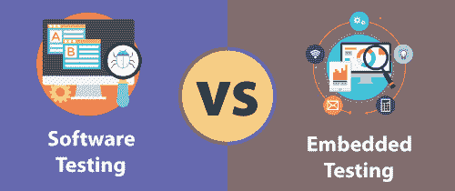

# 软件测试和嵌入式测试的区别

> 原文：<https://www.javatpoint.com/software-testing-vs-embedded-testing>

在本文中，我们将基于各种参数讨论**软件测试和嵌入式测试**之间的区别。

在比较**软件测试和嵌入式测试**之前，我们先简单介绍一下**软件测试**和**嵌入式测试**。

## 什么是软件测试？

[软件测试](https://www.javatpoint.com/software-testing-tutorial)是通过了解软件的各种质量来发现软件准确性的过程。以下是软件测试的一些重要品质:

*   [**扩展性**](https://www.javatpoint.com/scalability-testing)
*   [**可靠性**](https://www.javatpoint.com/reliability-testing)
*   **可重用性**
*   **便携性**
*   [**可用性**](https://www.javatpoint.com/usability-testing)

测试是关于评估软件模块/组件的性能，以便识别软件缺陷或错误。

这是一个在任何应用或软件上实现的强制性过程，因为如果软件由于缺乏测试而随时崩溃，这将是一个有风险的情况。因此，不在软件上执行测试过程就不能部署到最终用户。

软件测试技术也是与客户共享关于软件质量的信息。进而可以说**软件测试**的执行给了软件一个公正的看法，也提供了软件能力的安全性。

软件测试过程包括分析关键服务下的所有组件或模块，以验证其是否满足特定要求。

它还包括对几个环境中的代码以及代码的所有测试特性的检查。

## 什么是嵌入式测试？

为了验证和确认软件和硬件性能，我们将使用**嵌入式测试**流程。嵌入式测试过程的执行确保指定的整个系统及其软件和硬件没有错误/缺陷。

嵌入式测试的另一个优点是，它可以在硬件上执行，以便发现错误/缺陷。

在嵌入式测试的帮助下，我们可以记录系统的进度，这也有助于我们保证指定的系统符合客户规范或要求。

## 软件测试 VS 嵌入式测试

让我们看看**软件测试**和**嵌入式测试**的关键区别:

| S.NO | 比较基础 | 软件测试 | 嵌入式测试 |
| **1。** | **定义** | 软件测试是根据客户要求验证和确认软件的过程。 | 嵌入式测试是检查嵌入式系统中软件和硬件的功能和非功能属性的过程。 |
| **2。** | **已执行** | 既可以手动执行，也可以自动执行。而它主要以一种方式执行，即手动执行。 |
| **3。** | **在**执行 | 软件测试只能在软件上实现。 | 与软件测试相比，嵌入式测试既可以在软件上实现，也可以在硬件上实现。 |
| **4。** | **测试** | 它主要用于测试软件功能。 | 另一方面，它主要用于测试硬件行为。 |
| **5。** | **测试类型** | 通常，软件测试基于黑盒测试。 | 另一方面，嵌入式测试可以是白盒测试和黑盒测试。 |
| **6。** | **数据库** | 数据库可以在软件测试程序下进行测试。 | 数据库无法在嵌入式测试过程中进行测试。 |
| **7。** | **目标** | 通常，它在客户机-服务器应用上执行。 | 另一方面，嵌入式测试在硬件上执行。 |
| **8。** | **应用** | 在软件测试中，我们将测试网络和移动应用。 | 在嵌入式测试中，我们将测试嵌入式系统。 |
| **9。** | **贵** | 与嵌入式测试相比，软件测试有点昂贵且耗时。 | 另一方面，与软件测试相比，嵌入式测试成本更低，耗时更少。 |
| **10。** | **示例** | 雅虎邮件、谷歌邮件安卓应用就是软件测试的例子。 | 医疗保健领域的计算机和系统中使用的微控制器就是嵌入式测试的例子。 |

## 结论

在看到**软件测试和嵌入式测试**的所有本质区别后，我们可以得出结论，这两种测试技术都有各自的特点和能力，有助于测试工程师实现各自的目标。

此外，我们可以说，使用这两种测试技术提供了各种**优势**以及**劣势**，这意味着与软件测试相比，我们在执行嵌入式测试时可能会看到一些复杂性。

因此，与传统的软件测试过程相比，嵌入式测试执行起来更具挑战性。

* * *