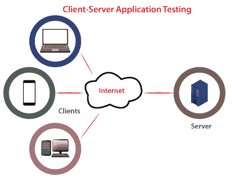
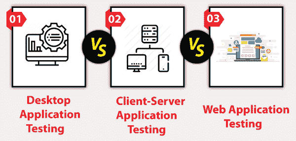

# 桌面应用程序测试、客户机-服务器应用程序测试和网络应用程序测试的区别

> 原文：<https://www.javatpoint.com/desktop-application-testing-vs-client-server-application-testing-vs-web-application-testing>

在[软件测试](https://www.javatpoint.com/software-testing-tutorial)中，我们有三种不同类型的应用测试，比如:

*   **桌面应用测试**
*   **客户端-服务器应用程序测试**
*   **网络应用测试**

这些软件应用程序的开发和创建正是为了在不同的环境和领域中运行。

上面提到的所有应用程序都与不同的环境相关，在这些环境中，它们可以单独进行不同的测试。换句话说，我们可以说这种测试的关键方面是测试它们的**环境**。

当最终用户从一种测试类型继续到另一种测试类型时，用户完全失去了对环境的控制。

在本教程中，我们将了解这些(桌面、客户端-服务器和网络应用程序测试)类型的应用程序之间的区别。

但是在我们讨论它们之间的区别之前，首先，我们将看到桌面、客户机-服务器和 Web 应用程序测试的简要介绍。

## 什么是桌面应用程序测试？

第一类软件应用是**桌面应用**。在桌面应用程序测试中，整个软件安装在最终用户的机器上，一次只有一个用户可以访问它。桌面应用程序又被称为**独立应用程序测试**。

基本上，它在个人计算机、机器和系统上执行。为了测试桌面应用程序，我们必须知道操作系统和数据库，以及用户如何与应用程序交互。

这些类型的应用程序只专注于特定的环境。桌面应用程序包括对应用程序的完全分析，如**图形用户界面(GUI)、功能、后端、数据库和加载**。

最终用户还需要识别不同的方法来测试内存泄漏和未处理的异常。

### 桌面应用程序测试的优势

以下是桌面应用程序测试的一些显著优势:

*   安全性是存在的，因为数据黑客在桌面应用程序测试中是不可能的。
*   这些应用程序访问速度更快。
*   执行桌面应用程序时不需要任何服务器。

### 桌面应用程序测试的缺点

桌面应用程序的一些重要缺点如下:

*   一次只有一个用户可以访问独立应用程序。
*   为了执行桌面/独立应用程序，安装过程是必要的。
*   在这个应用测试中，系统资源被占用。
*   使用桌面应用程序时无法共享数据。
*   在桌面应用程序测试中，维护成本很高或很困难，因为应用程序安装在用户机器上。如果出现任何问题，我们需要联系特定的人来解决这些问题。

## 什么是客户机-服务器应用程序测试？

客户端-服务器应用程序是另一种软件应用程序。这些类型的应用程序是单用户应用程序，在两个或多个系统上执行，在执行客户机-服务器应用程序时需要网络知识。

基本上，在客户端-服务器应用程序中，我们将在**服务器和客户端**等系统上测试应用程序图形用户界面，还将测试**功能、负载、数据库以及客户端和服务器之间的通信。**

最终用户需要识别负载和性能问题，并且还需要处理客户机-服务器应用程序下的代码空间。在客户端-服务器类型的应用测试中，我们可以借助需求和理解获得**测试用例**和**测试场景**。

我们可以在客户机-服务器应用程序下实现以下类型的测试:

*   **手动测试**
*   **互操作性测试**
*   **用户界面测试**
*   **兼容性测试**
*   **功能测试**
*   **配置测试**

### 客户端-服务器应用程序测试的优势

以下是客户端-服务器应用程序的一些显著优势:

*   与其他应用程序相比，在客户机-服务器应用程序测试中，维护有点容易。
*   我们可以快速访问这些应用程序。
*   客户端-服务器应用程序在数据共享方面是安全的。
*   不同的用户可以同时访问应用程序。
*   我们可以在客户机-服务器应用程序测试中轻松共享数据。

### 客户端-服务器应用程序测试的缺点

客户机-服务器应用程序的一些重要缺点如下:

*   如果服务器关闭，没有人可以访问应用程序，这是客户机-服务器应用程序测试的主要缺点。
*   为了执行客户机-服务器应用程序测试，安装是必要的。
*   在这种类型的应用程序测试中，系统资源将驻留在空间中。

## 什么是网络应用测试？

Web 应用是我们在**不同的浏览器和同一浏览器的不同版本以及不同的操作系统**上测试应用的应用。并且这种类型的应用可以在**两台或多台机器**上执行。

换句话说，我们可以说基于网络的应用程序在网络浏览器中执行，而不是安装在最终用户的设备上。这意味着整个软件安装在服务器上，最终用户可以使用网址访问特定的应用程序。

这些应用用于分析浏览器相似性和操作系统兼容性，属性如**性能、可用性、后端、图形用户界面、可访问性**。

这些应用程序可以在任何有互联网连接的设备上执行，如**台式电脑、平板电脑和手机**。

Web 应用程序易于访问，支持多种浏览器和设备，与平台无关，与其他类型的软件应用程序相比，这有助于我们降低成本。基于 Web 的应用程序更加复杂，需要全面的测试。

为了实现基于 web 的应用程序，测试工程师需要知道 web 应用程序是如何与用户通信的。在进行 web 应用程序测试时，了解**[【JavaScript】](https://www.javatpoint.com/javascript-tutorial)[Php](https://www.javatpoint.com/php-tutorial)等多项技术，调试**也是必要的。

我们可以在基于 web 的应用程序下实现以下类型的测试:

*   [**安全检测**](https://www.javatpoint.com/security-testing)
*   **用户界面测试**
*   **浏览器兼容性测试**
*   **功能测试**
*   **操作系统兼容性测试**
*   [**负荷测试**](https://www.javatpoint.com/load-testing)
*   **互操作性测试**
*   [**性能测试**](https://www.javatpoint.com/performance-testing)
*   **存储和数据量测试**
*   [**压力测试**](https://www.javatpoint.com/stress-testing)

### 网络应用测试的优势

以下是 web 应用程序的一些显著优势:

*   像客户端-服务器应用程序一样，web 应用程序也可以由几个用户同时访问。
*   在基于 web 的应用程序测试中，我们可以轻松地共享数据。
*   可以更快地访问这些类型的应用程序测试。
*   在实现基于 web 的应用程序时，不需要任何维护和安装。
*   在数据共享方面，基于 web 的应用程序是高度安全的。

### 网络应用程序测试的缺点

以下是 web 应用程序最常见的一些缺点:

*   如果服务器关闭，没有人可以访问应用程序，这是基于网络的应用程序测试的主要缺点。

## 桌面应用 VS 客户端-服务器应用 VS 网络应用测试

让我们将**桌面、客户端-服务器和 web 应用程序的**测试之间的显著差异填入下表:

| 没有。 | 比较基础 | 桌面应用程序测试 | 客户端-服务器应用程序测试 | 网络应用测试 |
| **1。** | **定义** | **桌面应用程序**是安装在一台计算机上，只能由一个人访问的应用程序。 | **客户端-服务器应用程序**是那些安装在客户端和服务器软件上以便访问应用程序的应用程序。 | **基于网络的应用**是那些通过浏览器访问的应用。这些应用程序是由网址驱动的，并在不同的网络浏览器上执行。 |
| **2。** | **用户数** | 桌面应用程序只能由单个用户访问。 | 客户端-服务器可以由多个用户访问，但数量有限。 | 基于网络的应用程序可以通过互联网和浏览器访问 n 个用户。 |
| **3。** | **要求** | 为了实现桌面应用程序，我们至少需要一个计算机系统或工作站。 | 为了执行客户机-服务器应用程序测试，我们需要至少一台服务器来加载应用程序和一台客户机或系统。 | 通过使用网络浏览器和互联网连接，个人笔记本电脑可以远程实现网络应用。 |
| **4。** | **于**执行 | 桌面应用程序在单台机器或工作站上执行。 | 通常，客户机-服务器应用程序在两层应用程序上执行。 | 通常，基于 web 的应用程序测试在三层应用程序上执行。 |
| **5。** | **环境** | 独立或桌面应用程序测试依赖于平台；这就是为什么环境是一台**用户机器**。 | 通常，在客户端-服务器应用程序测试中，环境是**内部网。** | 环境是基于网络的应用程序测试中的网络浏览器。 |
| **6。** | **意识** | 桌面或独立应用程序上没有客户端和服务器。 | 在客户机-服务器应用程序中，我们必须知道服务器的位置。 | 在 web 应用程序中，我们可能有也可能没有关于服务器位置的任何信息。 |
| **7。** | **驱动应用类型** | 单机应用是**桌面驱动。** | 客户端-服务器应用程序是**菜单驱动的应用程序**测试。 | Web 应用通常是 **URL 驱动的测试**。 |
| **8。** | **连通性** | 在独立应用程序测试中，没有服务器或客户端。我们已经意识到桌面应用程序不需要任何互联网连接，因为它们只托管在用户机器上。 | 客户端-服务器应用测试有**两个或两个以上的系统**，其中一个是**服务器**，另一个是**客户端**。应用程序被加载到服务器上，并安装在客户机上。 | web 应用测试有两个或两个以上的系统，一个是**服务器，**，另一个是**客户端。**在这种情况下，应用程序加载在服务器上，没有**可执行文件**。我们知道，Web 应用程序依赖于互联网连接来执行，并且需要执行互联网连接测试来分析应用程序以不同的速度运行。 |
| **9。** | **可达性** | 这些应用程序可能需要也可能不需要可信访问才能使用它。 | 这些应用程序的用户以前已经知道，因为他们可能有一个**用户名/密码**来打开应用程序。 | 所有用户都可以访问这些应用程序。 |
| **10。** | **进行的测试类型** | 在独立应用程序中，我们测试应用程序或软件的以下特性:

*   **[load]**
*   **Graphical user interface (GUI) function**
*   **There is a memory leak problem in the back end (database).**

 | 在客户机-服务器应用程序中，我们将测试应用程序的以下质量:

*   **[functionality]**
*   **load and performance**
*   **GUI (Graphical User Interface) is located on both sides.**
*   **Back end.**

 | 在 Web 应用测试中，我们将测试应用的以下特性:

*   **Compatibility between browser and operating system (OS).**
*   **User interface test**
*   **Broken chain test**
*   **Data quantity test**
*   **Static page test**
*   **Load, pressure and quantity**
*   **Cross-browser test.**

 |
| **11 时。** | **示例** | 桌面/支架应用的一些重要示例如下:

*   **Adobe Photoshop 安装软件计算器的 w**
*   **自动执行**
*   **MS 办公室**

 | 客户端-服务器应用程序的一些重要示例如下:

*   **[web browser]**
*   FTP
*   **净**
*   **E-mail**
*   **Gateway**

 | web 应用程序的一些重要示例如下:

*   **[Facebook]**
*   **Yahoo**
*   **Gmail**
*   **推特**

 |

## 结论

在看到桌面、客户机-服务器和 web 应用程序测试之间的所有显著差异后，我们可以得出结论，所有这些应用程序都是完全不同的，都有各种各样的优点和缺点。

简单来说，我们可以说，如果我们在测试一个独立或桌面应用程序，那么中心应该是面向环境的，因为 stone-only/桌面应用程序只在精确的环境中执行。

为了检查应用程序的可用性、后端、负载和其他功能，我们应该执行桌面应用程序。

另一方面，在**客户端-服务器应用程序测试**中，用户性能是可预测和可管理的，因为客户端-服务器应用程序不需要任何浏览器来访问应用程序。

然而，执行网络应用程序测试本身是一个关键的过程，以确保测试中的网络应用程序可以被实际用户轻松检索，并在所有操作系统和浏览器中正常工作。

为了检查应用程序的性能、**特性、可访问性、安全性和可用性**，我们应该执行 Web 应用程序。

几乎每个测试工程师都使用桌面/独立应用程序、客户机-服务器应用程序和网络应用程序测试等应用程序。

* * *