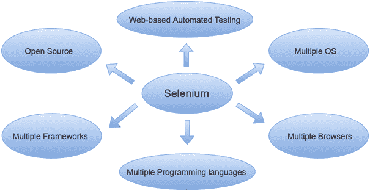

# Selenium 教程

> 原文：<https://www.javatpoint.com/selenium-tutorial>

Selenium 教程提供 Selenium 的基本和高级概念。我们的 Selenium 教程是为初学者和专业人士设计的。

Selenium 是应用最广泛的开源 Web UI(用户界面)自动化测试套件之一。

我们的 Selenium 教程包括 Selenium 的所有主题，如特性、Selenium vs . QTP、Selenium 工具套装、Selenium IDE、Selenium IDE 定位策略、Selenium WebDriver、WebDriver 特性、WebDriver vs RC、WebDriver 安装等。

## 什么是 Selenium

Selenium 是应用最广泛的开源 Web UI(用户界面)自动化测试套件之一。它最初是由杰森·哈金斯在 2004 年作为思想工厂的内部工具开发的。Selenium 支持跨不同浏览器、平台和编程语言的自动化。

Selenium 可以轻松部署在 Windows、Linux、Solaris 和 Macintosh 等平台上。此外，它还支持 iOS、windows mobile 和 android 等移动应用的操作系统。

Selenium 通过使用特定于每种语言的驱动程序来支持多种编程语言。Selenium 支持的语言包括 C#、Java、Perl、PHP、Python 和 Ruby。目前，Selenium Web 驱动程序最受 Java 和 C#的欢迎。Selenium 测试脚本可以用任何支持的编程语言进行编码，并且可以在大多数现代网络浏览器中直接运行。Selenium 支持的浏览器包括 Internet Explorer、Mozilla Firefox、谷歌 Chrome 和 Safari。

Selenium 可用于自动化功能测试，并可与自动化测试工具如 **Maven** 、 **Jenkins** 、**T10】Docker**集成，实现连续测试。还可以与 **TestNG** 、& **JUnit** 等工具集成，用于管理测试用例和生成报告。

* * *

## Selenium 指数

* * *

**Selenium**

*   [Selenium 教程](selenium-tutorial)
*   [Selenium 基本术语](selenium-basic-terminology)
*   [Selenium 特征](selenium-features)
*   [Selenium 限制](selenium-limitations)
*   [Selenium vs QTP](selenium-vs-qtp)
*   [Selenium 工具套件](selenium-tool-suite)

**Selenium IDE**

*   [Selenium IDE](selenium-ide)
*   [IDE-安装](selenium-ide-installation)
*   [IDE-功能](selenium-ide-features)
*   [IDE-第一个测试用例](selenium-ide-first-test-case)
*   [IDE-登录测试](selenium-ide-login-test)
*   [IDE-命令](selenium-ide-commands)
*   [IDE-手动创建测试用例](selenium-ide-creating-test-cases-manually)
*   [IDE 定位策略](selenium-ide-locating-strategies)
    *   [IDE-通过标识符定位](selenium-ide-locating-strategies-by-identifier)
    *   [IDE-按标识元素定位](selenium-ide-locating-strategies-by-id)
    *   [IDE-按名称定位](selenium-ide-locating-strategies-by-name)
    *   [IDE-通过 XPath 定位](selenium-ide-locating-strategies-by-xpath)
    *   [IDE CSS 定位](selenium-ide-locating-strategies-by-css)
        *   [按标识定位](selenium-css-selector-id)
        *   [按类别定位](selenium-css-selector-class)
        *   [按属性定位](selenium-css-selector-attribute)
        *   [按 ID/类定位&属性](selenium-css-selector-id-class-and-attribute)
        *   [子串定位](selenium-css-selector-sub-string)
        *   [通过内部文本定位](selenium-css-selector-inner-text)
    *   [IDE-通过 DOM 定位](selenium-ide-locating-strategies-by-dom)

**Selenium WebDriver 教程**

*   [Selenium WebDriver](selenium-webdriver)
*   [WebDriver-架构](selenium-webdriver-architecture)
*   [WebDriver-功能](selenium-webdriver-features)
*   [webriver vs RC](selenium-webdriver-vs-selenium-rc)
*   [webriver 安装](selenium-webdriver-installation)
*   [第一个测试案例](selenium-webdriver-first-test-case)
*   [WebDriver 命令](selenium-webdriver-commands)
*   [镀 Chrome 运行测试](selenium-webdriver-running-test-on-chrome-browser)
*   [火狐上运行测试](selenium-webdriver-running-test-on-firefox-browser-gecko-driver)
*   [IE 上的运行测试](selenium-webdriver-running-test-on-ie-browser)
*   [在 Safari 上运行测试](selenium-webdriver-running-test-on-safari-browser)
*   [定位策略](selenium-webdriver-locating-strategies)
    *   [按标识定位策略](selenium-webdriver-locating-strategies-by-id)
    *   [按名称定位策略](selenium-webdriver-locating-strategies-by-name)
    *   [按类名定位策略](selenium-webdriver-locating-strategies-by-class-name)
    *   [通过标签名称定位策略](selenium-webdriver-locating-strategies-by-tag-name)
    *   [通过链接文本定位策略](selenium-webdriver-locating-strategies-by-link-text)
    *   [通过部分链接文本定位策略](selenium-webdriver-locating-strategies-by-partial-link-text)
    *   [CSS 定位策略](selenium-webdriver-locating-strategies-by-css)
        *   [标签和标识](webdriver-locating-strategies-by-css-tag-and-id)
        *   [标签和等级](webdriver-locating-strategies-by-css-tag-and-class)
        *   [标签和属性](webdriver-locating-strategies-by-css-tag-and-attribute)
        *   [标签、类别和属性](webdriver-locating-strategies-by-css-tag-class-and-attribute)
        *   [子字符串匹配](webdriver-locating-strategies-by-css-sub-string-matches)
    *   [通过 XPath 定位策略](selenium-webdriver-locating-strategies-by-xpath)
        *   [使用单斜线](webdriver-locating-strategies-by-xpath-using-single-slash)
        *   [使用双斜线](webdriver-locating-strategies-by-xpath-using-double-slash)
        *   [使用单一属性](webdriver-locating-strategies-by-xpath-using-single-attribute)
        *   [使用多属性](webdriver-locating-strategies-by-xpath-using-multiple-attribute)
        *   [使用 AND](webdriver-locating-strategies-by-xpath-using-and)
        *   [使用或](webdriver-locating-strategies-by-xpath-using-or)
        *   [使用包含()](webdriver-locating-strategies-by-xpath-using-contains)
        *   [使用 starts_with()](webdriver-locating-strategies-by-xpath-using-starts_with)
        *   [使用文本()](webdriver-locating-strategies-by-xpath-using-text)
        *   [使用最后()](webdriver-locating-strategies-by-xpath-using-last)
*   [处理下拉菜单](selenium-webdriver-handling-drop-downs)
*   [WebDriver-拖放](selenium-webdriver-drag-and-drop)
*   [WebDriver-处理警报](selenium-webdriver-handling-alerts)
*   [滚动网页](selenium-webdriver-scrolling-web-page)
*   [WebDriver-浏览器命令](selenium-webdriver-browser-commands)
*   [WebDriver-导航命令](selenium-webdriver-navigation-commands)
*   [WebDriver-网络元素命令](selenium-webdriver-webelement-commands)
*   [操作单选按钮](selenium-webdriver-handling-radio-buttons)
*   [处理复选框](selenium-webdriver-handling-checkbox)
*   [Selenium 断言](selenium-assertions)
*   [Selenium 栅](selenium-grid)

**Selenium 蟒教程**

*   [Selenium 蟒](selenium-python)

**Selenium C#教程**

*   [Selenium C#](selenium-csharp)

**Selenium 检测**

*   [测试教程](testng-tutorial)
*   [测试简介](testng-introduction)
*   [测试安装](testng-installation-in-eclipse)
*   [测试功能](features-of-testng)
*   [运行测试用例](running-test-cases-in-testng)
*   [测试 XML 文件](how-to-create-xml-file-in-testng)
*   [排除/包含测试用例](exclude-include-test-cases-in-testng)
*   [用 Regex 运行测试用例](how-to-use-regex-in-testng)
*   [测试组](testng-groups)
*   [测试 g 注释](testng-annotations)
*   1)@ beforesuite
*   2)@后期
*   [3)@预测试](testng-beforetest-annotation)
*   [4)@测试后](testng-aftertest-annotation)
*   [5) @BeforeClass](testng-beforeclass-annotation)
*   [6) @AfterClass](testng-afterclass-annotation)
*   [7) @BeforeMethod](testng-beforemethod-annotation)
*   [8) @AfterMethod](testng-aftermethod-annotation)
*   [9)@ before group](testng-beforegroups-annotation)
*   [10)@后组](testng-aftergroups-annotation)
*   [标注属性](testng-annotation-attributes)
*   [测试参数](testng-parameters)

* * *

## 先决条件

在学习 Selenium 的概念之前，您应该对 java 或任何其他面向对象编程语言有一个基本的了解。

Selenium 支持的语言包括 C#、Java、Perl、PHP、Python 和 Ruby。目前，Selenium Webdriver 最受 Java 和 C#的欢迎。所以，如果你知道任何一种语言，那么理解 Selenium 的概念就不难了。此外，你应该事先了解软件测试技术，如自动化测试、功能测试等。

## 观众

我们的 Selenium 教程是为所有初学者和高级 Selenium 用户设计的。