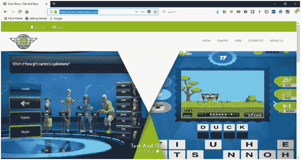
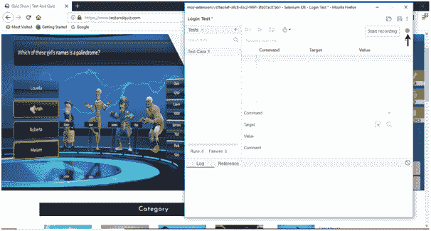
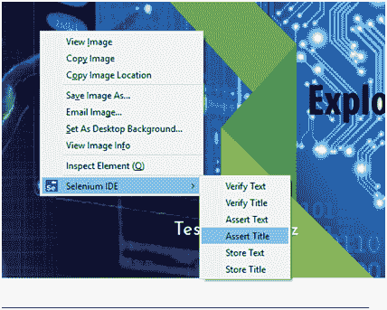
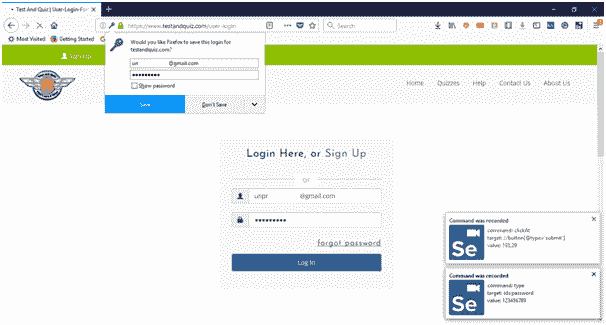
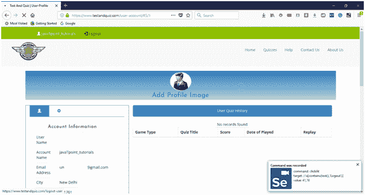
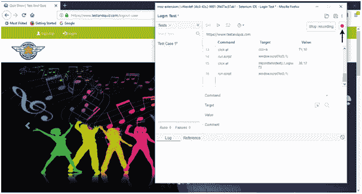
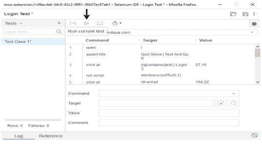
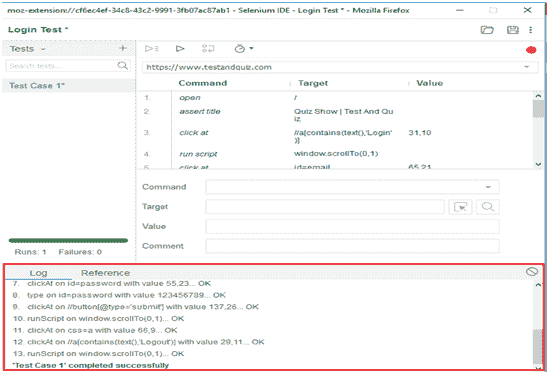
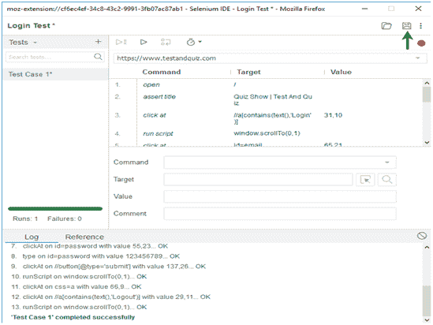
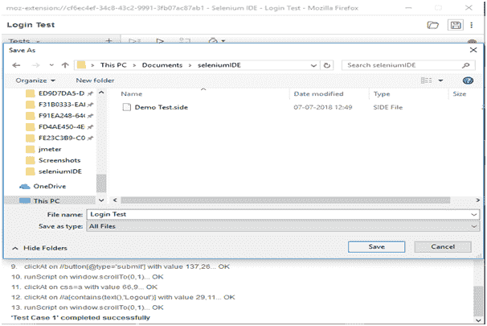

# SeleniumIDE-登录测试

> 原文：<https://www.javatpoint.com/selenium-ide-login-test>

在本节中，您将学习如何在 SeleniumIDE 中创建登录测试用例。

为了我们的测试目的，我们将测试测试和测验网站提供的登录页面，显示在以下网址下:[https://www.testandquiz.com/](https://www.testandquiz.com/)

#### 注意:您可以在任何公开网站上注册并创建登录测试。

下图显示了当我们点击上面提到的网址时出现的主页快照。

首先，您需要注册以获取登录凭据。对于这个测试，我们已经生成了我们的登录凭证。现在，我们将生成一个测试脚本，在 Selenium IDE 中创建一个登录测试。

## 

*   启动 Firefox 浏览器。
*   点击浏览器右上角的 Selenium 图标。
*   它将启动 SeleniumIDE 的默认界面。
*   进入你的火狐浏览器，打开网址:[https://www.testandquiz.com/](https://www.testandquiz.com/)
*   输入项目名称作为“登录测试”。
*   输入测试用例名称为“测试用例 1”。
*   点击“开始记录”按钮开始记录测试用例。

*   转到火狐浏览器，右键单击页面中的任何空白处，然后选择 SeleniumIDE 选项。
*   点击 SeleniumIDE>断言标题。断言标题命令确保页面标题是正确的。

*   现在，点击位于网站右上角的登录按钮。

*   填写登录凭证并点击登录按钮。与此同时，您将在浏览器的最右边获得由 IDE 执行的操作的通知。

*   登录后，单击用户名部分查看您的帐户详细信息。

*   它会将您重定向到您的帐户设置页面，在那里您可以编辑您的个人详细信息。

*   点击注销按钮。
*   现在，进入 IDE，点击停止记录按钮，停止记录测试用例。

## 2.回放

*   单击 IDE 工具栏菜单上的“运行当前测试”按钮。它将执行您与浏览器的所有交互，并为您提供已执行测试脚本的总体摘要。

*   “日志”窗格显示已执行测试脚本的总体摘要。

## 3.保存测试套件

*   点击菜单栏最右边的保存按钮。

*   将整个测试套件保存为“登录测试”。

*   测试套件可以在上述步骤中提供的位置找到。