# 硒集成开发环境-手动创建测试用例

> 原文：<https://www.javatpoint.com/selenium-ide-creating-test-cases-manually>

在本节中，您将学习如何在硒集成开发环境中使用硒命令手动创建测试用例。简单地说，我们将通过插入 selenium 命令而不是 recording 选项来创建测试用例。

在这个测试中，我们将在任何公开可用的搜索引擎(比如“谷歌”)上搜索文本操作。随后，我们将在同一个测试套件中创建一个登录测试用例。

要手动创建一个测试用例，首先你必须浏览最常用的 selenium 命令，我们在上一节已经讨论过了。现在，我们将创建第一个关于搜索操作的测试用例。我们将在谷歌搜索引擎上搜索我们的文本。

## 1.插入命令

*   启动 Firefox 浏览器。
*   点击浏览器右上角的硒图标。
*   它将启动硒集成开发环境的默认界面。
*   输入项目名称为“手动测试”。
*   输入测试用例名称作为“搜索测试”。
*   单击测试脚本编辑器框中的命令文本框。

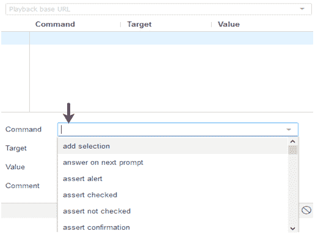

*   将第一个命令的属性修改为:

*   命令:打开
*   目标:[https://www.google.co.in]( https://www.google.co.in)
*   在测试用例执行期间，这个命令将在你的火狐浏览器上加载谷歌搜索引擎网页。

现在，我们必须添加一个命令，点击谷歌搜索引擎文本框。为此，我们需要文本框的唯一标识元素，这将有助于集成开发环境标识目标位置。

查找唯一标识元素的方法包括检查 HTML 代码。

*   打开你的火狐浏览器网址:[https://www.google.co.in]( https://www.google.co.in)。
*   右键单击谷歌搜索文本框，并选择检查元素。

*   它将启动一个窗口，包含测试盒开发中涉及的所有特定代码。

*   选择包含文本框标识名的输入标签元素。

*   将第二个命令的属性修改为:

*   命令:单击
*   目标:id=lst-ib
*   在测试用例执行期间，这个命令将点击谷歌搜索引擎网页上的搜索文本框。

#### 注意:对于大多数命令，测试脚本编辑器框的“值”部分是可选的。

我们将对第三个命令使用相同的标识号。第三个命令将在谷歌搜索文本框中输入指定的文本。

*   将第三个命令的属性修改为:

*   命令:键入
*   目标:id=lst-ib
*   值:javaTpointJavaFX 教程
*   在测试用例执行期间，这个命令将在谷歌搜索文本框中输入指定的文本。

我们现在将添加一个命令，它将在我们的网页上生成一个按钮点击事件。要生成这个事件，我们需要谷歌搜索按钮的唯一标识元素。

*   右键单击谷歌搜索按钮，并选择检查元素。

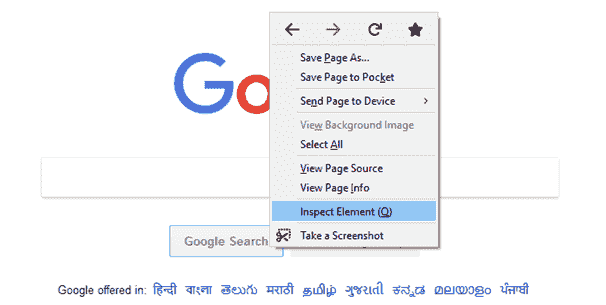

*   它将启动一个窗口，包含搜索按钮开发中涉及的所有特定代码。

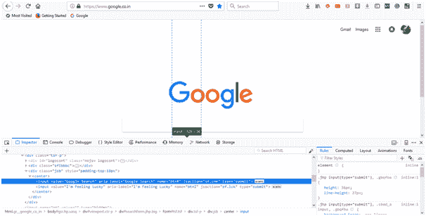

*   选择包含谷歌搜索按钮指定名称的名称元素。

*   将第四个命令的属性修改为:

*   命令:单击
*   目标:名称=btnK
*   在测试用例执行期间，这个命令将点击谷歌搜索引擎网页上的搜索按钮。

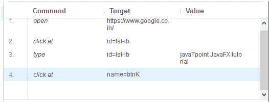

我们现在准备执行我们的第一个测试脚本。

## 执行测试脚本

*   单击集成开发环境工具栏菜单上的“运行当前测试”按钮。它将在浏览器上执行所有插入的命令，并为您提供已执行测试脚本的总体摘要。

*   “日志”窗格显示已执行测试脚本的总体摘要。

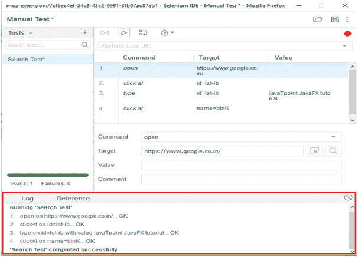

现在，我们将在同一个测试套件中创建第二个测试用例。

我们将基于最受欢迎的网站之一“Rediffmail”提供的登录功能生成一个测试用例。

首先，您需要注册以获取登录凭据。对于这个测试，我们已经生成了我们的登录凭证。

## 1.插入命令

单击测试用例窗格顶部的“添加新测试”按钮。

*   将测试用例重命名为“登录测试”。
*   单击测试脚本编辑器框中的命令文本框。

*   将第一个命令的属性修改为:

*   命令:打开
*   目标:[http://www.rediff.com/]( http://www.rediff.com/)
*   在测试用例执行期间，这个命令将在你的火狐浏览器上加载 Rediff 主页。

现在，我们必须添加一个命令，点击雷迪夫网站右上角的“登录”链接。为此，我们需要“登录”链接的唯一标识元素，这将有助于集成开发环境识别目标位置。

查找唯一标识元素的方法包括检查 HTML 代码。

*   在火狐浏览器上打开网址:[http://www.rediff.com/](http://www.rediff.com/)。
*   右键单击“登录”并选择检查元素。

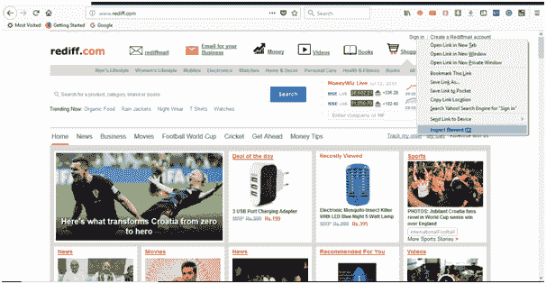

*   它将启动一个窗口，包含“登录”链接开发中涉及的所有特定代码。

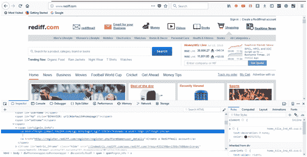

*   选择包含“登录”链接的指定名称的链接元素。

*   将第二个命令的属性修改为:

*   命令:单击
*   目标:链接=登录
*   在测试用例执行期间，这个命令将点击“登录”链接。

“登录”链接会将您重定向到登录页面。因此，对于要输入的第三个命令，我们需要“用户名”文本框的唯一标识，这将有助于 IDE 识别目标位置。

*   右键单击“用户名”文本框并选择检查元素。

*   它将启动一个窗口，包含“用户名”文本框开发中涉及的所有特定代码。

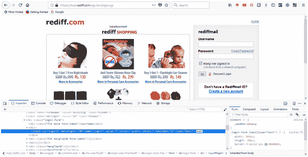

*   为“用户名”文本框选择包含特定标识的标识元素。

*   将第三个命令的属性修改为:

*   命令:单击
*   目标:id=login1
*   在测试用例执行期间，这个命令将点击“用户名”文本框。

我们将在下一个命令中使用相同的 id 元素，该命令包括键入用户 ID 作为登录凭据。

*   将第四个命令的属性修改为:

*   命令:键入。
*   目标:id=login1
*   值:frea********(用户登录标识)
*   在测试用例执行期间，该命令将在“Usename”文本框中键入用户 id。

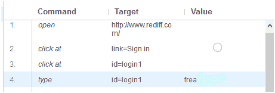

我们现在将添加一个命令，点击“密码”文本框。对于这个命令，我们需要“密码”字段的唯一标识，这将有助于 IDE 识别目标位置。

*   右键单击“密码”文本框并选择检查元素。

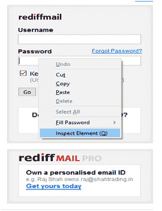

*   它将启动一个窗口，包含“密码”文本框开发中涉及的所有特定代码。

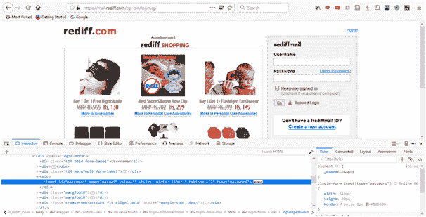

*   选择包含“密码”文本框特定标识的标识元素。

*   将第五个命令的属性修改为:

*   命令:单击
*   目标:id =密码
*   在测试用例执行期间，这个命令将点击“用户名”文本框。

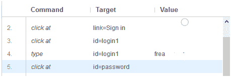

我们将在下一个命令中使用相同的 ID 元素，该命令包括键入密码作为登录凭据。

*   将第六个命令的属性修改为:

*   命令:键入
*   arget:id =密码
*   值:*********(用户登录密码)
*   在测试用例执行期间，该命令将在“密码”文本框中键入用户登录密码。

最后，我们需要登录提交按钮的唯一标识元素，这将有助于集成开发环境标识目标位置。

*   右键单击“开始”按钮并选择检查元素。

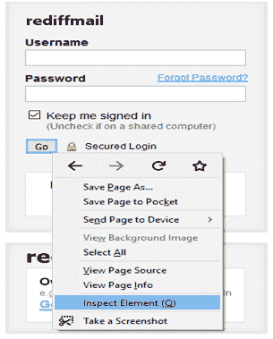

*   它将启动一个窗口，包含开发“开始”提交按钮所涉及的所有特定代码。

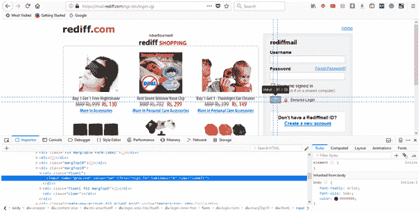

*   选择包含“开始”提交按钮的特定名称的名称元素。

*   将第七个命令的属性修改为:

*   命令:单击
*   目标:名称=继续
*   在测试用例执行期间，这个命令将点击“开始”提交按钮。

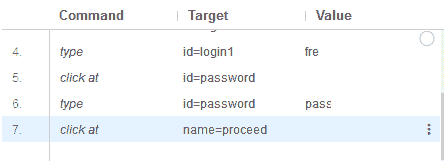

我们现在准备执行第二个测试脚本。

## 执行测试脚本

*   单击集成开发环境工具栏菜单上的“运行当前测试”按钮。它将在浏览器上执行所有插入的命令，并为您提供已执行测试脚本的总体摘要。

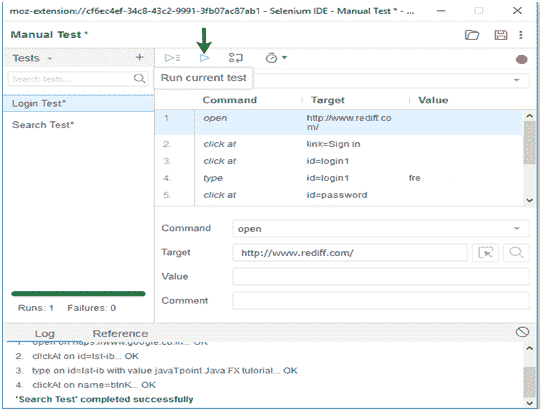

*   “日志”窗格显示已执行测试脚本的总体摘要。

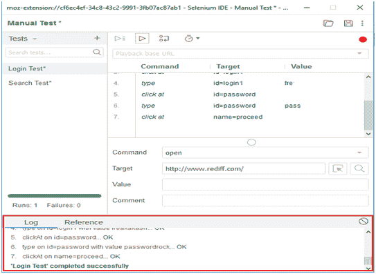

## 保存测试套件

*   点击菜单栏最右边的保存按钮。

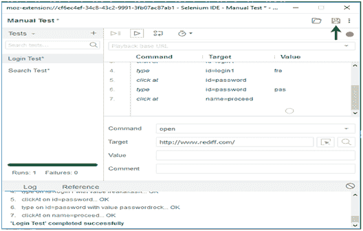

*   将整个测试套件保存为“手动测试”。

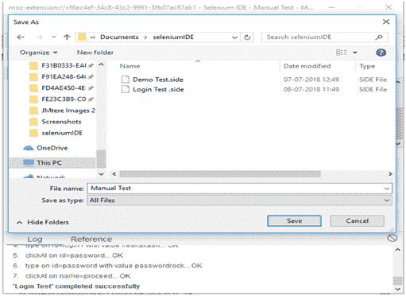

*   测试套件可以在上述步骤中提供的位置找到。