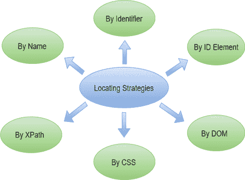

# Selenium 集成电路定位策略

> 原文：<https://www.javatpoint.com/selenium-ide-locating-strategies>

对于大多数 Selenium 命令，我们需要一个目标位置，它唯一地定义了 web 应用上下文中的 web 元素。

目标由定位策略组成，格式如下:

```

LocatorType = LocatorStrategy

```

在 SeleniumIDE 中，目标使用六种模式来指定特定网络元素的位置，它们是:

*   [通过标识符定位](selenium-ide-locating-strategies-by-identifier)
*   [通过标识元素定位](selenium-ide-locating-strategies-by-id)
*   [按名称定位](selenium-ide-locating-strategies-by-name)
*   [通过 XPath 定位](selenium-ide-locating-strategies-by-xpath)
*   [通过 CSS 定位](selenium-ide-locating-strategies-by-css)
*   [通过 DOM 定位](selenium-ide-locating-strategies-by-dom)



在详细进行每种模式之前，您应该精通 HTML 和 CSS。您也可以参考我们在以下链接下提供的 HTML 和 CSS 教程:

完成 HTML 教程:[https://www.javatpoint.com/html-tutorial](https://www.javatpoint.com/html-tutorial)

完成 CSS 教程:[https://www.javatpoint.com/css-tutorial](https://www.javatpoint.com/css-tutorial)