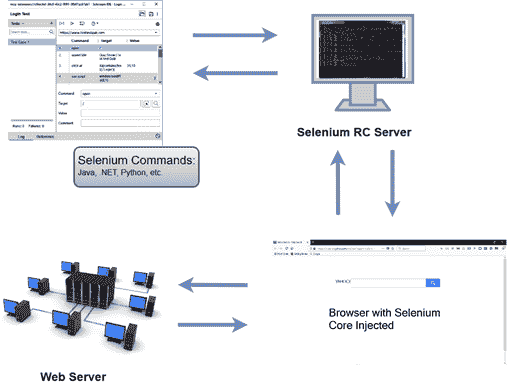
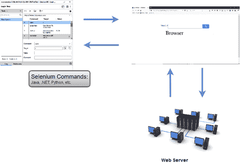

# Selenium网络驱动程序 Vs Selenium RC

> 原文：<https://www.javatpoint.com/selenium-webdriver-vs-selenium-rc>

Selenium RC 有很多限制，最终导致了 Selenium WebDriver 的开发。

查看Selenium RC 和Selenium网络驱动程序之间的主要区别:

## 1.体系结构

Selenium钢筋混凝土的架构是复杂的，因为它使用一个中间钢筋混凝土服务器与浏览器通信。RC 服务器最初是在运行测试脚本之前安装的，它充当 Selenium 命令和浏览器之间的中介。

当我们在 Selenium RC 中执行测试脚本时，会在内部执行以下操作。

*   服务器将一个名为 **Selenium Core** 的 JavaScript 程序注入浏览器。
*   随后，Selenium Core 将开始从 RC 服务器接收指令(Selenium 命令)。
*   当接收到所有指令后，Selenium Core 将作为 **JavaScript 命令**执行。
*   这些 JavaScript 命令充当浏览器的指令。
*   浏览器将执行 Selenium Core 提供的所有指令，并向服务器返回总体摘要。这个总体总结作为最终结果显示在用户屏幕上。

与 Selenium RC 相比，Selenium 网络驱动程序的体系结构更简单。

浏览器直接由操作系统级控制。在网络驱动程序上运行测试脚本的基本要求是:

*   集成开发环境，支持任何编程语言，如 Java、C#等。
*   执行测试脚本生成的指令的浏览器。

## 2.速度

Selenium WebDriver 的性能比 Selenium RC 更快，因为它直接与浏览器交互，而不使用任何外部代理服务器。另一方面，Selenium RC 使用一个中间 RC 服务器与浏览器通信。

在 Selenium RC 中执行测试脚本比在 WebDriver 中花费更多的时间，因为它使用 JavaScript 命令作为浏览器的指令。

## 3.面向对象的

Selenium WebDriver 是纯面向对象的 API，而 Selenium RC 是不太面向对象的 API。

WebDriver 完全基于面向对象的编程语言，如 Java、C#等。

## 4.测试移动应用

Selenium WebDriver 支持 iOS、windows mobile 和 android 等移动应用的操作系统。另一方面，Selenium RC 不支持移动应用的测试。

## 5.浏览器支持

Selenium WebDriver 还支持无头 HTMLUnit 浏览器(不可见浏览器)。

#### 注意:HTMLUnit 是一个不可见的浏览器，它有助于更快地执行测试，因为它不需要等待页面元素加载。

Selenium RC 不支持无头 HTMLUnit 浏览器，因为它需要一个真正的浏览器来使用。