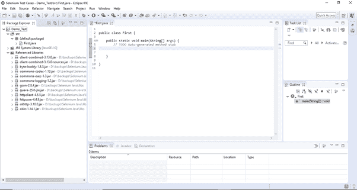
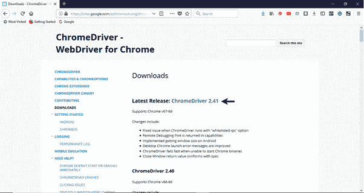
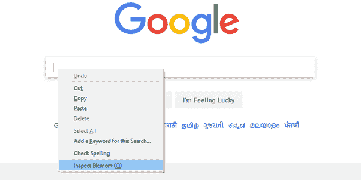
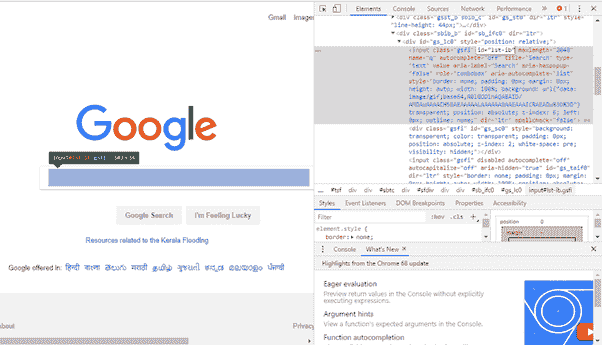
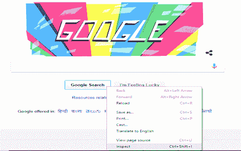
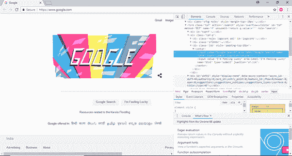
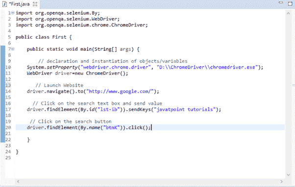
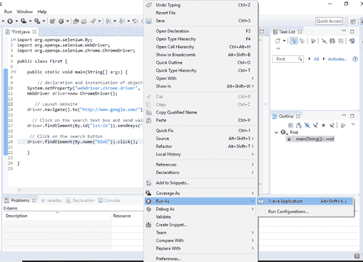
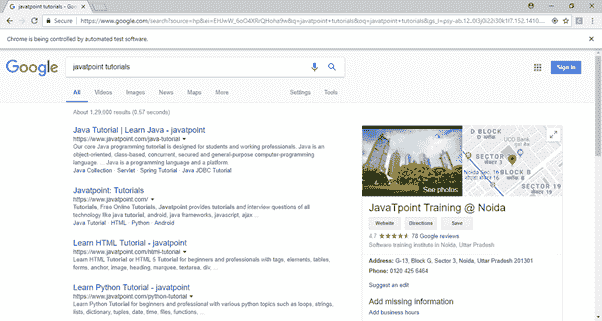

# Selenium网络驱动——第一个测试案例

> 原文：<https://www.javatpoint.com/selenium-webdriver-first-test-case>

在本节中，您将学习如何创建您的第一个Selenium自动化测试脚本。

在这个测试中，我们将自动化以下场景:

*   调用谷歌 Chrome 浏览器。
*   打开网址:[www.google.com](https://www.google.com)
*   点击谷歌搜索文本框。
*   键入值“javatpoint 教程”
*   点击搜索按钮。

我们将一步一步地创建我们的测试用例，以便让您详细了解每个组件。

**第一步**。启动 Eclipse 集成开发环境，并打开我们在本教程的前一部分(配置Selenium网络驱动程序)中创建的项目“演示测试”。我们将在“Demo_Test”测试套件下的“First.class”文件中编写我们的第一个 Selenium 测试脚本。



#### 注意:要调用 Selenium 中的浏览器，我们必须下载特定于该浏览器的可执行文件。例如，Chrome 浏览器使用一个名为 ChromeDriver.exe 的可执行文件来实现网络驱动协议。这些可执行文件在您的系统上启动一个服务器，该服务器又负责在 Selenium 中运行您的测试脚本。

第二步。在浏览器中打开网址:[https://sites . Google . com/a/chromium . org/chrome driver/downloads](https://sites.google.com/a/chromium.org/chromedriver/downloads )。

**第三步。**点击“ChromeDriver 2.41”链接。它会将您重定向到 ChromeDriver 可执行文件的目录。根据您当前使用的操作系统进行下载。



对于 windows，单击“chromedriver_win32.zip”下载。


下载的文件将是压缩格式。将内容解压到一个方便的目录中。


#### 注意:Selenium 开发人员已经为每个浏览器定义了属性，这些属性需要解析相应的可执行文件的位置，以便调用浏览器。例如，为 chrome browser 定义的属性- webdriver.chrome.driver 需要其可执行文件的路径-D:\ Chrome driver \ Chrome driver . exe 才能启动 Chrome browser。


**第四步**。我们需要像谷歌搜索文本框和搜索按钮这样的网络元素的唯一标识，以便通过我们的测试脚本自动执行它们。这些唯一标识与一些命令/语法一起配置，以形成定位器。定位器帮助我们在 web 应用的上下文中定位和识别特定的 web 元素。

查找唯一标识元素的方法包括检查 HTML 代码。

*   在你的 Chrome 浏览器中打开网址:[https://www.google.com](https://www.google.com)。
*   右键单击谷歌搜索文本框，并选择检查元素。



*   它将启动一个窗口，包含测试盒开发中涉及的所有特定代码。



*   选择 id 元素的值，即“lst-ib”。


*   下面给出了在 Selenium 网络驱动程序中通过“id”定位元素的 Java 语法。

    ```

    driver.findElement(By.id (<element ID>))

    ```

*   下面是在我们的测试脚本中定位谷歌搜索文本框的完整代码。

    ```

    driver.findElement(By.id ("lst-ib"))

    ```

*   现在，右键单击谷歌搜索按钮，并选择检查元素。



*   它将启动一个窗口，包含谷歌搜索按钮开发中涉及的所有特定代码。



*   选择**名称**元素的值，即“btnK”。


*   下面给出了在 Selenium 网络驱动程序中通过“名称”定位元素的 Java 语法。

    ```

    driver.findElement(By.name (<element name>))

    ```

*   下面是在我们的测试脚本中定位谷歌搜索按钮的完整代码。

    ```

    driver.findElement(By.name ("btnK"))

    ```

**第五步**。现在是时候编码了。我们为每个代码块嵌入了注释，以清楚地解释这些步骤。

```

import org.openqa.selenium.By;
import org.openqa.selenium.WebDriver;
import org.openqa.selenium.chrome.ChromeDriver;

public class First {

	public static void main(String[] args) {

	// declaration and instantiation of objects/variables
	System.setProperty("webdriver.chrome.driver", "D:\\ChromeDriver\\chromedriver.exe");
	WebDriver driver=new ChromeDriver();

// Launch website
	driver.navigate().to("http://www.google.com/");

	// Click on the search text box and send value
	driver.findElement(By.id("lst-ib")).sendKeys("javatpoint tutorials");

	// Click on the search button
	driver.findElement(By.name("btnK")).click();

	}

}

```

Eclipse 代码窗口如下所示:



**第六步**。右键单击 Eclipse 代码并选择**运行为> Java 应用**。



**第七步**。上述测试脚本的输出将在谷歌浏览器中显示。



## 守则的解释

### 导入包/语句

在 java 中，import 语句用于导入另一个包中的类。简单地说，import 关键字用于将内置和用户定义的包导入到 java 源文件中。

1.  **org . open QA . selenium . WebDriver**-引用实例化新的网页浏览器所需的 WebDriver 界面。
2.  **org . open QA . selenium . chrome . ChromeDriver**-引用 Chrome driver 类，该类是将 Chrome 特定的驱动程序实例化到由 WebDriver 类实例化的浏览器上所必需的。

### 实例化对象和变量

驱动程序对象通过以下方式实例化:

```

WebDriver driver=new ChromeDriver();

```

### 启动网站

要启动一个新网站，我们使用导航()。WebDriver 中的 to()方法。

```

driver.navigate().to("http://www.google.com/");

```

### 单击一个元素

在网络驱动程序中，用户交互是通过定位器的使用来实现的，我们将在本教程的后续部分讨论定位器。目前，下面的代码实例用于定位和解析特定 web 元素中的值。

```

driver.findElement(By.id("lst-ib")).sendKeys("javatpoint tutorials");

```