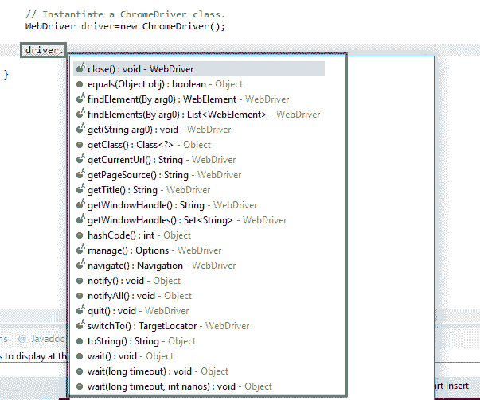
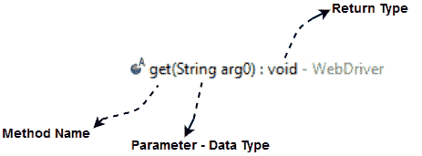
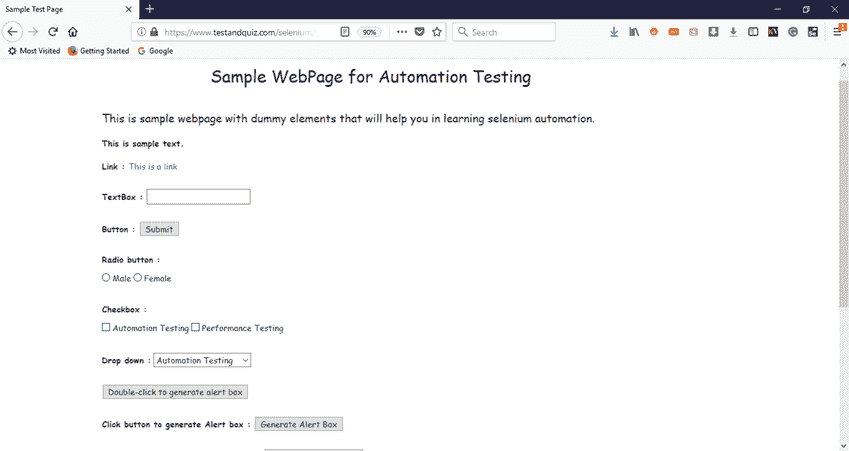

# Selenium网络驱动程序-命令

> 原文：<https://www.javatpoint.com/selenium-webdriver-commands>

正如我们在前面的 IDE 部分所讨论的，Selenium 命令是用于运行 Selenium 测试的一组命令。

在 Selenium WebDriver 中，我们有一组完全不同的命令来执行不同的操作。由于我们在 Java 中使用 Selenium WebDriver，所以命令只是用 Java 语言编写的**方法**。

#### 注意:java 方法是组合在一起执行特定操作的语句的集合。

在详细介绍 Selenium WebDriver 提供的命令之前，我们坚持让您先了解一下 Java 编程语言中的 Java OOPs(面向对象编程)概念。您也可以参考我们在 [Java 教程](java-tutorial)中提供的 [Java OOPs 概念](java-oops-concepts)部分。

现在，问题出现了，我们如何访问网络驱动程序提供的方法。

到目前为止，我们已经成功地在 Selenium 网络驱动程序中创建了我们的第一个测试脚本。因此，查看 Webdriver 提供的方法的一种可能的方法是打开加载了 Selenium Webdriver jar 文件的 Eclipse IDE，为 WebDriver 创建一个驱动程序对象，然后按下圆点键。它将向您展示网络驱动程序提供的所有可能的方法。



让我们从 Eclipse 显示的建议中考虑一个例子，以理解网络驱动程序提供的方法的语法。



### 方法名

要访问任何类的任何方法，我们需要创建一个类的对象，然后该对象的所有公共方法都会出现。

### 参数

参数是传递给方法以执行特定操作的参数。

### 返回类型

方法可以返回值，也可以不返回值(void)。如果在方法之后提到了 void，则意味着该方法没有返回值。如果它正在返回一个值，那么它必须显示该值的类型，例如 **getTitle(): String** 。

现在，我们将讨论网络驱动程序提供的各种命令。Selenium 网络驱动程序提供的命令可以大致分为以下几类:

1.  [浏览器命令](selenium-webdriver-browser-commands)
2.  [导航命令](selenium-webdriver-navigation-commands)
3.  [网络元素命令](selenium-webdriver-webelement-commands)

下面给出了网络驱动程序中一些最常用的 Selenium 命令:

### 1.获取网页

获取网页有两种方法:

*   使用获取方法

```

driver.get("www.javatpoint.com")

```

*   使用导航方法

```

driver.navigate().to("https://javatpoint.com/selenium-tutorial");

```

### 2.定位表单并发送用户输入

```

driver.findElement(By.id("lst-ib")).sendKeys("javatpoint tutorials");

```

### 3.清除用户输入

clear()方法用于清除文本框中的用户输入。

```

driver.findElement(By.name("q")).clear();

```

### 4.通过任何 web 元素获取数据

有时，我们需要获取通过 web 元素编写的文本来执行一些断言和调试。我们使用 getText()方法来获取写在任何 web 元素上的数据。

```

driver.findElement(By.id("element567")).getText();

```

### 5.执行点击事件

click()方法用于对任何 web 元素执行单击操作。

```

driver.findElement(By.id("btnK")).click();

```

### 6.在浏览器历史中向后导航

```

driver.navigate().back();

```

### 7.在浏览器历史中向前导航

```

driver.navigate().forward();

```

### 8.刷新/重新加载网页

```

driver.navigate().refresh();

```

### 9.关闭浏览器

```

driver.close();

```

### 10.关闭浏览器和其他所有与驱动程序相关的窗口

```

driver.quit();

```

### 11.在窗口之间移动

```

driver.switchTo().window("windowName");

```

### 13.在帧之间移动

```

driver.switchTo().frame("frameName");

```

### 14.拖放

拖放操作是使用操作类执行的。

```

WebElement element = driver.findElement(By.name("source"));
WebElement target = driver.findElement(By.name("target"));

(new Actions(driver)).dragAndDrop(element, target).perform();

```

让我们考虑一个示例测试脚本，它将涵盖大多数常用的网络驱动程序命令。

出于我们的测试目的，我们在以下网址下使用了一个虚拟网页:

[https://www.testandquiz.com/selenium/testing.html](https://www.testandquiz.com/selenium/testing.html)

网页的默认界面如下所示:



您也可以在Selenium测试练习中使用这个虚拟网页。

首先，您需要为您愿意在其上自动执行测试场景的浏览器下载浏览器驱动程序。在本教程的前面几节中，我们已经讨论了 Selenium 测试脚本在不同浏览器上的执行。

对于这个测试，我们使用火狐 Gecko 驱动程序在火狐浏览器上自动化我们的测试场景。

下面是带有嵌入注释的示例测试脚本。

```

import org.openqa.selenium.By;
import org.openqa.selenium.WebDriver;
import org.openqa.selenium.firefox.FirefoxDriver;
import org.openqa.selenium.remote.DesiredCapabilities;
import org.openqa.selenium.support.ui.Select;

public class Second {

	public static void main(String[] args) {

		  // System Property for Gecko Driver 
	System.setProperty("webdriver.gecko.driver","D:\\GeckoDriver\\geckodriver.exe" );

		 // Initialize Gecko Driver using Desired Capabilities Class
		DesiredCapabilities capabilities = DesiredCapabilities.firefox();
		capabilities.setCapability("marionette",true);
		WebDriver driver= new FirefoxDriver(capabilities);

		// Launch Website
	 driver.navigate().to("https://www.testandquiz.com/selenium/testing.html");

	    // Fetch the text "This is sample text." and print it on console
	    // Use the class name of the div to locate it and then fetch text using getText() method
	 String sampleText = driver.findElement(By.className("col-md-12")).getText();
	 System.out.println(sampleText);

	      // Use the linkText locator method to find the link and perform click using click() method
	 driver.findElement(By.linkText("This is a link")).click();

	      // Click on the textbox and send value
	 driver.findElement(By.id("fname")).sendKeys("JavaTpoint");

	 	// Clear the text written in the textbox
	 driver.findElement(By.id("fname")).clear();

	 	// Click on the Submit button using click() command
	 driver.findElement(By.id("idOfButton")).click();

		// Locate the radio button by id and check it using click() function
	 driver.findElement(By.id("male")).click();

		// Locate the checkbox by cssSelector and check it using click() function
	 driver.findElement(By.cssSelector("input.Automation")).click();

		// Use Select class for selecting value from dropdown
	Select dropdown = new Select(driver.findElement(By.id("testingDropdown")));
	dropdown.selectByVisibleText("Automation Testing");

		// Close the Browser
	         driver.close();

	}

}

```