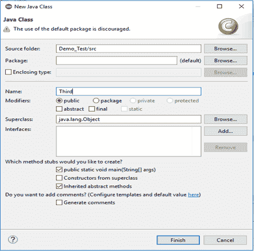
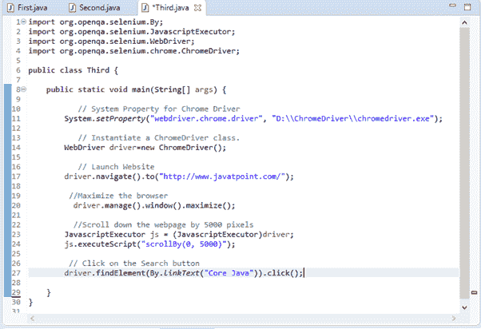
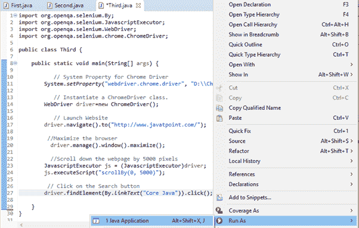

# Selenium网络驱动——在浏览器上运行测试

> 原文：<https://www.javatpoint.com/selenium-webdriver-running-test-on-chrome-browser>

在本节中，您将学习如何在 Chrome 浏览器上运行Selenium测试脚本。

Chrome 浏览器使用名为**ChromeDriver.exe**的可执行文件来实现网络驱动协议。这个可执行文件在您的系统上启动一个服务器，该服务器负责在 Selenium 中运行您的测试脚本。

让我们考虑一个测试案例，在这个案例中，我们将尝试在谷歌浏览器中自动化以下场景。

*   启动 Chrome 浏览器。
*   最大化浏览器。
*   打开网址:[www.javatpoint.com](https://www.javatpoint.com/)
*   向下滚动浏览网页
*   单击“Java 技术”部分的“核心 Java”链接。

我们将在同一个测试套件(Demo_Test)中创建第三个测试用例。

**第一步**。右键单击“src”文件夹，从新建>类创建一个新的类文件。

给出你的班级名称为“第三”，并点击“完成”按钮。




第二步。在浏览器中打开网址:[https://sites . Google . com/a/chromium . org/chrome driver/downloads](https://sites.google.com/a/chromium.org/chromedriver/downloads)。

**第三步**。点击“ChromeDriver 2.41”链接。它会将您重定向到 ChromeDriver 可执行文件的目录。根据您当前使用的操作系统进行下载。


对于 windows，单击“chromedriver_win32.zip”下载。


下载的文件将是压缩格式。将内容解压到一个方便的目录中。


**第四步**。将系统属性“webdriver.chrome.driver”设置为 ChromeDriver 文件的路径，并实例化一个 ChromeDriver 类。

下面是一个示例代码。

```

// System Property for Chrome Driver 
	System.setProperty("webdriver.chrome.driver","D:\\ChromeDriver\\chromedriver.exe");

       // Instantiate a ChromeDriver class. 	
	WebDriver driver=new ChromeDriver();

```

**第五步**。现在是时候编码了。我们为每个代码块嵌入了注释，以清楚地解释这些步骤。

```

import org.openqa.selenium.By;
import org.openqa.selenium.JavascriptExecutor;
import org.openqa.selenium.WebDriver;
import org.openqa.selenium.chrome.ChromeDriver;

public class Third {

	public static void main(String[] args) {

		   // System Property for Chrome Driver 
		System.setProperty("webdriver.chrome.driver", "D:\\ChromeDriver\\chromedriver.exe");

	         // Instantiate a ChromeDriver class. 	
		WebDriver driver=new ChromeDriver();

		   // Launch Website
		driver.navigate().to("http://www.javatpoint.com/");

		 //Maximize the browser
	      driver.manage().window().maximize();

		  //Scroll down the webpage by 5000 pixels
		JavascriptExecutor js = (JavascriptExecutor)driver;
		js.executeScript("scrollBy(0, 5000)"); 

		 // Click on the Search button
		driver.findElement(By.linkText("Core Java")).click();	

	}

}

```

Eclipse 代码窗口如下所示:



**第六步**。右键单击 Eclipse 代码并选择**运行为> Java 应用**。



**第六步**。上述测试脚本的输出将显示在 Chrome 浏览器中。

