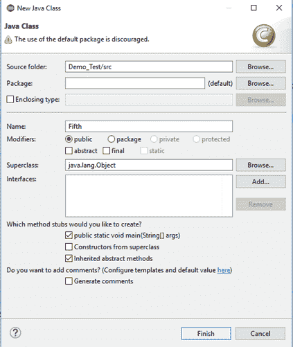
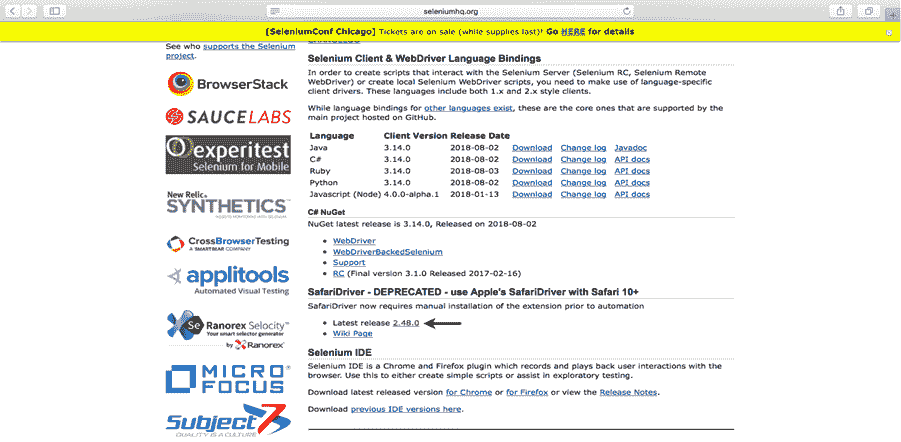
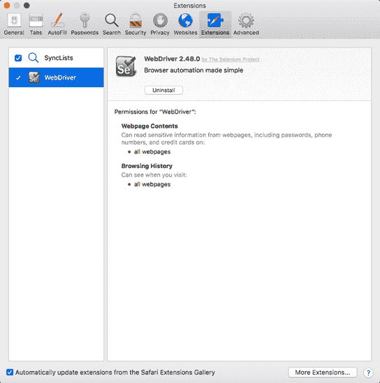
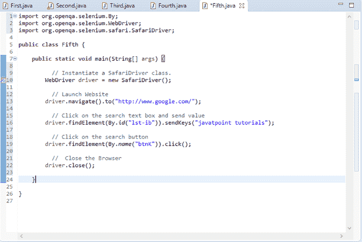
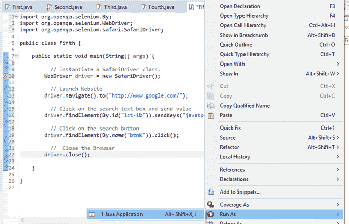

# Selenium WebDriver——在 Safari 浏览器上运行测试

> 原文：<https://www.javatpoint.com/selenium-webdriver-running-test-on-safari-browser>

在本节中，我们将学习如何在 Safari 浏览器上运行我们的 Selenium 测试脚本。

Safari 浏览器使用 SafariDriver 实现了 WebDriver 协议。SafariDriver 是您在 Selenium 和 Safari 浏览器中的测试之间的链接。SafariDriver 已经实现为 safari 浏览器中的插件，这提供了客户端和服务器机器的完美匹配，其中 SafariDriverServer 充当服务器，Selenium-Java/Language 绑定充当客户端。

#### 注意:以前 SafariDriver 在 windows 机器上支持 safari 浏览器，但最近苹果决定取消对 Windows 的支持，然后在 safari 上执行就变成了 Mac 机器的工作。同样，我们需要安装 safari 浏览器的 mac 机。

让我们考虑一个测试案例，在这个案例中，我们将尝试在 Safari 浏览器中自动化以下场景。

*   启动 Safari 浏览器。
*   打开网址:[www.google.com](https://www.google.com)
*   键入值“javatpoint 教程”
*   点击搜索按钮。
*   关闭浏览器

我们将在同一个测试套件(Demo_Test)中创建第五个测试用例。

**第一步**。右键单击“src”文件夹，从新建>类创建一个新的类文件。给出你的班级名字作为“第五名”，然后点击“完成”按钮。

 

**第二步**。在您的 Safari 浏览器中打开网址:[https://www.seleniumhq.org/download/](https://www.seleniumhq.org/download/)。它会指引你到 Selenium 官方网站的 ***【下载】*** 页面。向下滚动网页，找到 SafariDriver。

**第三步**。点击*“最新版本”*选项下载最新版本的 SafariDriver。



**第四步**。双击下载的文件。


这将在您的 Safari 浏览器扩展窗口上启动一个弹出框。单击“信任”按钮，在您的 Safari 浏览器中配置 WebDriver。




**第五步**。重新启动浏览器。

在编写测试脚本之前，让我们首先了解如何在 Selenium 中初始化 SafariDriver。Safari 浏览器由 **org.openqa.selenium.safari 包**中名为 **SafariDriver** 的类来表示。我们所要做的就是创建一个 SafariDriver 类的实例。

下面是一个示例代码:

```

WebDriver driver = new SafariDriver();

```

**第六步**。现在，是时候编码了。我们为每个代码块嵌入了注释，以清楚地解释这些步骤。

```

import org.openqa.selenium.By;
import org.openqa.selenium.WebDriver;
import org.openqa.selenium.safari.SafariDriver;

public class Fifth {

	public static void main(String[] args) {

		  // Instantiate a SafariDriver class. 	
		WebDriver driver = new SafariDriver();

		  // Launch Website
		driver.navigate().to("http://www.google.com/");

		  // Click on the search text box and send value
		driver.findElement(By.id("lst-ib")).sendKeys("javatpoint tutorials");

		  // Click on the search button
		driver.findElement(By.name("btnK")).click();

		  // Close the Browser
		driver.close();

	}

```

Eclipse 代码窗口如下所示:



**第七步**。右键单击 Eclipse 代码并选择**运行为> Java 应用**。



执行后，上述测试脚本将启动 Safari 浏览器，并自动执行所有测试场景。