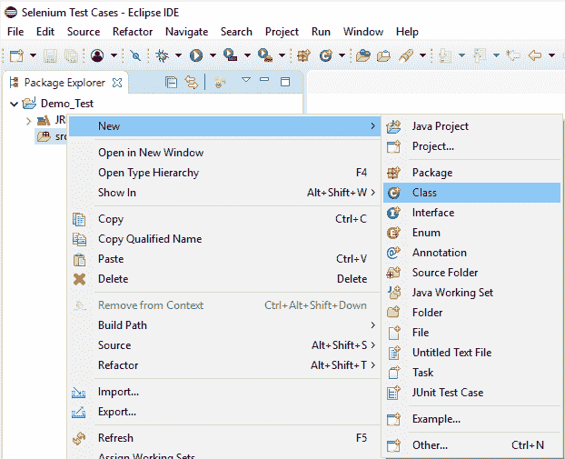
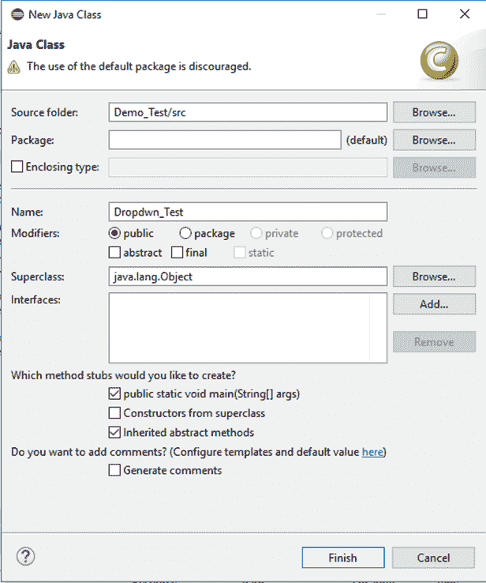
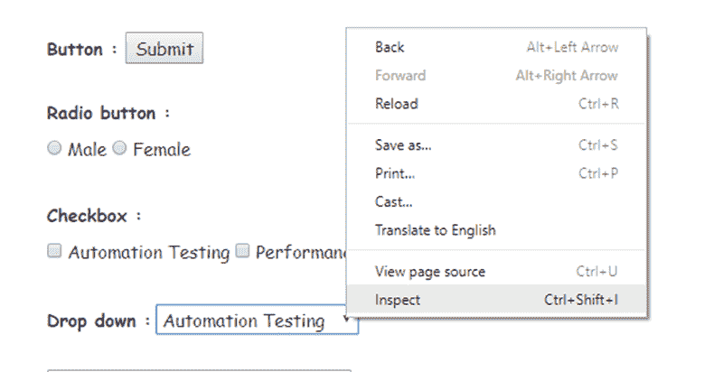
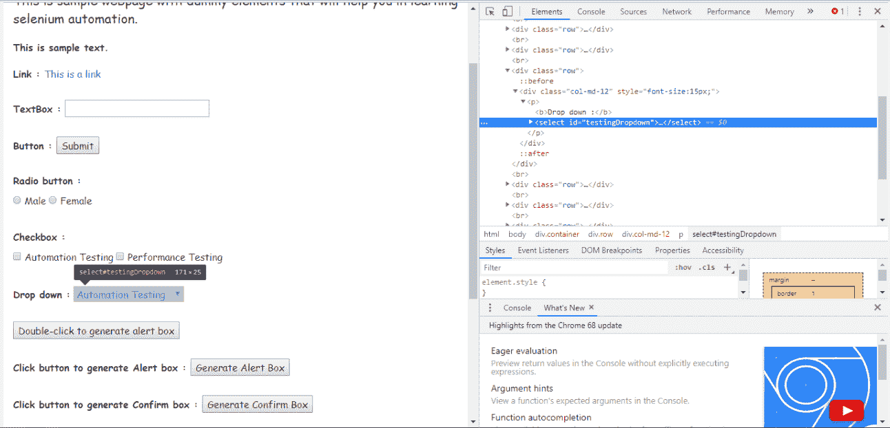
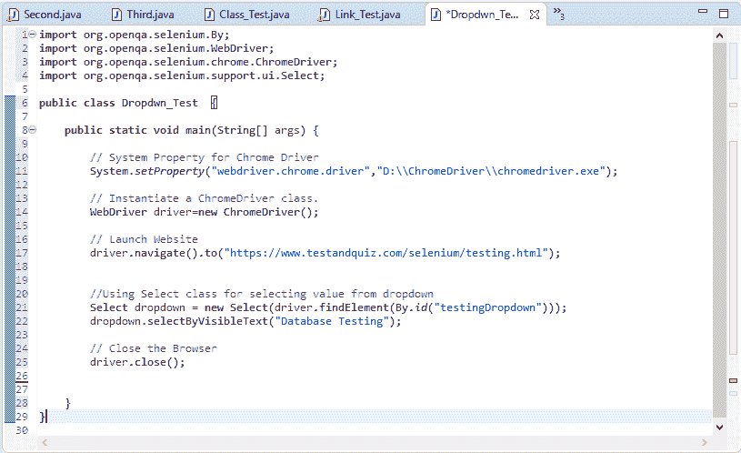

# 硒网络驱动程序-处理下拉菜单

> 原文：<https://www.javatpoint.com/selenium-webdriver-handling-drop-downs>

在本节中，您将学习如何在 Selenium 网络驱动程序中处理下拉列表。

在继续本节之前，让我们先了解一些在 Selenium 网络驱动程序中处理下拉列表的基础知识。

### 在硒网络驱动程序中选择

Selenium 网络驱动程序中的“选择”类用于在下拉列表中选择和取消选择选项。选择类型的对象可以通过将下拉式网络元素作为参数传递给其构造函数来初始化。

```

WebElement testDropDown = driver.findElement(By.id("testingDropdown"));
Select dropdown = new Select(testDropDown);

```

**如何从下拉菜单中选择一个选项？**

WebDriver 提供了三种从下拉菜单中选择选项的方法。

**1。selectByIndex** -用于根据其索引选择一个选项，从 0 开始。

```

dropdown.selectByIndex(5);

```

**2。选择值** -用于根据选项的‘值’属性选择选项。

```

dropdown.selectByValue("Database");

```

**3。selectByVisibleText** -用于根据选项上的文本选择一个选项。

```

dropdown.selectByVisibleText("Database Testing");

```

让我们考虑一个测试案例，其中我们将自动化以下场景:

*   调用谷歌浏览器
*   打开网址:[https://www.testandquiz.com/selenium/testing.html](https://www.testandquiz.com/selenium/testing.html)
*   从下拉菜单中选择“数据库测试”选项
*   关闭浏览器

我们将逐步创建我们的测试用例，以便让您完全理解如何在网络驱动程序中处理下拉列表。

**第一步**。启动 Eclipse IDE 并打开现有的测试套件“Demo_Test”，它是我们在本教程的前几节中创建的。

**第二步**。右键单击“src”文件夹，从新建>类创建一个新的类文件。



给出你的班级名称为“Dropdwn_Test”，点击“完成”按钮。



**第三步**。让我们进入编码领域。

*   要调用谷歌 Chrome 浏览器，我们需要下载 ChromeDriver.exe 文件，并将系统属性[“在 Chrome 浏览器上运行测试”](selenium-webdriver-running-test-on-chrome-browser)设置为您的 ChromeDriver.exe 文件的路径。我们已经在本教程的前几节讨论过这个问题。您也可以参考“在 Chrome 浏览器上运行测试”来了解如何下载和设置 Chrome 驱动程序的系统属性。

下面是为 Chrome 驱动程序设置系统属性的示例代码:

```

// System Property for Chrome Driver 
System.setProperty("webdriver.chrome.driver","D:\\ChromeDriver\\chromedriver.exe");

```

*   之后，我们必须使用 Chrome driver 类初始化 Chrome 驱动程序。

下面是使用 Chrome driver 类初始化 Chrome 驱动程序的示例代码。

```

         // Instantiate a ChromeDriver class. 	
	WebDriver driver=new ChromeDriver();

```

结合上述两个代码块，我们将获得启动谷歌浏览器的代码片段。

```

     	// System Property for Chrome Driver 
System.setProperty("webdriver.chrome.driver","D:\\ChromeDriver\\chromedriver.exe");
    	// Instantiate a ChromeDriver class. 	
	WebDriver driver=new ChromeDriver();

```

*   之后，我们需要编写代码来自动化我们的第二个测试场景(导航到所需的网址)。

以下是导航到所需网址的示例代码:

```

// Launch Website
driver.navigate().to("https://www.testandquiz.com/selenium/testing.html");

```

到目前为止，完整的代码如下所示:

```

import org.openqa.selenium.WebDriver;
import org.openqa.selenium.chrome.ChromeDriver;

public class Partial_Link {

	public static void main(String[] args) {

        // System Property for Chrome Driver 
System.setProperty("webdriver.chrome.driver","D:\\ChromeDriver\\chromedriver.exe");

      	// Instantiate a ChromeDriver class. 	
	WebDriver driver=new ChromeDriver();

      	// Launch Website
driver.navigate().to("https://www.testandquiz.com/selenium/testing.html"); 

	}

}

```

**第四步**。现在我们将尝试通过检查下拉菜单的 HTML 代码来定位它。

按照下面给出的步骤在示例网页上找到下拉菜单。

*   打开网址:[https://www.testandquiz.com/selenium/testing.html](https://www.testandquiz.com/selenium/testing.html)
*   右键单击示例网页上的下拉菜单，然后选择检查元素



*   它将启动一个窗口，包含下拉菜单开发中涉及的所有特定代码。



*   记下它的 id 属性。


**第五步**。为了自动化第三个测试场景，我们需要编写代码，从下拉菜单中选择“数据库测试”选项。

下面是示例代码，以便:

```

//Using Select class for selecting value from dropdown
Select dropdown = new Select(driver.findElement(By.id("testingDropdown")));
dropdown.selectByVisibleText("Database Testing");

Thus, our final test script will look something like this:
import org.openqa.selenium.By;
import org.openqa.selenium.WebDriver;
import org.openqa.selenium.chrome.ChromeDriver;
import org.openqa.selenium.support.ui.Select;

public class Dropdwn_Test  {

	public static void main(String[] args) {

       // System Property for Chrome Driver 
		System.setProperty("webdriver.chrome.driver","D:\\ChromeDriver\\chromedriver.exe");

      	// Instantiate a ChromeDriver class. 	
		WebDriver driver=new ChromeDriver();

      	// Launch Website
		driver.navigate().to("https://www.testandquiz.com/selenium/testing.html"); 

//Using Select class for selecting value from dropdown

Select dropdown = new Select(driver.findElement(By.id("testingDropdown")));
dropdown.selectByVisibleText("Database Testing");

	// Close the Browser
	    driver.close();

    }
}

```

下面的截图显示了我们测试脚本的 Eclipse 窗口。



**第六步。**右键单击 Eclipse 代码，选择**运行方式> Java 应用程序**。


执行后，上述测试脚本将启动 Chrome 浏览器，并自动执行所有测试场景。