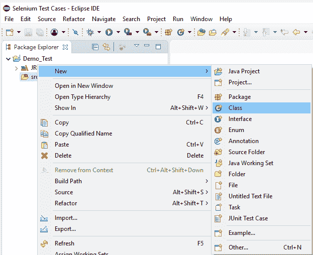
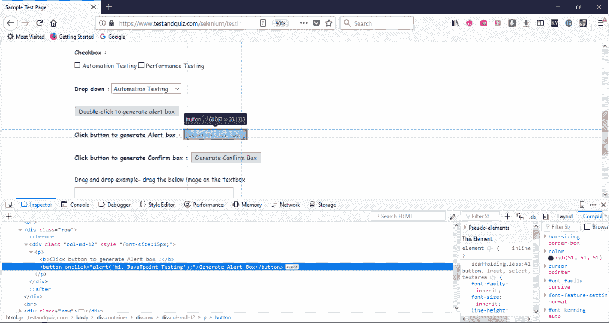
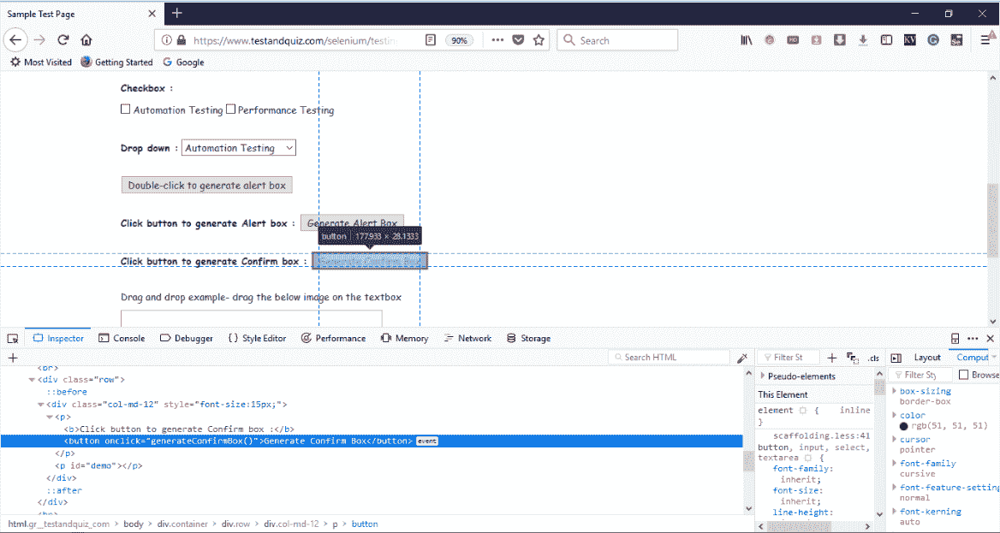

# Selenium网络驱动程序-处理警报

> 原文：<https://www.javatpoint.com/selenium-webdriver-handling-alerts>

在本节中，您将学习如何在 Selenium 网络驱动程序中处理警报。

Selenium 网络驱动程序根据警报类型提供了三种接受和拒绝警报的方法。

### 1.作废驳回()

该方法用于点击警报的“取消”按钮。

**语法:**

```

driver.switchTo().alert().dismiss();

```

### 2.无效接受()

该方法用于点击警报的“确定”按钮。

**语法:**

```

driver.switchTo().alert().accept();

```

### 3\. 字符串获取文本（）

此方法用于捕获警报消息。

**语法:**

```

driver.switchTo().alert().getText();	

```

### 4 . void sendkeys(string stringtossed)

此方法用于向警报框发送一些数据。

**语法:**

```

driver.switchTo().alert().sendKeys("Text");

```

让我们考虑一个测试案例，其中我们将自动化以下场景:

*   调用火狐浏览器
*   打开网址:[https://www.testandquiz.com/selenium/testing.html](https://www.testandquiz.com/selenium/testing.html)
*   点击“生成警告框”按钮
*   点击“生成确认框”按钮
*   关闭浏览器

我们将逐步创建我们的测试用例，以便让您完全理解如何在网络驱动程序中处理警报。

**第一步**。启动 Eclipse IDE 并打开现有的测试套件“Demo_Test”，它是我们在本教程的前几节中创建的。

**第二步**。右键单击“src”文件夹，从**新建>类**创建一个新的类文件。



将您的班级名称命名为“alert_test”，然后单击“完成”按钮。


**第三步**。让我们进入编码领域。

*   要调用火狐浏览器，我们需要下载 Gecko 驱动，并为 Gecko 驱动设置系统属性。我们已经在本教程的前几节讨论过这个问题。可以参考[“火狐浏览器上运行测试”](selenium-webdriver-running-test-on-firefox-browser-gecko-driver)了解火狐驱动程序如何下载和设置 System 属性。

下面是为 Gecko 驱动程序设置系统属性的示例代码:

```

 	 // System Property for Gecko Driver 
	System.setProperty("webdriver.gecko.driver","D:\\GeckoDriver\\geckodriver.exe" );

```

*   之后，我们必须使用期望能力类初始化壁虎驱动程序。

下面是使用 DesiredCapabilities 类初始化 gecko 驱动程序的示例代码。

```

  // Initialize Gecko Driver using Desired Capabilities Class
		DesiredCapabilities capabilities = DesiredCapabilities.firefox();
		capabilities.setCapability("marionette",true);
	WebDriver driver= new FirefoxDriver(capabilities);

```

结合以上两个代码块，我们将获得启动 Firefox 浏览器的代码片段。

```

	  // System Property for Gecko Driver 
	System.setProperty("webdriver.gecko.driver","D:\\GeckoDriver\\geckodriver.exe" );

	 // Initialize Gecko Driver using Desired Capabilities Class
	DesiredCapabilities capabilities = DesiredCapabilities.firefox();
	capabilities.setCapability("marionette",true);
	WebDriver driver= new FirefoxDriver(capabilities);

```

*   之后，我们需要编写代码来自动化我们的第二个测试场景(导航到所需的 URL)

以下是导航到所需网址的示例代码:

```

// Launch Website
driver.navigate().to("https://www.testandquiz.com/selenium/testing.html"); 

```

到目前为止，完整的代码如下所示:

```

import org.openqa.selenium.WebDriver;
import org.openqa.selenium.firefox.FirefoxDriver;
import org.openqa.selenium.remote.DesiredCapabilities;

public class alert_test {

	public static void main(String[] args) {

	// System Property for Gecko Driver 
		System.setProperty("webdriver.gecko.driver","D:\\GeckoDriver\\geckodriver.exe" );

	// Initialize Gecko Driver using Desired Capabilities Class
DesiredCapabilities capabilities = DesiredCapabilities.firefox();
			capabilities.setCapability("marionette",true);
			WebDriver driver= new FirefoxDriver(capabilities);

      // Launch Website
driver.navigate().to("https://www.testandquiz.com/selenium/testing.html"); 

	}

}

```

**第四步**。现在，我们将尝试定位“生成警报框”和“生成确认框”，以便执行警报处理操作。正如我们所知，定位一个元素需要检查它的 HTML 代码。

按照下面给出的步骤在示例网页上找到下拉菜单。

*   打开网址:[https://www.testandquiz.com/selenium/testing.html](https://www.testandquiz.com/selenium/testing.html)
*   右键单击“生成警告框”按钮，并选择检查元素。


*   它将启动一个窗口，包含“生成警报框”按钮开发中涉及的所有特定代码。



*   记下其链接文本，即“生成警告框”


同样，我们将检查“生成确认框”按钮。



*   记下其链接文本，即“生成确认框”


**第五步。**

为了自动化我们的第三和第四个测试场景，我们需要编写点击并接受**生成警报框**以及点击并接受生成确认框的代码。

下面给出了自动化我们的第三和第四个测试场景的代码片段。

```

//Handling alert boxes
	//Click on generate alert button
driver.findElement(By.linkText("Generate Alert Box")).click();

	//Using Alert class to first switch to or focus to the alert box
Alert alert = driver.switchTo().alert();

	//Using accept() method to accep the alert box
	alert.accept();

	//Handling confirm box
	//Click on Generate Confirm Box
driver.findElement(By.linkText("Generate Confirm Box")).click();

	Alert confirmBox = driver.switchTo().alert();

	//Using dismiss() command to dismiss the confirm box
	//Similarly accept can be used to accept the confirm box
	confirmBox.dismiss();

```

因此，我们的最终测试脚本将如下所示:

```

import org.openqa.selenium.By;
import org.openqa.selenium.WebDriver;
import org.openqa.selenium.firefox.FirefoxDriver;
import org.openqa.selenium.remote.DesiredCapabilities;
import org.openqa.selenium.Alert;
public class alert_test {

	public static void main(String[] args) {

		// System Property for Gecko Driver 
		System.setProperty("webdriver.gecko.driver","D:\\GeckoDriver\\geckodriver.exe" );

		// Initialize Gecko Driver using Desired Capabilities Class
			DesiredCapabilities capabilities = DesiredCapabilities.firefox();
			capabilities.setCapability("marionette",true);
			WebDriver driver= new FirefoxDriver(capabilities);

		// Launch Website
		driver.navigate().to("https://www.testandquiz.com/selenium/testing.html"); 

		//Handling alert boxes
		//Click on generate alert button
		driver.findElement(By.linkText("Generate Alert Box")).click();

		//Using Alert class to first switch to or focus to the alert box
		Alert alert = (Alert) driver.switchTo().alert();

		//Using accept() method to accept the alert box
		alert.accept();

		//Handling confirm box
		//Click on Generate Confirm Box
		driver.findElement(By.linkText("Generate Confirm Box")).click();

		Alert confirmBox = (Alert) driver.switchTo().alert();

		//Using dismiss() command to dismiss the confirm box
		//Similarly accept can be used to accept the confirm box
		((Alert) confirmBox).dismiss();

	}

}

```

执行后，上述测试脚本将启动火狐浏览器，并自动执行所有测试场景。