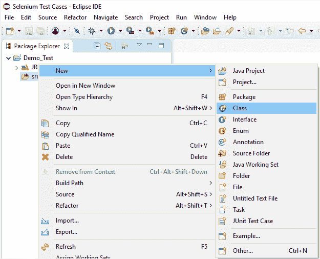

# 硒网络驱动程序-滚动网页

> 原文：<https://www.javatpoint.com/selenium-webdriver-scrolling-web-page>

在本节中，您将学习如何向下或向上滚动以显示网页上的附加信息。

让我们考虑一个测试案例，其中我们将自动化以下场景:

*   调用 Firefox 浏览器
*   打开网址:[www.javatpoint.com](www.javatpoint.com)
*   向下滚动网页以显示“Java 技术”部分

我们将逐步创建我们的测试用例，以便让您完全理解如何使用 JavaScript 的“scrollBy”方法滚动网页。

**第一步**。启动 Eclipse IDE 并打开现有的测试套件“Demo_Test”，它是我们在本教程的前几节中创建的。

**第二步**。右键单击“src”文件夹，从**新建>类**创建一个新的类文件。



给出你的班级名称为“滚动测试”，点击“完成”按钮。


**第三步**。让我们进入编码领域。

*   要调用火狐浏览器，我们需要下载 Gecko 驱动，并为 Gecko 驱动设置系统属性。我们已经在本教程的前几节讨论过这个问题。可以参考[“火狐浏览器上运行测试”](selenium-webdriver-running-test-on-firefox-browser-gecko-driver)了解火狐驱动程序如何下载和设置 System 属性。

下面是为 Gecko 驱动程序设置系统属性的示例代码:

```

 	 // System Property for Gecko Driver 
	System.setProperty("webdriver.gecko.driver","D:\\GeckoDriver\\geckodriver.exe" );

```

*   之后，我们必须使用期望能力类初始化壁虎驱动程序。

下面是使用 DesiredCapabilities 类初始化 gecko 驱动程序的示例代码。

```

  // Initialize Gecko Driver using Desired Capabilities Class
		DesiredCapabilities capabilities = DesiredCapabilities.firefox();
		capabilities.setCapability("marionette",true);
	WebDriver driver= new FirefoxDriver(capabilities);

```

结合以上两个代码块，我们将获得启动 Firefox 浏览器的代码片段。

```

	  // System Property for Gecko Driver 
	System.setProperty("webdriver.gecko.driver","D:\\GeckoDriver\\geckodriver.exe" );

	 // Initialize Gecko Driver using Desired Capabilities Class
	DesiredCapabilities capabilities = DesiredCapabilities.firefox();
	capabilities.setCapability("marionette",true);
	WebDriver driver= new FirefoxDriver(capabilities);

```

*   之后，我们需要编写代码来自动化我们的第二个测试场景(导航到所需的 URL)

以下是导航到所需网址的示例代码:

```

       // Launch Website
driver.navigate().to("www.javatpoint.com"); 

```

到目前为止，完整的代码如下所示:

```

import org.openqa.selenium.WebDriver;
import org.openqa.selenium.firefox.FirefoxDriver;
import org.openqa.selenium.remote.DesiredCapabilities;

public class Scroll_Test {

	public static void main(String[] args) {

	// System Property for Gecko Driver 
		System.setProperty("webdriver.gecko.driver","D:\\GeckoDriver\\geckodriver.exe" );

	// Initialize Gecko Driver using Desired Capabilities Class
DesiredCapabilities capabilities = DesiredCapabilities.firefox();
			capabilities.setCapability("marionette",true);
			WebDriver driver= new FirefoxDriver(capabilities);

      // Launch Website
driver.navigate().to("www.javatpoint.com"); 

	}

}

```

**第四步。**为了自动化我们的第三个测试场景，我们需要编写向下滚动网页的代码，以便显示 JavaTpoint 网站上的 Java 技术部分。

要滚动网页，我们必须使用 JavaScript 的 scrollBy 方法。为了执行 JavaScript 方法，我们将使用 JavaScript 执行器。scrollBy 方法采用两个参数，水平和垂直滚动的像素各一个。

```

JavascriptExecutor js = (JavascriptExecutor)driver;
js.executeScript("scrollBy(0, 4500)");

```

因此，我们的最终测试脚本将如下所示:

```

import org.openqa.selenium.JavascriptExecutor;
import org.openqa.selenium.WebDriver;
import org.openqa.selenium.firefox.FirefoxDriver;
import org.openqa.selenium.remote.DesiredCapabilities;

public class Scroll_Test {

	public static void main(String[] args) {

		// System Property for Gecko Driver 
		System.setProperty("webdriver.gecko.driver","D:\\GeckoDriver\\geckodriver.exe" );

		// Initialize Gecko Driver using Desired Capabilities Class
			DesiredCapabilities capabilities = DesiredCapabilities.firefox();
			capabilities.setCapability("marionette",true);
			WebDriver driver= new FirefoxDriver(capabilities);

		// Launch Website
		driver.navigate().to("www.javatpoint.com"); 

		//Scroll down the webpage by 4500 pixels
		JavascriptExecutor js = (JavascriptExecutor)driver;
		js.executeScript("scrollBy(0, 4500)");

	}
}

```

执行后，上述测试脚本将启动火狐浏览器，并自动执行所有测试场景。