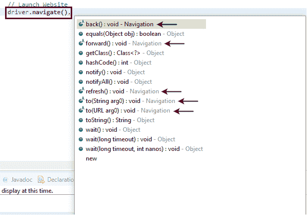
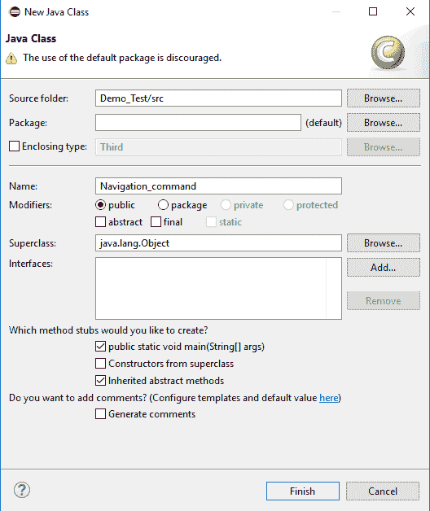

# Selenium WebDriver-导航命令

> 原文：<https://www.javatpoint.com/selenium-webdriver-navigation-commands>

WebDriver提供了一些基本的浏览器导航命令，允许浏览器在浏览器历史中向前或向后移动。

就像 WebDriver 提供的浏览器方法一样，我们也可以通过在 Eclipse 面板中键入 driver.navigate()来访问 WebDriver 提供的导航方法。



#### 注意:以“导航”为关键字的方法被声明为导航命令。

给出了Selenium WebDriver最常用的一些浏览器导航命令。

### 1.导航到命令

**方法:**

```

to(String arg0) : void

```

在 WebDriver 中，这个方法在现有的浏览器窗口中加载一个新的网页。接受*字符串*作为参数，返回 *void* 。

加载/导航新网页的相应命令可以写成:

```

driver.navigate().to("www.javatpoint.com");

```

#### 注意:get 命令(driver . get(URL)；)位于浏览器命令部分，其功能与导航命令相同

```

(driver.navigate().to("www.javatpoint.com"); 

```

### 2.前进命令

**方法:**

```

to(String arg0) : void

```

在WebDriver中，这种方法使网络浏览器能够在现有的浏览器窗口中点击**前进**按钮。它既不接受任何东西，也不返回任何东西。

将浏览器历史记录向前推进一页的相应命令可以写成:

```

 driver.navigate().forward();

```

### 3.后台命令

**方法:**

```

back() : void

```

在WebDriver中，这种方法使网络浏览器能够在现有的浏览器窗口中点击**后退**按钮。它既不接受任何东西，也不返回任何东西。

将您带回浏览器历史记录一页的相应命令可以写成:

```

driver.navigate().back();

```

### 4.刷新命令

**方法:**

```

refresh() : void

```

在 WebDriver 中，此方法在现有浏览器窗口中刷新/重新加载当前网页。它既不接受任何东西，也不返回任何东西。

将您带回浏览器历史记录一页的相应命令可以写成:

```

driver.navigate().refresh();

```

让我们考虑一个示例测试脚本，它将涵盖WebDriver提供的大多数导航命令。

**在这个示例测试中，我们将自动化以下测试场景:**

*   调用火狐浏览器
*   导航至网址:[https://www.testandquiz.com/selenium/testing.html](https://www.testandquiz.com/selenium/testing.html)
*   点击“这是一个链接”链接(该链接会将您重定向到 javaTpoint 网站)
*   使用**返回**命令返回主页
*   再次使用**前进**命令返回 javaTpoint 网站
*   再次使用**至**命令返回主页
*   使用**刷新**命令刷新浏览器
*   关闭浏览器

出于我们的测试目的，我们在以下网址下使用了一个虚拟网页:

[https://www.testandquiz.com/selenium/testing.html](https://www.testandquiz.com/selenium/testing.html)(你也可以在你的Selenium测试实践中使用这个虚拟网页)

*   **第一步。**启动 Eclipse IDE，打开我们在WebDriver教程[WebDriver安装](selenium-webdriver-installation)部分创建的现有测试套件“Demo_Test”。
*   **第二步。**右键点击“src”文件夹，从**新建>类**新建一个类文件。


给出你的班级名称作为“导航命令”，点击“完成”按钮。



**第三步。**让我们进入编码领域。

*   要调用火狐浏览器，我们需要下载 Gecko 驱动，并为 Gecko 驱动设置系统属性。

下面是为 Gecko 驱动程序设置系统属性的示例代码:

```

// System Property for Gecko Driver System.setProperty("webdriver.gecko.driver","D:\\GeckoDriver\\geckodriver.exe" )

```

之后，我们必须使用期望能力类初始化壁虎驱动程序。

下面是使用 DesiredCapabilities 类初始化 gecko 驱动程序的示例代码。

```

// Initialize Gecko Driver using Desired Capabilities Class
DesiredCapabilities capabilities = DesiredCapabilities.firefox();
capabilities.setCapability("marionette",true);
WebDriver driver= new FirefoxDriver(capabilities);

```

结合以上两个代码块，我们将获得启动 Firefox 浏览器的代码片段。

```

// System Property for Gecko Driver 
System.setProperty("webdriver.gecko.driver","D:\\GeckoDriver\\geckodriver.exe" );

// Initialize Gecko Driver using Desired Capabilities Class
DesiredCapabilities capabilities = DesiredCapabilities.firefox();
capabilities.setCapability("marionette",true);
WebDriver driver= new FirefoxDriver(capabilities);

```

*   之后，我们需要编写代码来自动化我们的第二个测试场景(获得所需的网址)

以下是导航到所需网址的示例代码:

```

//Navigate to the desired URL
driver.navigate().to("https://www.testandquiz.com/selenium/testing.html");

```

*   为了自动化我们的第三个测试场景，首先我们必须在虚拟测试页面上唯一地标识“这是一个链接”链接。

查找唯一标识元素的方法包括检查 HTML 代码。

1.  在火狐浏览器中打开网址:[https://www.testandquiz.com/selenium/testing.html](https://www.testandquiz.com/selenium/testing.html)。
2.  右键单击“这是一个链接”链接文本，并选择“检查元素”。


它将启动一个窗口，包含“这是一个链接”链接开发中涉及的所有特定代码。从检查器文本框中选择链接文本的名称。


通过链接文本唯一标识一个网页元素的 Java 语法如下:

```

driver.findElement(By.linkText () 
```

因此，为了在示例网页上定位链接文本，我们将使用其链接文本的值:

```

driver.findElement(By.linkText ())

```

现在，我们需要编写点击链接文本的代码。

下面是点击链接文本的示例代码。

```

// Click on the Link Text using click() command  driver.findElement(By.linkText("This is a Link")).click();

```

点击后，该链接会将浏览器窗口重定向到 javaTpoint 网站的官方网页。

*   为了自动化第四个测试场景，我们必须恢复第三个测试场景执行的操作。为此，我们将使用**后退**命令撤销点击链接文本时执行的操作。

下面是指向 javaTpoint 网站后返回主页的示例代码。

```

// Go back to Home Page
 driver.navigate().back(); 

```

*   现在，下一个测试场景要求我们再次转到第三个测试场景执行的操作，即窗口将再次指向 javaTpoint 网站。

下面是再次前进到 javaTpoint 网站官方网页的示例代码。

```

// Go forward to Registration page
driver.navigate().forward();

```

*   现在，为了自动化我们的第六个测试场景，我们将需要通过使用 **To 命令**再次导航到虚拟网站的主页。

下面是返回主页的示例代码。

```

// Go back to Home page
driver.navigate().to(appUrl);

```

*   要刷新浏览器窗口，使用**刷新命令**如下:

```

// Refresh browser
driver.navigate().refresh();

```

*   最后，给定的代码片段将终止进程并关闭浏览器。

```

driver.close(); 

```

将上述所有代码块组合在一起，我们将获得执行测试脚本“Navigation_command”所需的源代码。

最终的测试脚本将如下所示:

(我们在每个部分都嵌入了注释，以清楚地解释步骤)

```

import org.openqa.selenium.By;  
import org.openqa.selenium.WebDriver;  
import org.openqa.selenium.firefox.FirefoxDriver;  
import org.openqa.selenium.remote.DesiredCapabilities;  

public class Navigation_command {  

    public static void main(String[] args) {  

    	// System Property for Gecko Driver   
        System.setProperty("webdriver.gecko.driver","D:\\GeckoDriver\\geckodriver.exe" );  

        // Initialize Gecko Driver using Desired Capabilities Class  
        	DesiredCapabilities capabilities = DesiredCapabilities.firefox();  
            capabilities.setCapability("marionette",true);  
            WebDriver driver= new FirefoxDriver(capabilities);  

            // Launch Website  
            driver.navigate().to("https://www.testandquiz.com/selenium/testing.html");   

            //Click on the Link Text using click() command  
            driver.findElement(By.linkText("This is a Link")).click();

            //Go back to Home Page
            driver.navigate().back(); 

            //Go forward to Registration page
            driver.navigate().forward();

            // Go back to Home page
            driver.navigate().to("https://www.testandquiz.com/selenium/testing.html");

            //Refresh browser
            driver.navigate().refresh();

            //Closing browser
            driver.close(); 
    }
}

```

要在 Eclipse 窗口上运行测试脚本，右键单击屏幕，然后单击

**运行方式→ Java 应用**


在执行时，测试脚本将启动火狐浏览器并自动执行所有测试场景。