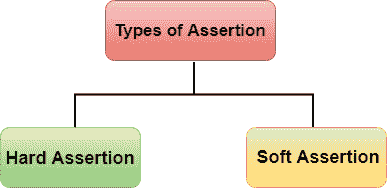

# 断言

> 原文：<https://www.javatpoint.com/selenium-assertions>

断言决定了应用的状态，不管它是否与我们期望的一样。如果断言失败，那么测试用例失败并停止执行。

要在 WebDriver 中使用断言，您需要下载 Testng jar 文件并将其添加到 eclipse 中。从下面给出的链接下载 Testng jar 文件:

[https://mvnrepository.com/artifact/org.testng/testng/6.7](https://mvnrepository.com/artifact/org.testng/testng/6.7)

**断言有两种类型:**

*   硬断言
*   软断言



## 硬断言

硬断言是当测试用例失败时抛出**断言异常**的断言。在硬断言的情况下，您可以通过像 java 异常一样使用 catch 块来处理错误。假设我们在一个套件中有两个测试用例。套件中的第一个测试用例有一个失败的断言，如果我们想要在套件中运行第二个用例，那么我们需要处理断言错误。硬断言包含以下方法:

*   资产质量
*   不等断言
*   AssertTrue
*   AssertFalse
*   断言 Null
*   AssertNotNull

### AssertFalse()

断言验证条件返回的布尔值。如果布尔值为假，则断言通过测试用例，如果布尔值为真，则断言通过异常中止测试用例。AssertFalse()方法的语法如下:

```

Assert.AssertFalse(condition);

```

**我们通过一个例子来了解一下:**

*   **条件为假时**

```

package mypack;
import org.junit.Assert;
import org.openqa.selenium.By;
import org.openqa.selenium.WebDriver;
import org.openqa.selenium.chrome.ChromeDriver;
public class Checkbox_test {

	public static void main(String[] args) {
	// TODO Auto-generated method stub
		System.setProperty("webdriver.chrome.driver","C:\\\\work\\\\chromedriver.exe");
		WebDriver driver = new ChromeDriver();
		driver.navigate().to("https://www.spicejet.com/");
		Assert.assertFalse(driver.findElement(By.cssSelector("input[id*='SeniorCitizenDiscount']")).isSelected());
		System.out.println(driver.findElement(By.cssSelector("input[id*='SeniorCitizenDiscount']")).isSelected());

	}

}

```

在上面的代码中，Assert.assertFalse()包含返回 False 值的条件。因此，它通过了测试用例。

**控制台上的输出**


*   **条件成立时**

```

package mypack;
import org.junit.Assert;
import org.openqa.selenium.By;
import org.openqa.selenium.WebDriver;
import org.openqa.selenium.chrome.ChromeDriver;
public class Checkbox_test {

public static void main(String[] args) 
{
// TODO Auto-generated method stub
System.setProperty("webdriver.chrome.driver","C:\\\\work\\\\chromedriver.exe");
WebDriver driver = new ChromeDriver();
driver.navigate().to("https://www.spicejet.com/");
Assert.assertFalse(true);
System.out.println(driver.findElement(By.cssSelector("input[id*='SeniorCitizenDiscount']")).isSelected());

}}

```

在上面的代码中，Assert.assertFalse()方法包含真实条件。因此，断言失败，这意味着测试用例也失败了。断言失败将异常停止执行。

**控制台上的输出**


### AssertTrue()

断言验证条件返回的布尔值。如果布尔值为真，则断言通过测试用例，如果布尔值为假，则断言通过异常中止测试用例。AssertTrue()方法的语法如下:

```

Assert.AssertTrue(condition);

```

**我们通过一个例子来了解一下。**

```

package mypack;
import org.junit.Assert;
import org.openqa.selenium.By;
import org.openqa.selenium.WebDriver;
import org.openqa.selenium.chrome.ChromeDriver;
public class Checkbox_test 
{

	public static void main(String[] args) 
           {
		// TODO Auto-generated method stub
		System.setProperty("webdriver.chrome.driver","C:\\\\work\\\\chromedriver.exe");
		WebDriver driver = new ChromeDriver();
		driver.navigate().to("https://www.spicejet.com/");
		driver.findElement(By.cssSelector("input[id*='SeniorCitizenDiscount']")).click();
	      Assert.assertTrue(driver.findElement(By.cssSelector("input[id*='SeniorCitizenDiscount']")).isSelected());
System.out.println(driver.findElement(By.cssSelector("input[id*='SeniorCitizenDiscount']")).isSelected());

	}

}

```

在上面的代码中，**driver . find element(by . CSS selector(" input[id * = ' seniorcitizen discount ']")。单击()；**此语句用于选择“老年人”框。在下一条语句中，我们将应用断言来检查测试用例是失败还是通过。Assert.assertTrue()方法中的参数返回真值，因此测试用例通过。

**输出**


**控制台上的输出**


### AssertEquals()

AssertEquals()是一种用于比较实际结果和预期结果的方法。如果实际结果和预期结果相同，那么断言毫无例外地通过，测试用例被标记为“通过”。如果实际的和预期的结果不一样，那么断言失败并出现异常，测试用例被标记为“失败”。AssertEquals()方法的语法如下:

```

Assert.assertEquals(actual,expected);

```

**我们通过一个例子来了解一下。**

*   **当成年人数为 5 人时。**

```

package mypack;
import org.junit.Assert;
import org.openqa.selenium.By;
import org.openqa.selenium.WebDriver;
import org.openqa.selenium.chrome.ChromeDriver;
public class Checkbox_test {
public static void main(String[] args) 
{
  // TODO Auto-generated method stub
System.setProperty("webdriver.chrome.driver","C:\\\\work\\\\chromedriver.exe");
WebDriver driver = new ChromeDriver();
driver.navigate().to("https://www.spicejet.com/"); Assert.assertEquals("5Adult",driver.findElement(By.id("divpaxinfo")).getText());
System.out.println(driver.findElement(By.id("divpaxinfo")).getText());
}}

```


*   **当成人数量不等于 5 时**


**控制台上的输出**


### AssertNotEquals()

与**assertnotequils()**方法的功能相反。AssertNotEquals()是一种用于比较实际结果和预期结果的方法。如果实际结果和预期结果不一样，那么断言毫无例外地通过，测试用例被标记为“通过”。如果实际结果和预期结果都相同，那么断言会因异常而失败，测试用例会被标记为“失败”。AssertNotEquals()方法的语法如下:

```

AssertNotEquals(actual,expected,message);

```

**我们通过一个例子来了解一下。**

*   **当实际字符串不等于预期字符串时。**

```

package mypack;
import org.junit.Assert;
public class Checkbox_test {
public static void main(String[] args) {
		// TODO Auto-generated method stub
		Assert.assertNotEquals("Hello", "How are you");
		System.out.println("Hello...This is javaTpoint");

	}

}

```

在上面的代码中，实际字符串，即 Hello 不等于预期字符串，即你好。因此，断言通过了测试用例。这将执行下一个语句，下一个语句是 **System.out.println(“你好...这是 JavaPoint”)；**。

**输出**


*   **当实际字符串等于预期字符串时。**

```

package mypack;
import org.junit.Assert;
public class Checkbox_test {
public static void main(String[] args) 
{
// TODO Auto-generated method stub
Assert.assertNotEquals("Hello", "Hello");
System.out.println("Hello...This is javaTpoint");
}}

```

**输出**


### 断言 Null()

AssertNull()是一个验证对象是否为 Null 的方法。如果对象为空，那么断言通过测试用例，测试用例被标记为“通过”，如果对象不为空，那么断言中止测试用例，测试用例被标记为“失败”。AssertNull()方法的语法如下:

```

Assert.assertNull(object);

```

**我们通过一个例子来了解一下。**

*   **当一个对象为空时。**

```

package mypack;
import org.junit.Assert;
public class Checkbox_test {

public static void main(String[] args) {

Assert.assertNull(null);
System.out.println("Hello...This is javaTpoint");
}}

```

**输出**


*   **当一个对象不等于空时。**

```

package mypack;
import org.junit.Assert;
public class Checkbox_test {

	public static void main(String[] args) {
		// TODO Auto-generated method stub
   Assert.assertNull(10);
	System.out.println("Hello World");

	}

}

```

**输出**


### AssertNotNull()

AssertNotNull()是一个验证对象是否为 Null 的方法。如果对象不为空，那么断言通过测试用例，测试用例被标记为“通过”，如果对象为空，那么断言中止测试用例，测试用例被标记为“失败”。AssertNotNull()方法的语法如下:

```

Assert.assertNotNull(object);

```

**我们通过一个例子来了解一下。**

*   **当一个对象不为空时。**

```

package mypack;
import org.junit.Assert;
public class Checkbox_test
{
  public static void main(String[] args) {
// TODO Auto-generated method stub
 Assert.assertNotNull(10);
System.out.println("C Language");

}}

```

**输出**


*   **当一个对象为空时。**

```

package mypack;
import org.junit.Assert;
public class Checkbox_test {
public static void main(String[] args) {
		// TODO Auto-generated method stub

		Assert.assertNotNull(null);
		System.out.println("C Language");

	}

}

```

**输出**


## 软断言

到目前为止，我们已经了解了使用 Testng 框架的 WebDriver 中的硬断言。在硬断言中，如果断言失败，那么它将中止测试用例，否则它将继续执行。有时，即使断言失败，我们也希望执行整个脚本。这在硬断言中是不可能的。为了克服这个问题，我们需要在 testng 中使用一个软断言。