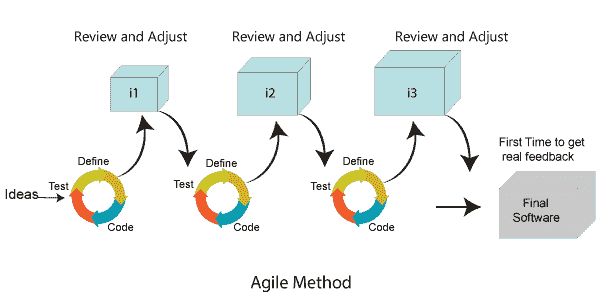
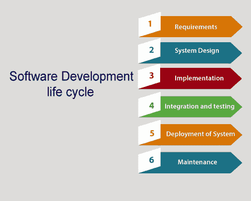

# 敏捷方法的优势

> 原文：<https://www.javatpoint.com/advantage-and-disadvantage-of-agile-methodology>

与传统的瀑布模型或其他模型相比，使用敏捷方法有各种优势。敏捷开发方法和测试实践已经为许多具有积极方面的组织创造了奇迹。它的积极方面不是隐藏的，它在组织中非常明显。

## 敏捷方法的优势

1.  客户满意是快速、持续地开发和交付有用的软件。
2.  客户、开发人员和产品负责人定期互动，以强调而不是强调流程和工具。
3.  产品开发速度快，交付频繁(几周而不是几个月。)
4.  面对面的谈话是最好的交流方式。
5.  它持续关注技术上的卓越和良好的设计。
6.  业务人员和开发人员之间的日常密切合作。
7.  定期适应不断变化的环境。
8.  即使是后期的需求变更也是受欢迎的。

## 敏捷方法的缺点:

1.  它对小型开发项目没有用处。
2.  缺乏必要的设计和文件的强度。
3.  它需要一个专家项目成员在会议中做出重要决定。
4.  与其他开发方法相比，敏捷开发方法的成本略高。
5.  如果项目经理不清楚需求和他/她想要的结果，项目可能会很快偏离轨道。

## 瀑布模型的优势:

1.  这是最容易管理的传统模式之一。由于其传统的开发性质，每个阶段都有特定的可交付成果和审查过程。
2.  它在需求易于理解的小型项目中运行良好。
3.  它有一个更快的产品交付模式。
4.  有详细记录的过程和结果。
5.  易于适应的团队转换方法
6.  这种项目管理方法有利于管理依赖关系。

## 瀑布模型的缺点:

1.  开发大规模项目规模不是一个理想的模式。
2.  它要求在开始时有一个明确的要求；否则，它可能会导致一种不太有效的方法。
3.  很难回到上一阶段进行更改。
4.  一旦开发完成，测试过程就开始了。因此，在项目开发的后期发现错误的可能性很高。因此，修复成本很高。

## 敏捷方法和瀑布模型之间的压缩:

| 敏捷方法 | 瀑布模型 |
| 它遵循增量方法。 | 这是一个连续的设计过程。 |
| 它将项目开发生命周期分为冲刺阶段。 | 软件开发过程分为不同的阶段。 |
| 敏捷方法是一种灵活的方法。 | 瀑布是一种结构化的软件开发方法。 |
| 敏捷是许多不同项目的集合。 | 它作为一个单一的项目完成。 |
| 测试计划在每次冲刺后都会被审核 | 测试计划在完成开发后进行审查。 |
| 测试团队可以毫无问题地参与需求变更阶段。 | 测试很难引发需求的任何变化。 |

* * *