# Bugzilla 教程

> 原文： [https://www.javatpoint.com/bugzilla](https://www.javatpoint.com/bugzilla)

在本教程中，我们将讨论以下主题:

*   [Bugzilla 概述](#Overview)
*   [布奇拉的特点](#Features)
*   [Bugzilla 装置](#Installation)
*   [Bugzilla 的成分](#Components)

## 什么是 Bugzilla？

Bugzilla 是一个 bug 跟踪工具，有助于跟踪与他们的产品相关的问题。

Bugzilla 工具是用 Perl 语言编写的，使用的是 MySQL 数据库。

这是一个错误跟踪工具。但是，它也可以用作测试管理工具，因为它可以与其他测试用例管理工具链接，如质量中心、测试链接等。

它是一个开源工具，也就是说，用户可以免费获得这个工具。

* * *

## 布奇拉的特点

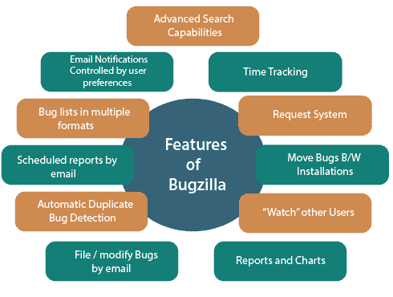

以下是 Bugzilla 的特性:

**高级搜索功能**

Bugzilla 有两种搜索形式:

*   它有类似谷歌的 bug 搜索，使用简单，还可以搜索 bug 的全文。
*   它为您提供了一个非常高级的搜索系统，您可以在其中创建任何您想要的搜索类型，例如基于时间的搜索(例如，您想要查看自过去两天以来优先级已更改的 bug 列表)。

**由用户偏好控制的电子邮件通知**

如果 Bugzilla 中有任何更改，您将收到一封电子邮件，您收到的关于哪个 bug 的通知完全由用户首选项控制。

**ug 多格式列表**

报告和图表当您搜索 bug 时，您可以获得多种格式的 bug 列表，例如 Atom、iCalendor 格式。当您在 Bugzilla 中使用时间跟踪功能时，会使用 iCalendor 格式。Bugzilla 中甚至有更多的格式可用，例如包含所有 bug 详细信息的可打印格式，用于将 bug 列表导入电子表格的 CSV 格式。

**通过电子邮件安排的报告**

Bugzilla 有一个系统，可以向您、用户或组发送您所提到的时间表中指定的搜索结果。

**自动重复 Bug 检测**

当你归档一个新的 bug 时，当你键入 bug 的摘要时，系统会寻找类似的 bug。如果系统发现类似的错误，那么它允许用户将他们自己添加到这些错误之一的抄送列表中，而不是创建一个新的。

**通过电子邮件提交/修改 Bugs】**

您可以向 Bugzilla 发送电子邮件来创建新的 bug 或修改现有的 bug。您甚至可以将文件附加到 Bug 中。

**时间追踪**

Bugzilla 还提供了时间跟踪功能。您可以确定修复一个 bug 需要多少小时，甚至还可以跟踪您需要花在 bug 上的时间。您还可以设置修复 bug 的截止日期。

**请求系统**

请求系统是一种要求其他用户处理 bug 的方式。用户可以同意请求，也可以拒绝请求，Bugzilla 将跟踪答案。

**清除安装之间的 Bugs】**

Bugzilla 能够将 bug 从一个 Bugzilla 安装转移到另一个。在 Bugzilla 中，一个 bug 也可以跨不同版本移动。

**“关注”其他用户**

Bugzilla 允许你观察其他用户。您还将收到用户从 Bugzilla 收到的电子邮件。当一些开发人员休假，然后其他开发人员需要处理这个错误时，这个特性非常有用。

**报告和图表**

Bugzilla 提供了一个高级报告系统。如果你想知道一个 bug 的数据库是什么样子，那么你可以在 X 轴和 Y 轴上创建两个字段。借助搜索条件，您可以限制 bug 的信息。您也可以将这些报告导出为 CSV 格式。

* * *

## Bugzilla 安装

**以下是安装 Bugzilla 的要求:**

*   您需要下载并安装活动的 Perl。
*   下载 Bugzilla
*   安装数据库安装程序
*   Bugzilla 配置
*   配置 Apache

### 登录 Bugzilla

Bugzilla 安装需要这几个软件。但是，有些网站提供 Bugzilla web 应用，[https://bugzilla.mozilla.org/home](https://bugzilla.mozilla.org/home)网站就是其中之一。

*   导航至[https://bugzilla.mozilla.org/home](https://bugzilla.mozilla.org/home)网站。当您点击给定的网址时，屏幕出现，或者我们可以说欢迎页面出现，如下所示:

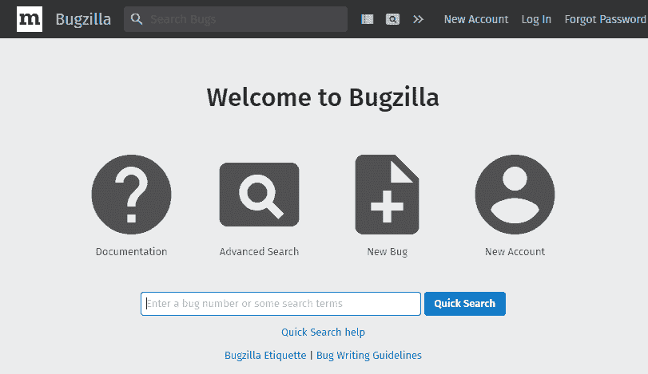

*   如果您已经是现有用户，则可以登录 Bugzilla。如果您是第一个用户，则可以创建一个新帐户。

点击**新账户**创建新用户。

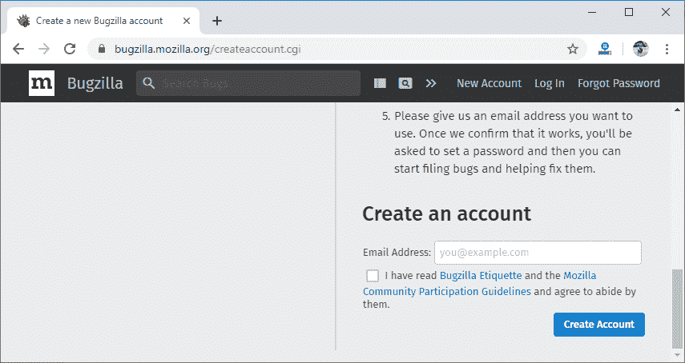

在上面的屏幕中，输入您的电子邮件 id，然后单击创建帐户按钮。单击“创建帐户”按钮后，会向您的电子邮件 id 发送确认邮件。

当您点击发送到您的电子邮件 id 的链接时，将出现 **Bugzilla** 页面，要求重置密码。

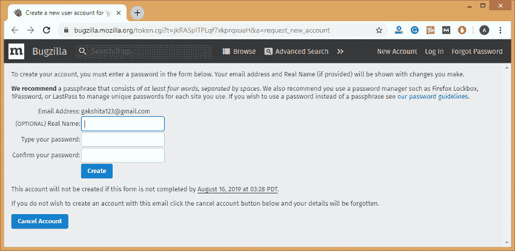

输入姓名和密码后，点击**创建**按钮。

* * *

## 布奇拉的成分

Bugzilla 中提供的一些主要组件:

### 1)新 Bug

**以下是提交 bug 所需的步骤:**

**第一步:**点击**新 Bug** 图标提交新 Bug。

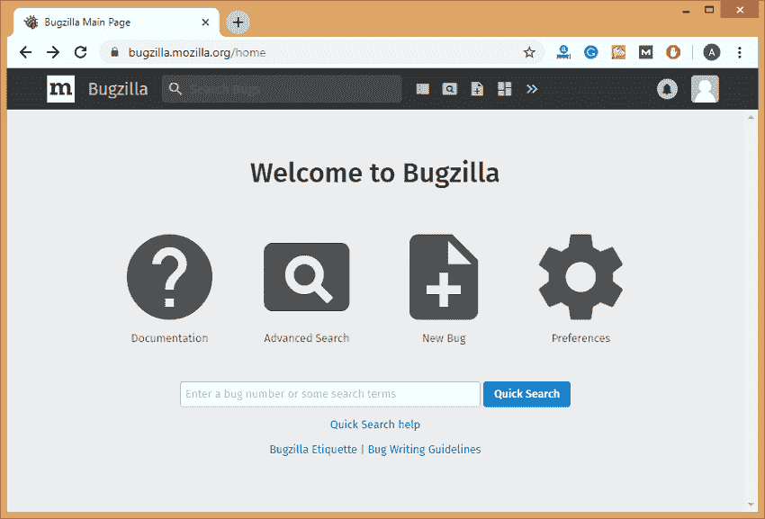

**第二步:**点击新 Bug，你将被重定向到显示所有产品的新页面。

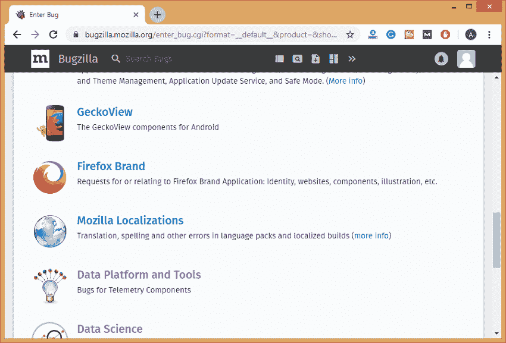

**第三步:**假设我选择产品**数据平台和工具**。当我选择产品时，屏幕出现，如下所示:

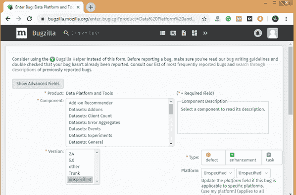 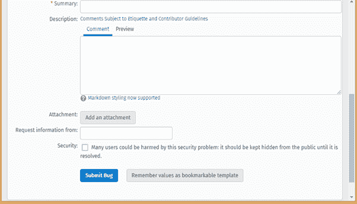

**在上图中，我们需要填写以下字段:**

**产品:**就是你刚才选的一款产品，即**数据平台和工具**。

**组件:**每个产品可以根据其功能分为几个组件。

**版本:**产品的版本决定了检测到 bug 的产品。

**汇总:**用于定义产品的汇总。

**从以下位置请求信息:**

**附件:**文件也可以附加相关 bug。

**描述:**提供一个 bug 的完整描述。

**安全:**你可以勾选安全框，这样这个 bug 就可以对公众隐藏，直到并且除非它被解决。

### 2)搜索

您还可以搜索特定的 bug。

有两种类型的搜索:

*   简单搜索
*   高级搜索

**简单搜索**

**按照步骤搜索 bug:**

**第一步:**点击首页**搜索图标**。

**第二步:**点击搜索图标后，出现如下图所示的屏幕:

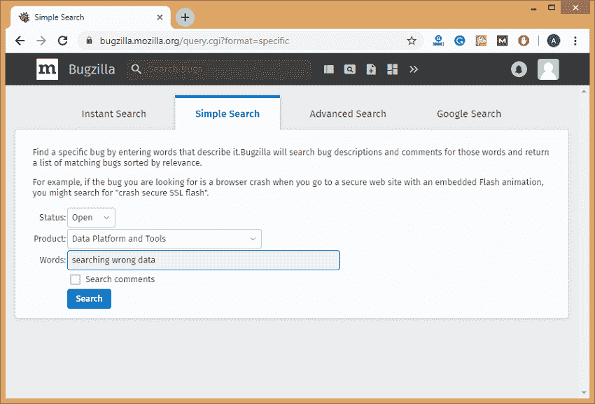

在上面的屏幕中，我们需要输入三个字段，即状态、产品和单词。

**第三步:**点击**搜索**按钮。单击“搜索”按钮后，出现如下所示的错误列表:

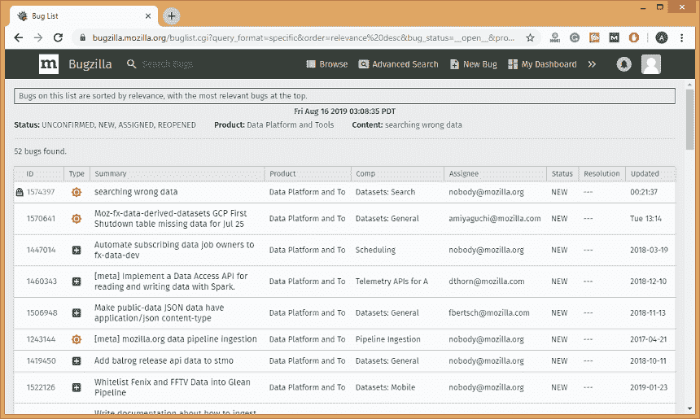

**高级搜索**

**高级搜索需要以下步骤:**

**第一步:**点击**高级搜索**选项。

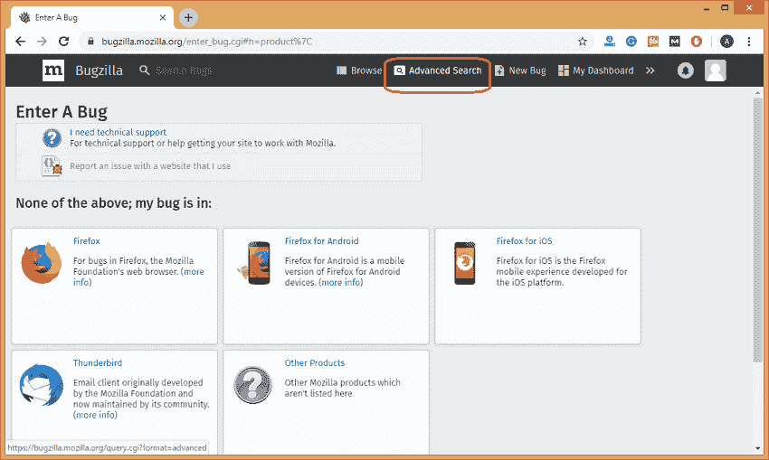

点击**高级搜索**选项，屏幕出现如下所示:

**第二步:**在分类框下选择 bug 的类别，于是我选择了 Client 软件。选择已经创建 bug 的产品，所以我在产品框下选择数据平台和工具。选择 com。在组件部分，我选择了客户端计数。您也可以选择错误的状态和解决方法。

**第三步:**选择所有字段后，点击**搜索**按钮。

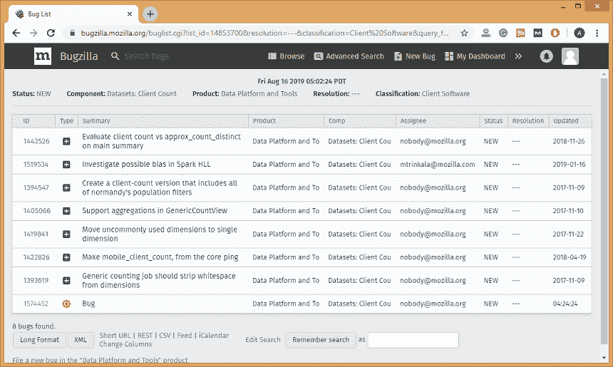

上面的屏幕根据您的搜索显示了错误列表。

### 3)偏好

在 Bugzilla 中使用首选项来根据我们的要求自定义默认设置。

Bugzilla 中的首选项如下所示:

**a)账户信息**

在“帐户首选项”中，您可以更改帐户信息。出于安全目的，您需要首先在密码字段中输入您的当前密码，如果您想更改电子邮件地址，则确认邮件会发送到旧的和新的电子邮件地址，这可以防止帐户劫持。

**以下是帐户首选项所需的步骤:**

**第一步:**点击首页**用户偏好**。

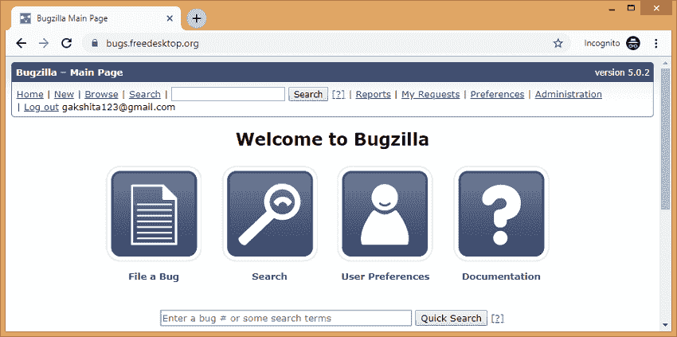

**第二步:**点击下方屏幕显示的**账户信息**标签:

上面的屏幕显示了一些与您的帐户相关的字段，如果您想更改您的密码，那么您需要输入您的当前密码、新密码、真实姓名，如果您想更改您的电子邮件地址，那么请输入您的新电子邮件地址。

**第三步:**填写完所有字段后，点击**提交变更**按钮。

**b)一般偏好**

常规首选项用于自定义 Bugzilla 中的默认设置。我们可以自定义以下设置:

*   当一个新的 bug 被提交时，你可以在发送的邮件的主题行中添加新的。
*   您还可以设置电子邮件中使用的语言。
*   当报告新的错误时，您也可以显示可能的重复。

**以下是自定义默认设置所需的步骤:**

**第一步:**点击首页**用户偏好**。

**第二步:**点击**常规首选项**选项卡。

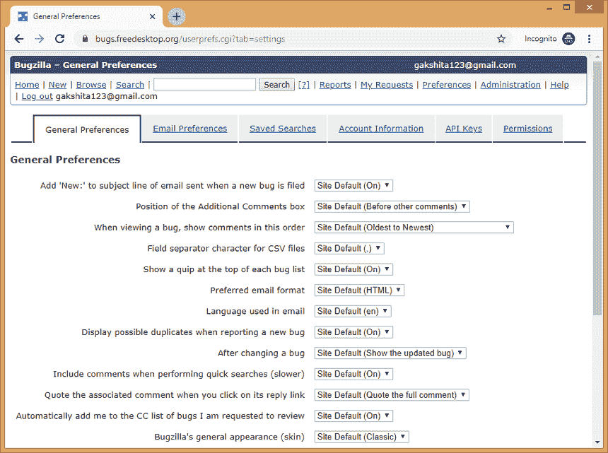

上面的屏幕显示了我们可以自定义的设置数量。

**c)电子邮件首选项**

电子邮件首选项允许您发送某些特定事件的电子邮件通知。它为您提供了对 Bugzilla 应该发送多少电子邮件的完全控制。如果您想接收尽可能多的电子邮件，请点击**启用所有邮件**按钮，如果您不想接收任何来自 Bugzilla 的电子邮件，请点击**禁用所有邮件**按钮。

**以下是电子邮件首选项所需的步骤:**

**第一步:**点击首页**用户偏好**。

**第二步:**点击**邮件首选项**标签。

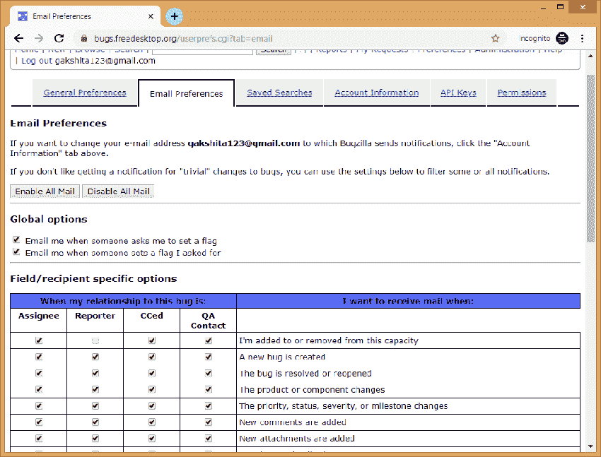

行代表可能发生在 bug 上的事件，而列代表与 bug 的关系。

**受让人:**受让人是被指定对 bug 负责的人。名称/账户字段出现在“**分配给**”字段中。

**记者:**举报 bug 的人。姓名/账户字段存在于“**记者**”字段中。

**CCed:** 表示你在 bug 的 CC 列表上。您的帐户出现在错误的抄送文本中。

**质量保证联系人:**是 X-Bugzilla-Reason 头定义了 bug 的质量保证联系人。

**d)保存的搜索**

在保存的搜索中，您可以运行已创建的保存的搜索，它还允许您共享保存的搜索。您也可以将保存的搜索添加到屏幕的页脚。

**e)权限**

这是一个提供信息的页面，它定义了安装 Bugzilla 的当前权限。

下面给出了完整的许可列表:

用户可以为自己配置哀嚎报告

确认:可以确认错误。

编辑 bug:可以编辑任何 bug 的所有方面。

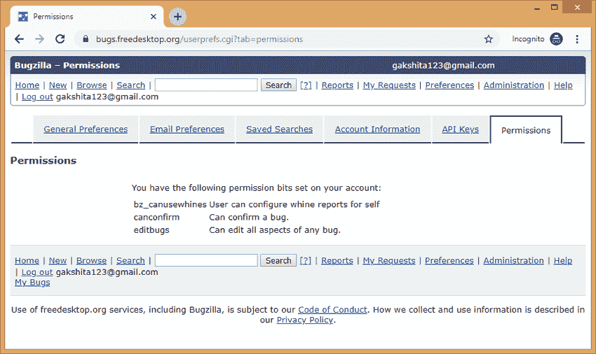

### 4)报告

报告有助于规范 bug 的当前状态。缺陷的目的是查看缺陷的分析、进展和沟通，以及生命周期的当前阶段。缺陷报告在创建错误后也很有用，可以帮助开发人员分析产品的质量。

**Bugzilla 中可以生成三种类型的报告:**

1.  图形报告
2.  表格报告
3.  复制

**图形报告**

图形报告是一组折线图、条形图和饼图。图形报告在许多方面都有帮助，例如，哪个组件的 bug 数量最多，哪个 bug 的优先级最高，等等。

**要生成图形报告，您需要遵循以下步骤:**

**步骤 1:** 登录 Bugzilla 账户。

**第二步:**点击**报告**链接。

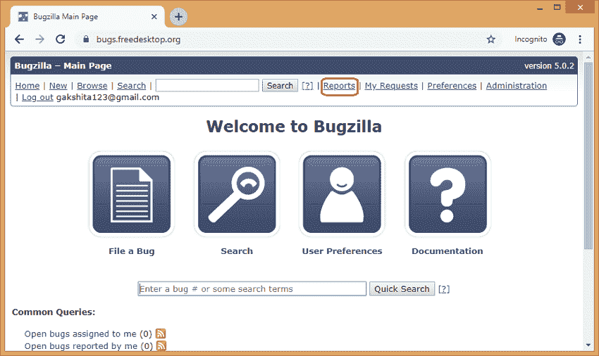

**第三步:**点击**图形报告**链接。

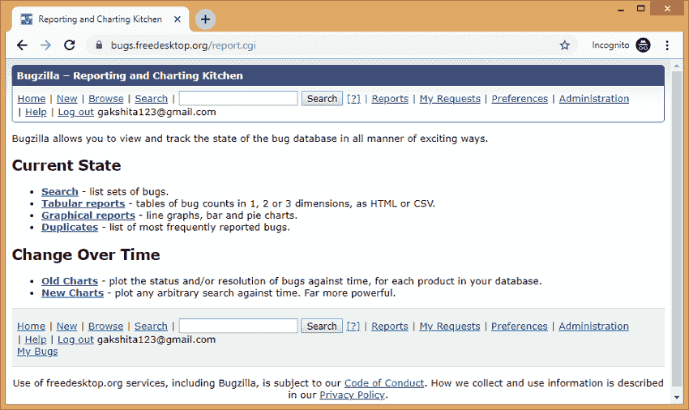

**步骤 4:** 点击图形报告后，出现如下所示的屏幕:

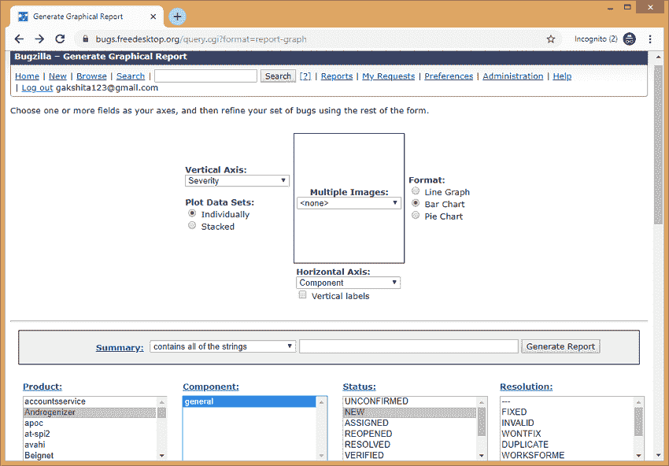

在上面的屏幕中，我们需要首先定义图形的 x 轴、y 轴和格式。假设我选择条形图作为格式，y 轴作为严重性，x 轴作为组件。现在，我们需要描述我们必须创建图形报告的产品和组件。

**条形图**

当 x 轴是组件，y 轴代表严重性时。

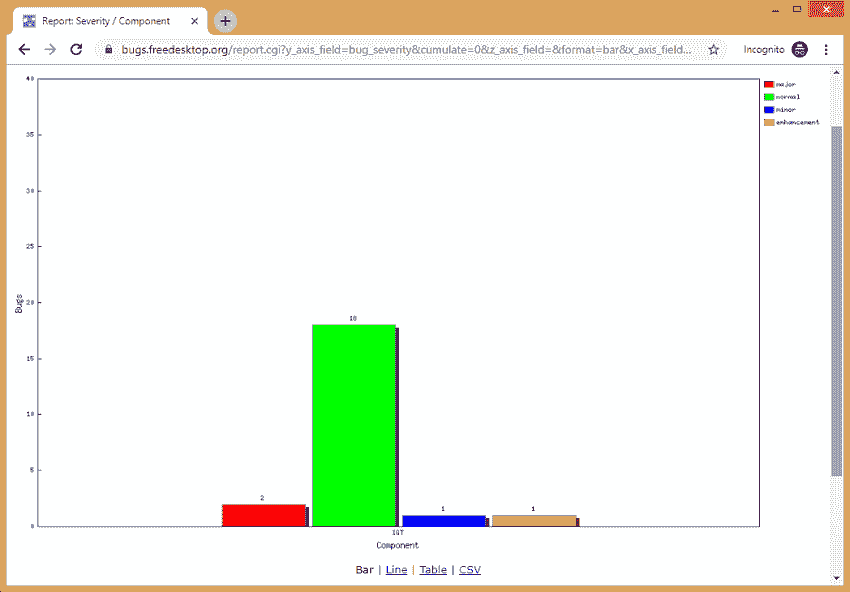

**线图**

当 x 轴是组件，y 轴代表严重性时。

**饼图**

当 x 轴为“受理人”，y 轴为“严重性”时。

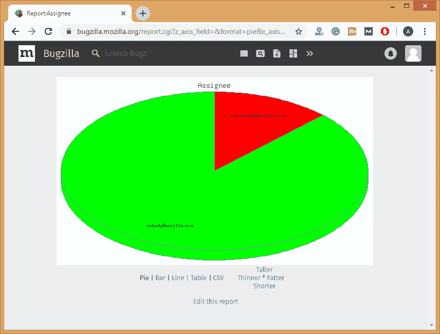

红色部分代表主要严重程度，绿色部分代表正常严重程度。上面的饼图表示分配给 *[【邮件保护】](/cdn-cgi/l/email-protection)* 的 bug 属于严重级别，分配给 *[【邮件保护】](/cdn-cgi/l/email-protection)* 的 bug 属于正常级别。

**表格报告**

表格报告以 HTML 或 CSV 格式生成一维、二维或三维的 bug 计数表。

**以下是生成表格报告所需的步骤:**

**第一步:**点击**报告**部分。

**第二步:**点击**表格报表**，如下图截图所示:

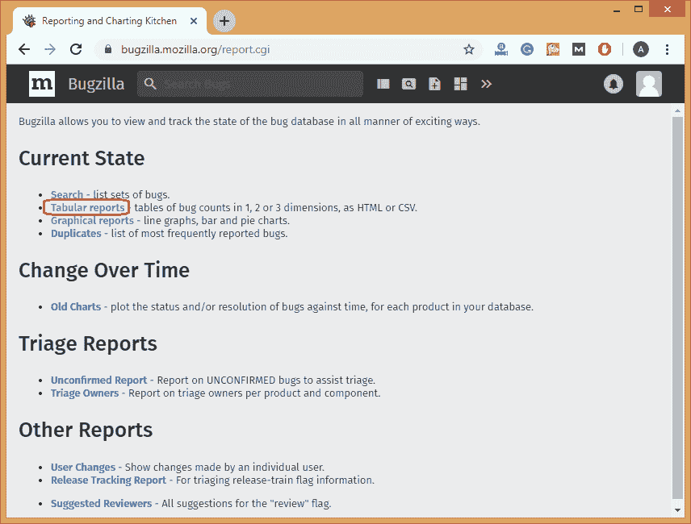

**第三步:**点击**表格报告**，屏幕出现，如下图所示:

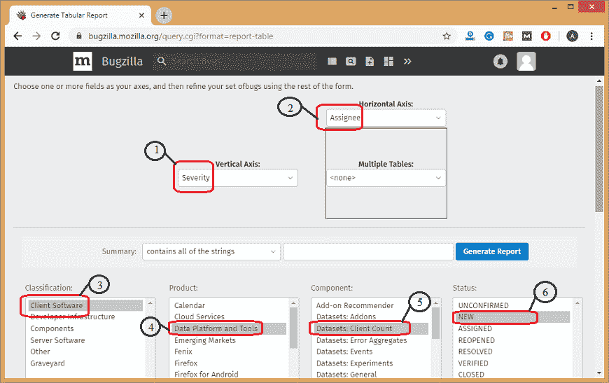

在上面的屏幕中，您需要填写一些必填字段来生成表格报告，如纵轴(y 轴)、横轴(x 轴)和产品详细信息。产品详情为**分类**、产品、组件、状态。在分类下，我选择了客户端软件，在**产品**下，我选择了数据平台和工具。在**组件**下，我选择了客户端计数，在**状态**部分，我选择了新建。我选择了严重性作为纵轴，受让人作为横轴。

**第三步:**填写完所有必填字段后，点击**生成报告**按钮。

**步骤 4:** 下面的屏幕显示了生成的表格报告。

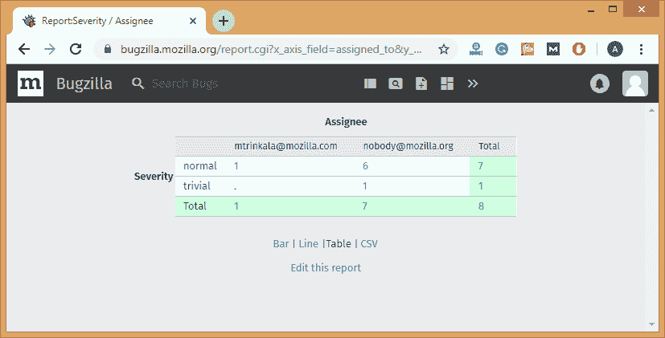

**副本**

在 Bugzilla 中，重复是最常报告的错误。最常报告的 bug 意味着最常看到的开放 bug。重复项包含该字段，即计数直接和间接错误数量的重复计数。这有助于最小化进入 Bugzilla 的重复 bug 的数量。它还帮助质量保证测试人员记录新的缺陷，而不是已经存在的缺陷。它还帮助涉众找到重新打开的 bug 的根本原因。

**如何使用重复列表**

*   查看最常报告的错误。
*   如果你的 bug 列在报告的 bug 列表中，那么点击 bug 编号来确认你已经找到 bug，你也可以在评论中添加额外的信息。
*   如果您的 bug 没有列在 bug 列表中，那么您可以执行以下步骤:
    *   尝试找到已经归档的类似 bug。
    *   如果你的 bug 被发现了，那么你可以在评论中添加额外的信息。
    *   如果你的 bug 没有列在 bug 列表中，那就提交一个新的 bug。

以下是使用重复列表所需的步骤:

**第一步:**点击**报告**。

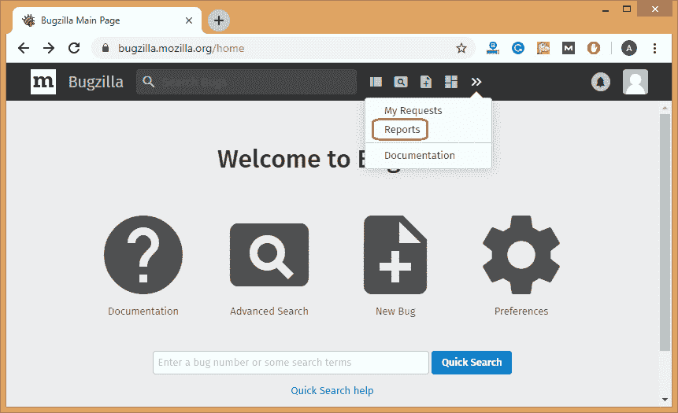

**第二步:**点击**复制**，如下图:

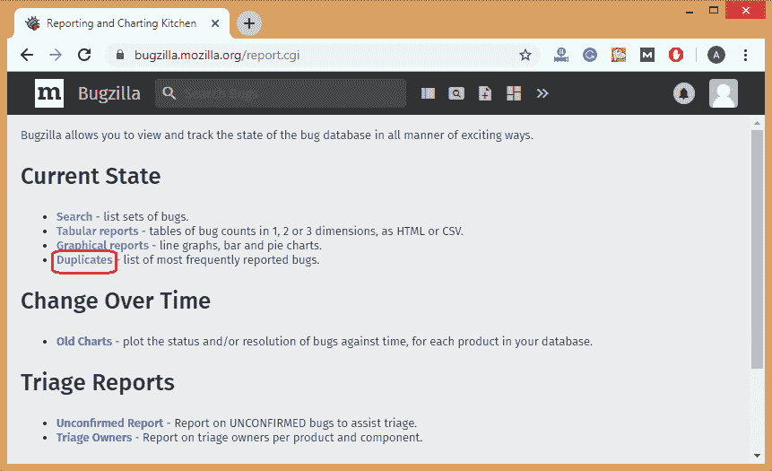

**步骤 3:** 点击复制后，出现如下所示的屏幕:

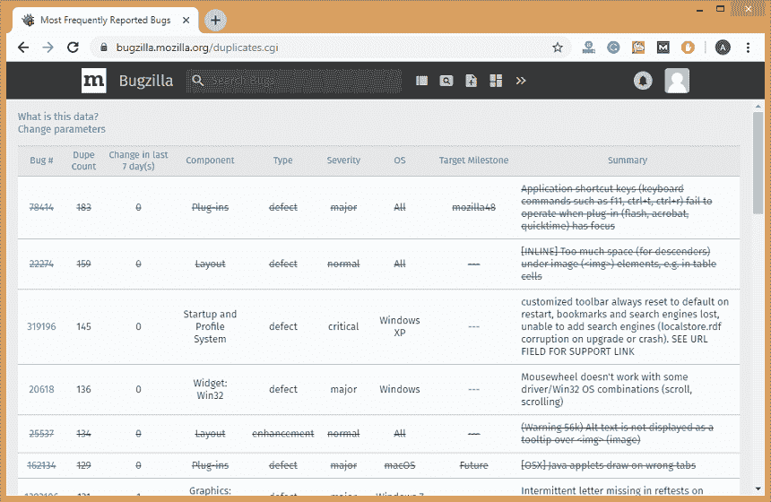

上面的屏幕显示了最常报告的 bug 表。该错误表由一些重要字段组成，如重复计数、组件、严重性、摘要、操作系统。

**更改参数**

我们还可以定制最常报告的 bug 表。以下是用于自定义 bug 表的字段:

*   **限于产品**
    此字段用于过滤掉一些特定的产品或组件。用户可以选择单个产品或多个产品。
*   **排序或限制时，使用**
    它包含两个选项，即整个列表和当前可见列表。
*   **最大行数**
    用户可以提供他/她在单个页面上可以看到的最大缺陷数。
*   **变更栏是最后一个**
    中的变更，在该字段中，用户可以提供他/她可以看到这些天内发生的变更的天数。
*   **只打开 bug**
    这个字段允许你过滤掉那些关闭的 bug

**先改一些参数，然后看 bug 表。**

在上面的屏幕中，我们选择了核心墓地产品，最大行数为 20，并且我们选中了**仅打开 bugs】字段。**

填写完以上所有字段后，点击**更改**按钮。

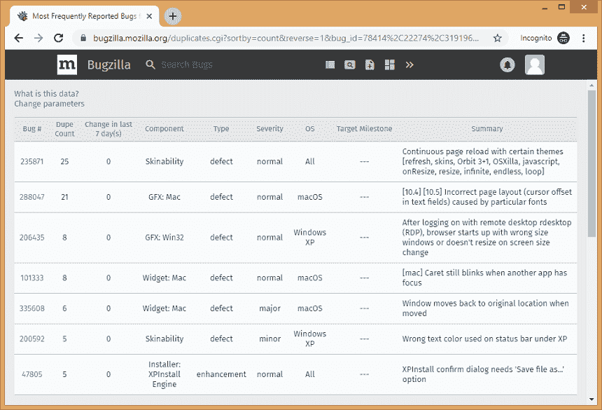

上图显示 bug 表已经根据我们在**变更参数**中输入的数据进行了过滤。

* * *