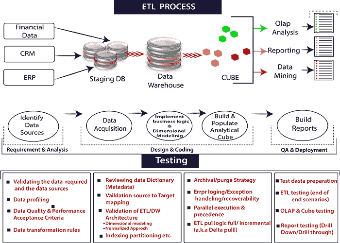
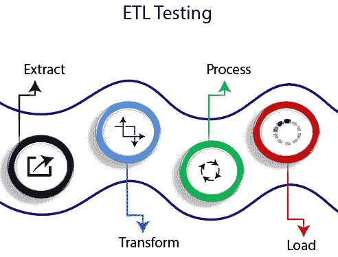

# 提取、转换和加载测试

> 原文：<https://www.javatpoint.com/etl-testing-introduction>

ETL 测试是在数据被移动到生产数据仓库系统之前完成的。它也被称为表平衡或产品协调。就测试范围和测试过程中遵循的步骤而言，ETL 测试不同于数据库测试。

ETL 测试是为了确保转换后从源加载到目的地的数据是准确的。它涉及在不同阶段验证数据，在源和目标之间使用。



## ETL 测试流程

和其他测试过程一样，ETL 测试也要经历一些测试过程。



ETL 测试分五个阶段进行。

1.  ETL 测试识别数据源和需求。
2.  数据恢复
3.  实现维度建模和业务逻辑。
4.  构建和填充数据
5.  生成报告

## ETL 测试的类型

ETL 测试的类型有:

**1。新数据仓库测试:**从核心开始构建和验证。在这个测试中，输入来自客户的需求和不同的数据源。然而，新的数据仓库是在 ETL 工具的帮助下构建和验证的。

**以下是不同组扮演的职责:**

*   **业务分析师:**业务分析师收集并记录需求。
*   **基础设施人:**这些人设置测试环境。
*   **QA 测试人员:** QA 测试人员开发测试计划和测试脚本，然后执行这些测试计划和脚本。
*   **开发人员:**开发人员对每个模块进行单元测试。
*   **数据库管理员:**数据库管理员测试性能和压力。
*   **用户:**用户做功能测试，包括 UAT(用户接受度测试)。

**2。生产验证测试:**该测试在数据移动到生产系统时对数据进行。Informatica 数据验证选项提供了 ETL 测试和管理功能的自动化，以确保数据不会危及生产系统。

**3。源到目标测试(验证):**这种类型的测试是为了验证转换为预期数据值的数据值。

**4。应用升级:**这种类型的 ETL 测试是自动生成的，节省了测试开发时间。这种类型的测试检查从旧应用程序中提取的数据是否与新应用程序中的数据完全相同。

**5。元数据测试:**元数据测试包括数据类型、数据长度和检查索引/约束的测量。

**6。数据准确性测试:**进行此测试是为了确保数据按照预期准确加载和转换。

**7。数据转换测试:**数据转换测试在很多情况下都会进行。这不能通过编写一个源 SQL 查询并将输出与目标进行比较来实现。需要为每一行运行多个 SQL 查询来验证转换规则。

**8。数据质量测试:**数据质量测试包括语法和参考测试。为了避免在业务过程中由于日期或订单编号而导致的任何错误，数据质量已经完成。**语法测试:**它会根据无效字符、字符模式、不正确的大写或小写顺序等报告脏数据。**参考测试:**会根据数据模型检查数据。

**例如**，客户 ID 数据质量检测包括编号检查、日期检查、精度检查、日期检查等。

**9。增量 ETL 测试:**做这个测试是为了在添加新数据时，检查新旧数据的数据完整性。增量测试验证系统是否正确处理，即使在增量 ETL 过程中插入和更新数据之后。

**10。图形用户界面/导航测试:**该测试用于检查前端报告的导航或图形用户界面方面。

**11 时。迁移测试:**在这个测试中，客户有一个现有的数据仓库，ETL 正在执行这项工作。但是客户正在寻找提高效率的工具。它包括以下步骤:

*   **设计和验证测试**
*   **设置测试环境**
*   **执行验证测试**
*   **报告错误**

**12 时。变更请求:**在这种情况下，数据被添加到现有的数据仓库中。可能会出现这样的情况:客户要求更改当前的业务规则，或者他们可以集成新的规则。

**13。报告测试:**数据仓库最终结果，**报告测试**。报告应通过验证报告中的数据和布局进行测试。报告是制定重要业务决策的重要资源。

## 在 ETL 测试中执行的任务

ETL 测试中涉及的任务有:

*   对数据的理解，用于报告
*   数据模型回顾
*   源到目标的映射
*   检查源数据中的数据
*   包和模式的验证
*   在目标系统中，应该进行数据验证
*   聚合规则验证和数据转换计算
*   目标系统和数据源之间的数据比较
*   对于目标系统，应检查质量和数据完整性。
*   数据的性能测试。

## ETL 和数据库测试的区别

ETL 和数据库测试都涉及数据验证，但两者并不相同。ETL 测试通常在数据仓库中的数据上执行，而数据库测试则在事务系统上执行。数据从不同的应用程序进入事务数据库。

### 在 ETL 测试中执行的操作

ETL 测试包括以下操作:

*   验证从源系统到目标系统的数据移动。
*   源系统和目标系统中的数据计数验证。
*   ETL 测试按照需求和期望验证转换、提取。
*   ETL 测试验证表关系连接和键在转换过程中是否是保存者。

### 在数据库测试中执行的操作

数据库测试侧重于数据准确性、数据正确性和有效值。

数据库测试执行以下操作:

*   数据库测试侧重于验证表中具有有效数据值的列。
*   为了验证主键或外键是否得到维护，使用了数据库测试。
*   数据库测试验证列中是否缺少数据。这里，我们检查列中是否有任何应该具有有效值的空值？
*   我们验证列中数据的准确性。

**例如**，月数列的值不应该大于 12。

| 功能 | 测试 | 数据库测试 |
| **主要目标** | 为商业智能报告的数据提取、转换和加载执行 ETL 测试。 | 执行数据库测试是为了验证和集成数据。 |
| **业务需求** | 用于信息、预测和分析报告的 ETL 测试。 | 该测试用于集成来自多个应用程序的数据和服务器影响。 |
| **适用系统** | ETL 测试包含不能在业务流环境中使用的历史数据。 | ETL 测试包含业务流发生的事务系统。 |
| **建模** | 使用多维方法。 | 采用电流变方法。 |
| **数据库类型** | ETL 测试应用于 OLAP 系统。 | 数据库测试用于 OLTP 系统。 |
| **数据类型** | ETL 使用具有更少连接、更多索引和聚合的非规范化数据。 | 数据库使用带连接的规范化数据。 |
| **常用工具** | 查询敦促、信息等。使用工具。 | QTP，硒工具用于数据库测试。 |

## ETL 性能测试

ETL 性能测试用于确保 ETL 系统是否能够处理多个用户和事务的预期负载。性能测试涉及到 ETL 系统上的服务器端工作负载。

### 如何进行 ETL 性能测试？

下面是测试 ETL 测试性能的步骤:

**第一步:找出生产中转化的负荷。**

**步骤 2:将创建相同负载的新数据，或者将其从生产数据移动到本地服务器。**

**第三步:现在，我们将禁用 ETL，直到生成所需的代码。**

**第四步:我们将从数据库表中统计需要的数据。**

**第五步:我们将记下最后一次运行的 ETL，并启用 ETL。它将获得足够的压力来转换产生和运行它的整个负载。**

**第六步:ETL 完成后，我们会对创建的数据进行统计。**

**需要注意的基本性能:**

*   **找出变换负载所花费的总时间**
*   **找出已经改善或下降的性能。**
*   **我们将检查整个预期负载是否被提取和转移。**

## ETL 测试中的数据准确性

在 ETL 测试中，我们关注数据的准确性，以确保数据是否按照我们的期望被准确地加载到目标系统中。

**执行数据准确性应遵循的步骤如下:**

**值比较:**在值比较中，我们比较源系统和目标系统中具有最小或没有转换的数据。通过使用各种 ETL 工具，ETL 测试是可能的。例如，Informatica 中的源限定符转换。

表达式转换也可以在数据准确性测试中执行。可以在 SQL 语句中使用一组运算符来检查源系统和目标系统中的数据准确性。

**检查关键数据的列:**可以通过比较源系统和目标系统中的不同值来检查关键数据列。

```

SELECT cust_name, order_id, city, count(*)  FROM customer GROUP BY cust_name, order_id, city;

```

## 数据转换中的 ETL 测试

执行数据转换相当复杂，因为它不能通过编写单个 SQL 查询并将输出与目标进行比较来实现。为了进行数据转换的 ETL 测试，我们必须为每一行编写多个 SQL 查询来验证转换规则。

为了成功地执行数据转换的 ETL 测试，我们必须从源系统中挑选足够的样本数据来应用转换规则。

**为数据转换执行 ETL 测试的重要步骤是:**

**第一步。**第一步是为输入数据和预期结果创建一个场景。现在，我们将与业务客户一起验证 ETL 测试。ETL 测试是在设计过程中收集需求的最佳方法，可以作为测试的一部分。

**第二步。**第二步是根据场景创建测试数据。ETL 开发人员将自动执行用场景电子表格填充数据集的整个过程，因为情况发生了变化，所以允许通用性和移动性。

**第三步。**利用数据分析，结果将比较源数据和目标数据之间每个字段中值的范围和提交情况。

**第四步。**我们将验证 ETL 生成字段的准确处理。例如，代理键。

**第五步。**我们将验证仓库中与数据模型或设计中指定的数据类型相同的数据类型。

**第六步。**将在测试引用完整性的表之间创建数据场景。

**第 7 步。**我们将验证数据中的父子关系。

**第八步。**最后，我们将执行**查找转换**。查找查询应该是直接的，没有任何数据收集，并且根据源表只返回一个值。我们可以直接在源限定符中加入查找表。如果不是这种情况，我们将编写一个查询，将查找表与源中的主表连接起来，并将比较目标中相应列中的数据。

## 测试用例

***ETL 测试的目的是保证业务转换后从源到目的加载的数据是准确的。*T3】**

ETL 测试适用于信息管理行业的不同工具和数据库。

在 ETL 测试性能期间，ETL 测试人员总是使用两个文档，它们是:

**1。ETL 映射表:** ETL 映射表包含源表和目标表的所有信息，包括每一列及其在引用表中的查找。ETL 测试人员需要适应 SQL 查询，因为 ETL 测试可能涉及编写带有多个连接的大查询，以在 ETL 的任何阶段验证数据。当我们为数据验证编写查询时，ETL 映射表提供了重要的帮助。

**2。源(目标)的数据库模式:**应保持可访问，以验证映射表中的任何细节。

## ETL 测试场景和测试用例:

| ETL 测试场景 | 测试用例 |
| **映射单据验证** | 我们将验证映射文档是否提供了 ETL 信息。应在每个映射文档中维护日志更改。 |
| **验证** | 

*   We use the corresponding mapping documents to verify the target and source table structures.
*   The data types of the source and target tables should be the same.
*   The data type length of source and destination should be the same.
*   We will verify the specified data field type and format.
*   The length of the source data type should not be less than that of the target data type.

 |
| **约束验证** | 应该根据我们的期望为特定的表定义约束。 |
| **数据一致性问题** | 

*   Through semantic definition, the data type and length of specific attributes may be different in files or tables.
*   Abuse of integrity constraints.

 |
| **完整性问题** | 

*   Here, we must ensure that all expected data are loaded into the target table.
*   In this scenario, the record count will be compared between the source and the target.
*   We will check the rejection records.
*   Data should not be truncated in columns of truncated tables.
*   The boundary value analysis will be checked.
*   We will compare the unique values of the key fields of the data loaded in the warehouse and the source data.

 |
| **正确性问题** | 

*   This scene is used to correct misspellings or inaccurate data records.
*   Correct data, that is, empty, non-unique, out of range.

 |
| **转化** | 

*   This scenario is used to check the transition.

 |
| **数据质量** | 

*   This scenario is used to check numbers and verify.
*   Data check: The scene will follow the date format, and all records should be the same.
*   Accuracy check
*   data check
*   Empty check

 |
| **空验证** | 

*   This scenario will validate null values, where a "non-null" value is specified for a specific column.

 |
| **重复检查** | 

*   In this scenario, we will check the validity of the unique key and the primary key, and according to business requirements, any other columns should be unique without duplicate rows.
*   We will check whether there are duplicate values in any column extracted from multiple column sources and combine them into one column.
*   According to the customer's requirements, we need to ensure that there is no duplication in the multi-column combination, only the goal.

 |
| **日期验证** | 

*   Dates are using many areas in development to know the date of row creation.
*   Identify existing records from the perspective of ETL development.
*   Sometimes, on the date value, updates and inserts are generated.

 |
| **数据清洁** | 

*   Unnecessary columns should be removed before loading to the staging area.

 |


| ETL 错误的类型 | 描述 |
| **用户界面错误** | 这些错误与应用程序的图形用户界面有关，如颜色、字体样式、导航、拼写检查等。 |
| **输入输出错误** | 在这种类型的错误中，应用程序开始接受无效值，而有效值被拒绝。 |
| **边界值分析 bug** | 这些错误检查最小值和最大值。 |
| **计算错误** | 计算错误显示了数学错误，大多数时候最终输出是错误的。 |
| **加载条件错误** | 这些类型的 bug 不允许多个用户。它不允许用户接受的数据。 |
| **比赛状态错误** | 在这种 bug 下，系统将无法正常运行。它开始崩溃或悬挂。 |
| **等价类划分 bug** | 这种类型的错误导致无效类型。 |
| **版本控制 bug** | 这些类型的错误通常发生在回归测试中，并且不会给出任何关于版本的信息。 |
| **硬件 bug** | 在这种类型的错误中，设备不会像预期的那样响应应用程序。 |
| **帮助源 bug** | 这个错误将导致帮助文档中的错误。 |

## ETL 测试人员的职责

ETL 测试人员负责验证数据源，应用转换逻辑，并将数据加载到目标表中，提取数据。

ETL 测试人员的职责是:

**验证源系统中的表。**涉及以下操作类型:

*   计数检查
*   数据类型检查
*   将记录与源数据进行协调
*   确保没有加载垃圾邮件数据
*   删除重复数据
*   检查所有钥匙是否到位

**应用转换逻辑**

在加载数据之前应用转换逻辑。它涉及以下操作:

*   在检查计数记录之前和之后应用转换逻辑。
*   验证从临时区域到中间表的数据流。
*   检查数据阈值验证；例如，年龄值不应超过 100。
*   检查代理键

**数据加载**

数据从临时区域加载到目标系统。它涉及以下操作:

我们将检查事实表中是否加载了聚合值和计算度量。

*   在数据加载期间，我们将基于目标表检查建模视图。
*   我们将检查 CDC 是否已应用于增量负载表。
*   检查数据维度表并查看该表的历史记录。
*   根据预期结果，检查基于加载的事实和维度表的商业智能报告。

## 测试 ETL 工具

ETL 测试人员也需要测试测试用例和工具。它涉及以下操作:

*   测试 ETL 工具及其功能
*   测试数据仓库系统
*   创建、设计和执行测试用例和测试计划
*   测试平面文件数据传输

## ETL 测试的优势

ETL 测试的好处如下:

1.  ETL 测试可以同时从任何数据源提取或接收数据。
2.  ETL 可以将异构数据源的数据同时加载到一个通用的(频繁的)不同的目标上。
3.  ETL 可以同时加载不同类型的目标。
4.  ETL 可以从各种来源提取所需的业务数据，并且可以根据需要将业务数据加载到不同的目标中作为所需的格式。
5.  ETL 可以根据业务执行任何数据转换。

## ETL 测试的缺点

ETL 测试的缺点如下:

1.  ETL 测试的主要缺点之一是，我们必须是面向数据的开发人员或数据库分析师才能使用它。
2.  当我们需要快速响应时，实时或按需访问并不理想。
3.  ETL 测试需要几个月的时间才能放到任何地方。
4.  保持数据符合不断变化的需求是一项挑战。

标题:

ETL 测试人员也需要测试测试用例和工具。它涉及以下操作:

*   测试 ETL 工具及其功能
*   测试数据仓库系统
*   创建、设计和执行测试用例和测试计划
*   测试平面文件数据传输

## ETL 测试的未来范围

ETL 测试的范围非常光明。 **Informatica PowerCenter、Oracle 数据集成器、微软 SQL server 集成服务、SAS、IBM infosphere 信息服务器、**等 ETL 工具。由于其需求，所有这些在行业中都有巨大的需求。ETL 测试的范围在未来会增加。

## 结论

ETL 测试是一种业务测试，开发人员、业务分析师、最终用户和数据库管理员都参与其中。ETL 测试需要了解 **SDLC** 和 **ETL 策略**，测试人员应该知道如何编写 **SQL 查询**。许多企业认为 ETL 是一个挑战，但事实是它对企业是有益的。保护数据不丢失是必不可少的，需要更新数据以满足市场的要求。

* * *