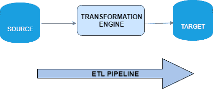
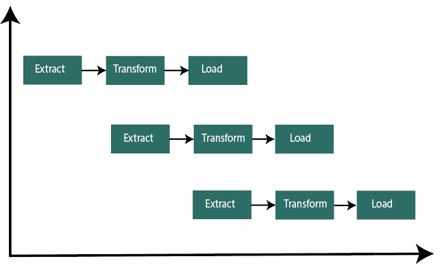

# ETL 管道

> 原文：<https://www.javatpoint.com/etl-pipeline>

ETL 管道是指从输入源提取数据，将数据转换并加载到输出目的地(如数据集市、数据库和数据仓库)进行分析、报告和数据同步的一组过程。

ETL 代表提取、转换和加载。

**提取**

在这个阶段，数据从各种不同的来源中提取，例如业务系统、营销工具、传感器数据、应用编程接口和交易数据库。

**变换**

第二步是将数据转换成不同应用程序使用的格式。在这个阶段，我们将数据的存储格式更改为不同应用程序中使用的格式。成功提取数据后，我们会将数据转换为用于标准化处理的表单。在 ETL 过程中使用了各种工具，如数据阶段、信息或 SQL Server 集成服务。

**加载**

这是 ETL 过程的最后阶段。在这里，信息以一致的格式提供。现在，我们可以获得任何特定的数据，并将其与另一部分数据进行比较。

数据仓库可以自动更新，也可以手动触发。

这些步骤根据需求在仓库之间执行。作为该过程的一部分，数据被临时存储在至少一组暂存表中。

**但是，当数据加载到数据库或数据仓库时，数据管道不会结束。ETL 目前正在增长，因此它可以支持跨事务系统、运营数据存储、MDM 中心、Cloud 和 Hadoop 平台的集成。由于非结构化数据的增长，数据转换的过程变得更加复杂。例如，现代数据处理包括实时数据，如来自大型电子商务网站的网络分析数据。Hadoop 是大数据的代名词。开发了几个基于 Hadoop 的工具来处理 ETL 过程的不同方面。我们可以使用的工具取决于数据是如何被成批结构化的，或者我们是否在处理数据流。**

## ETL 管道和数据管道的区别

虽然 ETL 管道和数据管道几乎做同样的活动。他们跨平台移动数据，并以这种方式进行转换。主要区别在于正在构建管道的应用程序。

### ETL 管道

ETL 管道是为数据仓库应用程序构建的，包括企业数据仓库以及特定主题的数据集市。当新应用程序取代传统应用程序时，ETL 管道也用于数据迁移解决方案。ETL 管道通常是通过使用行业标准的 ETL 工具构建的，这些工具精通结构化数据的转换。

*数据管道或商业智能工程师构建 ETL 管道。*

### 数据管道

可以为任何使用数据带来价值的应用程序构建数据管道。它可以用于跨应用程序集成数据，构建数据驱动的 web 产品，构建预测模型，创建实时数据流应用程序，执行数据挖掘活动，构建数字产品中的数据驱动特性。随着用于构建数据管道的开源大数据技术的出现，数据管道的使用在过去十年中有所增加。这些技术能够转换非结构化和结构化数据。

*数据工程师搭建数据管道。*

**ETL 管道和数据管道的区别是:**

| ETL 管道 | 数据管道 |
| ETL 管道定义为从一个系统中提取数据，将其转换并加载到某个数据库或数据仓库中的过程。 | 数据管道是指将数据从一个系统移动到另一个系统并在此过程中转换数据的任何一组处理元素。 |
| ETL 管道意味着管道分批工作。例如，管道每 12 小时运行一次。 | 数据管道也可以作为流评估运行(即，每个事件都在发生时进行处理)。数据管道的类型是 ELT 管道(将整个数据加载到数据仓库并在以后进行转换)。 |

* * *