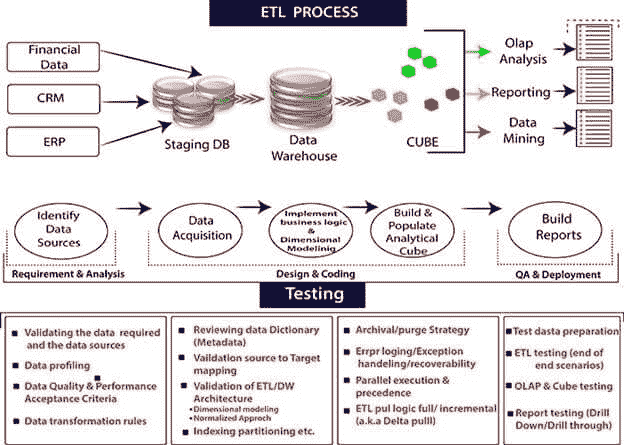
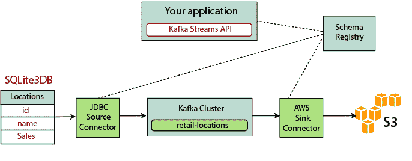

# ETL 过程

> 原文：<https://www.javatpoint.com/etl-process>

ETL 代表提取、转换和加载。ETL 是一个用于提取数据、转换数据以及将数据加载到最终源的过程。ETL 遵循将数据从源系统加载到数据仓库的过程。

执行 ETL 过程的步骤如下:

### 抽出

提取是从文本文件、XML 文件、Excel 文件或各种其他来源收集数据的第一个过程。

### 转换

转换是 ETL 过程的第二步，所有收集的数据都被转换成相同的格式。格式可以是任何符合我们要求的。在此步骤中，将一组函数规则应用于提取的数据，以将其转换为单一标准格式。它可能涉及以下任务:

*   **过滤:**只有特定的属性才会加载到数据仓库中。
*   **清洗:**用特定的默认值填充空值。
*   **连接:**将多个属性连接成一个。
*   **拆分:**将单个属性拆分为多个属性。
*   **排序:**根据属性对元组进行排序。

### 装货

加载是 ETL 过程的最后一步。从各种来源收集大块数据，对它们进行转换，最后加载到数据仓库中。

ETL 是从不同的源系统中提取数据，转换数据，并将数据加载到数据仓库中的过程。ETL 过程需要各种利益相关者的积极投入，包括开发人员、分析师、测试人员、高层管理人员。

ETL (Extract，Transform and Load)是从分析所需的原始数据中提取信息并将其转换为能够满足业务需求的格式并将其加载到数据仓库中的自动化过程。对于特定类型的分析，ETL 通常会汇总数据以减小其大小并提高性能。

***ETL 过程采用流水线概念。在这个概念中，一旦提取了数据，就可以对其进行变换，并且在变换期间，可以获得新的数据。并且当修改后的数据被加载到数据仓库中时，已经提取的数据可以被转换。***

当我们构建一个 ETL 基础设施时，我们必须集成数据源，仔细规划和测试，以确保我们正确地转换源数据。

在这里，我们将解释构建 ETL 基础设施的三种方法，以及在不使用 ETL 的情况下构建数据管道的另一种方法。

* * *

## 1)用批处理构建一个 ETL 管道

下面是构建传统 ETL 流程的过程，在这个过程中，我们将数据从源数据库批量传输和处理到数据仓库。开发企业 ETL 管道具有挑战性；我们通常会依赖于像 Stitch 和 Blendo 这样的 ETL 工具，这些工具可以简化和自动化这个过程。

用批处理构建 ETL，这是 ETL 的最佳实践。

1) **参考数据:**这里，我们将创建一组定义允许值集的数据，并且可能包含该数据。

**示例:**在国家数据字段中，我们可以定义允许的国家代码。

2) **从数据引用中提取:**ETL 步骤的成功在于正确提取数据。大多数 ETL 系统将来自多个源系统的数据组合在一起，每个源系统都有其数据组织和格式，包括关系数据库、非关系数据库、XML、JSON、CSV 文件，并且在成功提取后，数据被转换成单一格式以标准化格式。

3) **数据验证:**自动化流程确认从源中提取的数据是否有期望值。例如，在过去一年的金融交易数据库中，数据字段应包含过去 12 个月内的有效日期。如果数据未通过验证规则，验证引擎将拒绝该数据。我们会定期分析被拒绝的记录，以找出问题所在。在这里，我们更正源数据或修改提取的数据，以在下一批中解决问题。

4) **转换数据:**移除无关或错误的数据，应用业务规则，检查数据完整性(确保数据没有在源中损坏或被 ETL 损坏，并且在前几个阶段没有数据被丢弃)，并根据需要创建聚合。如果我们分析收入，我们可以将发票的美元金额汇总成每日或每月的总额。我们需要对一系列规则或函数进行编程和测试，以实现所需的转换，并在提取的数据上运行它们。

5) **阶段:**我们通常不会将转换后的数据直接加载到目标数据仓库中。数据应该首先输入到暂存数据库中，这样在出现问题时更容易回滚。此时，我们还可以为法规遵从性生成审计报告，或者诊断和修复数据问题。

6) **发布到数据仓库:**将数据加载到目标表中。有些数据仓库每次都会覆盖现有的信息，ETL 管道每天、每月或每周都会加载一批新的信息。换句话说，ETL 可以添加新数据而不覆盖，时间戳表明它是唯一的。我们必须小心地这样做，以防止数据仓库由于磁盘空间和性能限制而“爆裂”。

* * *

## 2)用流处理构建一个 ETL 管道

现代数据处理通常包括实时数据。例如，来自某大型电子商务网站的 web 分析数据。在这些用例中，我们不能大批量地提取和转换数据，需要对数据流执行 ETL，这意味着当客户端应用程序将数据写入数据源时，数据应该被立即处理、转换并保存到目标数据存储中。今天有许多流处理工具可用，包括- apache Samza、Apache store 和 Apache Kafka。

**基于卡夫卡构建流媒体 ETL 涉及以下几点:**

1) **将数据提取到卡夫卡:**JDBC 连接器拉取源表的每一行。当客户端应用程序向表中添加行时，Kafka 会自动将它们作为新消息写入 Kafka 主题，从而实现实时数据流。

2) **从 Kafka 中提取数据:** ETL 应用程序从 Kafka 主题中提取消息作为 Avro Records，后者创建一个 Avro 模式文件并对其进行反序列化，并从消息中创建 KStream 对象。

3) **变换 KStream 对象中的数据:**使用 Kafka Streams API，流处理器一次接收一条记录，对其进行处理，可以从下游处理器产生一条或多条输出记录。它们可以一次转换一条消息，根据条件过滤它们，或者对多条消息执行数据操作。

4) **将数据加载到其他系统:** ETL 应用程序仍然保存数据，现在这需要将其流式传输到目标系统，如数据仓库或数据湖。他们的目的是使用 S3 接收器连接器将数据流式传输到亚马逊 S3。我们可以实现与其他系统的集成。例如:使用[亚马逊驱动程序将数据流式传输到红移数据仓库。](https://aws.amazon.com/kinesis/data-firehose/)

* * *