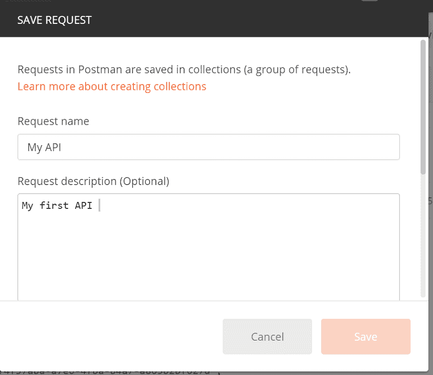
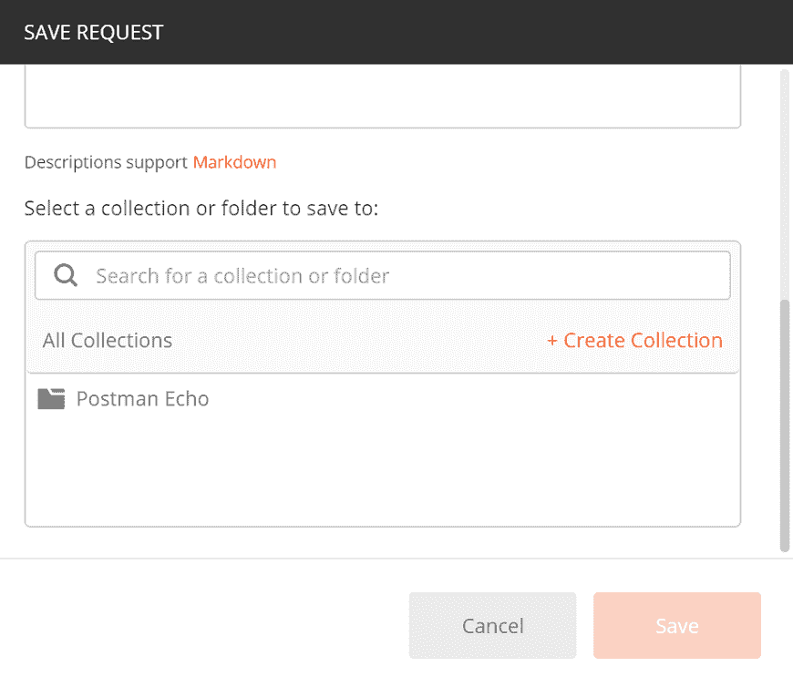
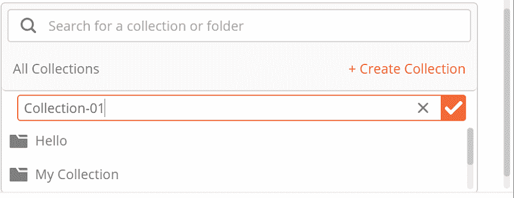
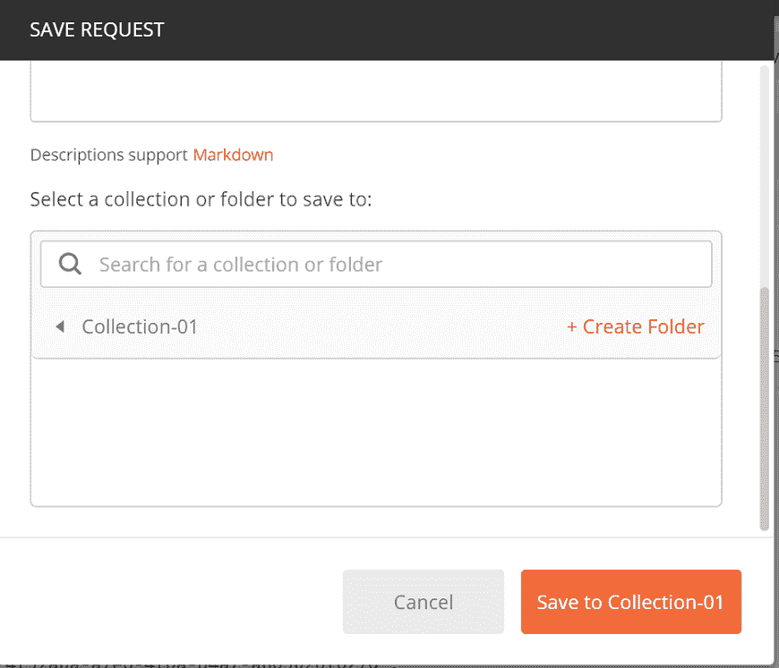
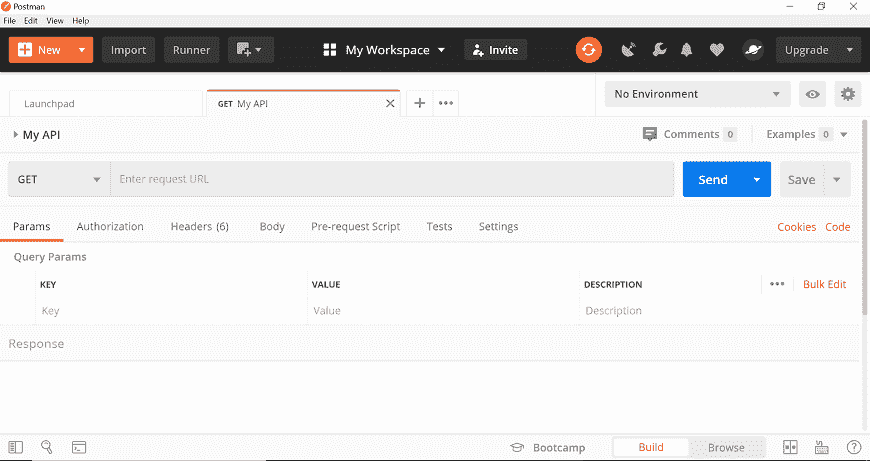
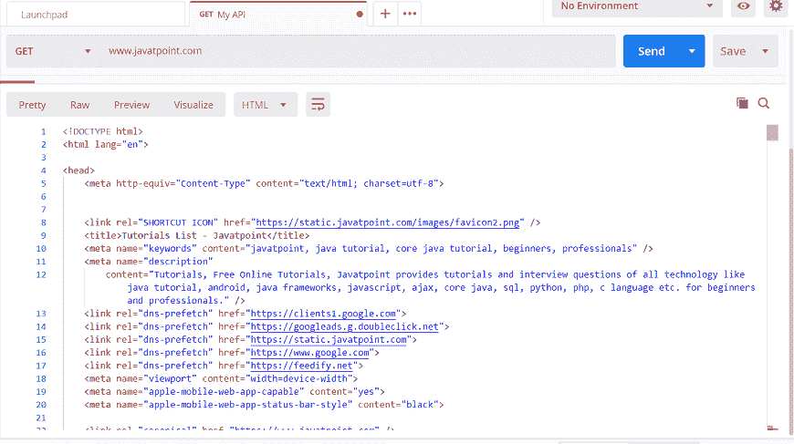
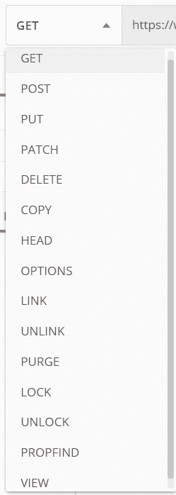

# 创建请求

> 原文：<https://www.javatpoint.com/postman-creating-requests>

让我们在 Postman 中创建新的请求。在请求中，我们可以有许多细节。在这个请求创建过程中，您必须输入一个网址并选择方法。除此之外，您还可以选择指定附加信息的数量。

要创建请求，请执行以下步骤:

**第一步:**发动邮递员。

**第二步:**点击邮差主页窗口左上角的新建选项。单击按钮后，将会打开一个下拉菜单。

**步骤 3:** 从下拉列表中点击请求选项。

**第 4 步:**一旦选择了 Request 选项，系统将提示您输入请求名称，您还可以描述该 API 以备将来使用。描述部分是可选的；我们可以留空。

这里我的请求名是“我的应用编程接口”

**第五步:**向下滚动，点击+创建收藏。

输入收藏名称(此处，“收藏-01”是我的收藏名称)并点击右侧标记。

**第 6 步:**点击保存按钮创建您的请求。

一旦你点击保存按钮，一个新的标签将会打开，显示你给定的请求名称。

**第七步:**在地址栏输入[www.javatpoint.com](https://www.javatpoint.com)，点击发送。

选择“发送”后，您将收到以下响应。

## 设置请求网址

为了发送请求，您应该有一个定义应用编程接口端点的网址。所有的应用编程接口操作通常都与一个端点相关联，端点是这些应用编程接口可以访问执行任务所需资源的地方。

要访问 Postman 中的 API，需要输入 URL，每个 URL 包含一个端点。

*   当您创建一个应用编程接口时，通常，网址是基本位置加上路径。比如[https://www.javatpoint.com/java-tutorial](https://www.javatpoint.com/java-tutorial)，其中[https://www.javatpoint.com](https://www.javatpoint.com)为基础 URL，[/Java-教程](https://www.javatpoint.com/java-tutorial)为端点路径。
    
*   如果您使用第三方应用编程接口，那么您不需要提供网址，您的应用编程接口提供商将提供您需要的网址。

## 选择请求方法

在网址文本字段中输入网址后，默认情况下将为新请求选择 GET 方法。还有多种其他方法可用。

一些常用的方法有:

**GET:** 这个 HTTP 方法用于从一个 API 中检索数据。

**POST:** 要将新数据发送到一个 API，我们可以使用这个方法。

**DELETE:** 用于删除现有数据。

**PATCH:** 此方法用于更新现有数据。

**PUT:** 此方法用于更新已有数据。

* * *