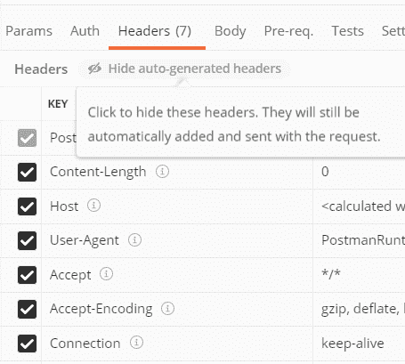

# 授权请求

> 原文：<https://www.javatpoint.com/postman-authorizing-requests>

*   授权请求包括验证发送请求的客户端的身份，并验证是否允许客户端访问和执行端点操作。API 使用授权细节来确保客户端请求安全地访问数据。
*   邮递员中有几种授权类型，您可以在创建应用编程接口时使用。
*   在使用第三方应用编程接口时，您需要向提供商询问您需要的任何授权细节。

### 邮差中授权请求的步骤

*   打开邮差应用，在请求网址部分输入请求。
*   在授权下，选项卡从下拉菜单中选择授权**类型**，如下图所示。

### 各种授权类型包括

*   **从父代**
    继承授权这是默认的授权类型。在这种情况下，授权类型将与父级相同，这意味着无论您为该集合(父级)选择什么样的授权类型；将为该集合下的请求选择相同的身份验证类型。
*   **无授权**
    如果选择此类型，邮递员将不会随请求发送任何授权数据。
*   **应用编程接口密钥**
    这是将密钥和值与应用编程接口请求一起发送。
*   **承载令牌**
    这种授权类型允许通过使用访问密钥来授权请求。
*   **基本授权**
    这允许用户发送用户名和密码以及应用编程接口登录请求。
*   **摘要认证**
    这是你的 API 请求的两点认证。在这种身份验证类型中，用户将发送一个请求，服务器将用一个只能使用一次的号码进行回复。然后，用户将再次发送请求以及用户名、密码和请求授权的领域号。
*   **OAuth**
    该授权类型是访问第三方 API 数据。
*   **Hawk 认证**
    这使得用户能够使用部分加密验证来认证他们的请求。Hawk 身份验证 id 是您的应用编程接口身份验证 ID 值，Hawk 身份验证密钥是您的应用编程接口身份验证密钥值，在此身份验证类型下，授权是必需的。
*   **AWS 签名**
    对于亚马逊网络服务请求，使用此身份验证类型。
*   **NTLM 身份验证(测试版)**
    这是 windows 操作系统和独立系统的身份验证类型。
*   **Akamai edge grid**
    Akamai 技术使用这种授权类型来授权请求。
*   选择身份验证类型后，应用将指示标题、正文、网址或参数中的哪一部分将包含您的数据，以便用户在运行请求之前可以看到这些数据将如何发送。
*   授权数据可以作为请求的标头、正文或参数发送。
    
*   例如，auth 数据作为头发送，如上图所示，因此这些头将随请求一起自动发送。

* * *