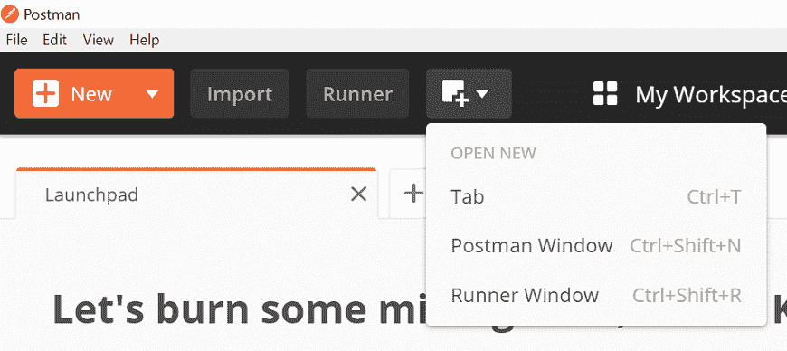
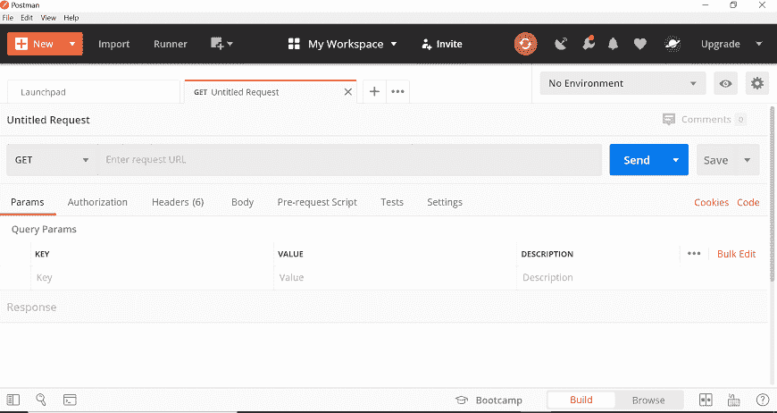
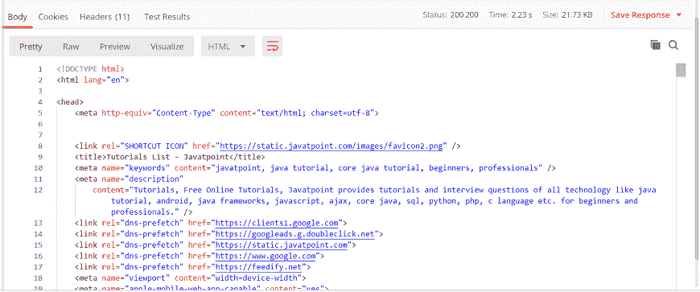
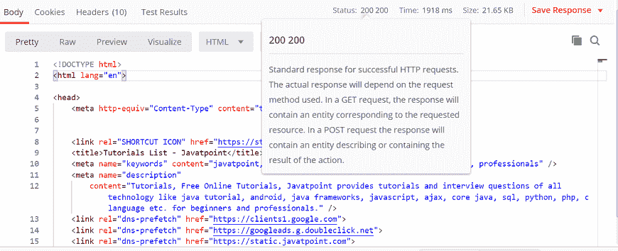

# Postman 获取请求

> 原文：<https://www.javatpoint.com/get-request-in-postman>

既然现在我们知道如何在 Postman 中创建请求，那么是时候处理 GET 请求了。获取请求从服务器获取信息。当您在服务器上发出 GET 请求时，服务器会响应请求。

获取请求不会影响服务器上的任何数据。意味着当您发出 GET 请求时，服务器上没有数据的创建、更新、添加或删除。

GET 请求包含 URL 内部的所有信息，正因为如此，有些人在发送密码等机密数据时，不喜欢使用 GET 请求。例如，如果你在谷歌上搜索任何东西，你实际上是在使用 GET 请求，因为没有敏感信息，你只是在请求页面。你可以尝试在谷歌上搜索一些东西；您将在 URL 中获得相同的搜索字符串。

要在 Postman 中创建第一个 GET 请求，请执行以下步骤:

**步骤 1:** 创建请求。要创建新请求，打开一个新标签，点击 **+** 加号按钮。

您也可以通过输入 **ctrl+T** 打开新标签页，或者从**打开新标签页**菜单中选择**标签页**选项。

创建新请求后，您将看到以下窗口:

**第二步:**在地址栏输入网址。我们将使用[www.javatpoint.com](https://www.javatpoint.com)。

**步骤 3:** 现在，从请求方法列表中选择 GET 请求。

**第 4 步:**现在按发送。

**第五步:**一旦按下发送按钮，就会得到服务器的响应。确保您有正确的互联网连接；否则，你不会得到回应。

您可以检查状态代码。在这里，我们得到了状态代码 **200 200，**这意味着我们得到了请求的成功响应。

在响应框的正文选项卡中，我们有多个选项可以查看不同格式的响应。

**漂亮:**在这个选项中，代码会用不同的关键字进行彩色显示，并且在代码中有缩进，这对于阅读很有用。

**Raw:** 这几乎类似于漂亮，但是显示的代码没有颜色，并且是单行的。

**预览:**这将显示已发送页面的预览。

* * *