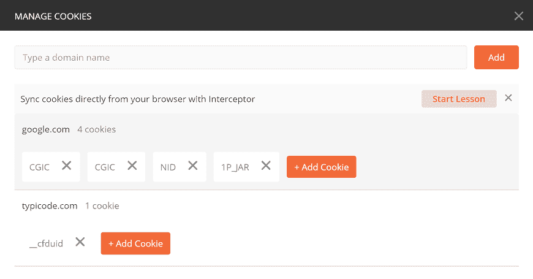
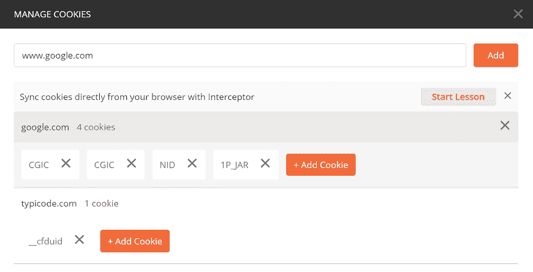
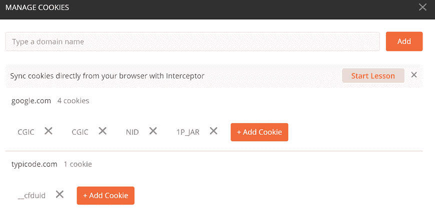
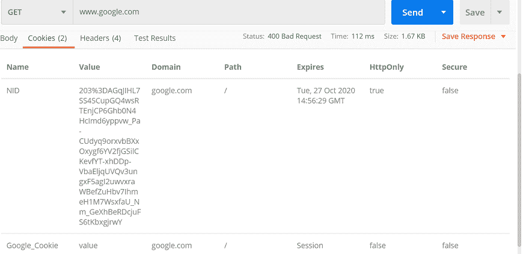
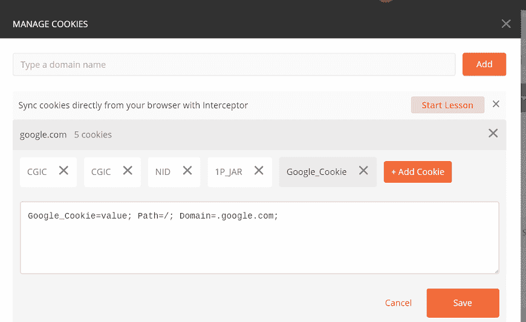

# Postman 里的饼干

> 原文：<https://www.javatpoint.com/cookies-in-postman>

Cookies 是非常小的文件，包含服务器文件或网站页面的信息。当你第一次打开网站时，一个 cookie 文件会被下载到你的机器上。此 cookie 包含一些详细信息；当您再次访问时，同一站点可以使用这些详细信息。这使得网站可以根据您的上次访问提供详细的回复。

在 postman 中，我们可以看到作为服务器响应发送的 cookies。我们无法对 cookies 进行任何更改，因为我们从服务器获得了。

### Cookies 管理器

要在 Postman 中开始处理 cookie，请从 Postman 窗口右侧的“发送”按钮下打开 cookie 选项。

当您选择 cookie 时，它将打开“管理 cookie”窗口。在这里你可以看到域名列表和与之链接的 cookies。

## 创建一个 Cookie

在[Postman](https://www.javatpoint.com/postman)中，我们还可以为域创建新的 cookies。要创建新的 cookie，请选择“添加 Cookie”按钮。

在这里，我将夺取[www.google.com](https://www.google.com)领地。

在[网址](https://www.javatpoint.com/url-full-form)文本框中输入域名，点击添加按钮。

由于库存中已经有一个 google.com 域，我们将直接添加 cookies。单击“+添加 Cookie”

将会打开一个新的文本框，其中已经写入了一些默认值。如下例所示编辑这些值:

点击保存按钮。

在这里你可以看到你新创建的饼干。

关闭面板。并在网址文本字段中输入网址 www.google.com，然后点击发送。转到响应部分，然后单击 Cookies 选项卡。我们可以看到我们在这里添加的饼干。

### 更新 Cookie

在 Postman 中，我们可以更新 cookies。单击“COOKIES”更改现有的 Cookies，并从“MANAGE COOKIES”部分的域列表中选择域，然后单击要更新的 Cookies。我们可以更改任何属性，然后单击保存进行更新。

### 删除 Cookie

删除 cookie 非常容易。要删除现有的 cookie，请单击“cookie”，然后在“管理 cookie”部分，从域列表中选择域，转到要删除的 cookie，然后单击 X 选项。您的 cookie 将被删除。

* * *