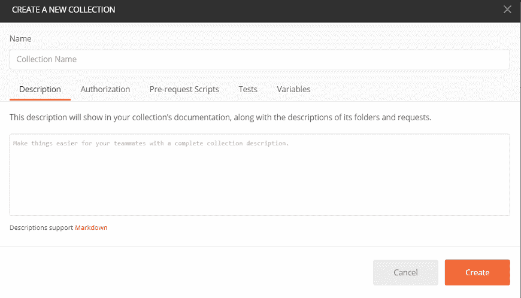

# Postman 收藏介绍

> 原文：<https://www.javatpoint.com/postman-collections>

*   Postman 中的集合意味着一组已经保存在 Postman 中的 API 请求，可以排列到文件夹中。集合中可以创建任意数量的文件夹。
*   将类似的请求放入文件夹和集合中有助于客户更好地组织和记录他们的请求。
*   所有的 API 请求都可以存储和保存在一个集合中，这些集合可以在 Postman 工作区的团队中共享。

### 创建集合的优势

*   **易原料药进出口**
    一个集合可以进出口。这样可以节省传输请求的时间。
*   **请求分类**
    请求可以分组到文件夹和集合中，以便于访问。
*   **在请求之间传递数据**
    脚本可以用来在 API 请求之间传递数据。
*   **运行集合/文件夹。**
    你可以在 Postman 中整体运行单个请求或文件夹或集合。
*   **API 文档**
    Postman 为您提供了一个选项，可以为您的请求、文件夹和收藏添加名称和描述。
*   **构建测试套件**
    测试脚本可以添加到请求中，并且可以构建集成测试套件。
*   **省时**
    为收藏设置任何变量都会自动应用于收藏和请求下生成的文件夹；因此，它节省了时间。

* * *