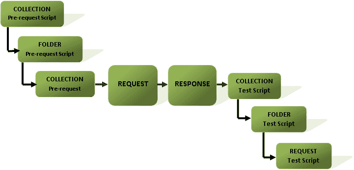

# 脚本介绍

> 原文：<https://www.javatpoint.com/postman-scripts>

Postman 不仅用于手动测试，我们还可以对 API 进行自动化测试。Postman请求和收集可以应用于动态行为。

在邮差脚本中，是允许您自动化应用编程接口测试的代码行。它提供您编写预请求和测试脚本。

*   在发送请求之前，会运行一个预请求脚本，
*   收到响应后，**测试脚本**将运行。

在 Postman 中，我们可以编写测试，在请求之间传递数据，并更改参数。它允许将测试脚本和预请求脚本添加到集合、文件夹、请求或未附加到组的请求中。

## 邮差沙盒

要在 Postman 中编写脚本，我们使用 Postman 沙盒。

[邮差](https://www.javatpoint.com/postman)沙盒已经用 [Javascript](https://www.javatpoint.com/javascript-tutorial) 写好了。这是一个执行环境。由于沙箱是用 Javascript 编写的，因此，它将只接收用 Javascript 编写的脚本。

因此，我们必须用 javascript 编写脚本，使代码在 Postman 中可执行。

## 邮差中脚本的执行顺序

在 Postman 中，**单个请求**的脚本执行顺序如下:

*   与请求相关联的预请求脚本将在发送请求之前执行。
*   与请求相关联的测试脚本将在发送请求后执行。

集合中每个请求的脚本执行顺序如下:

*   在集合中的每个请求之前，将运行与集合关联的预请求脚本。
*   在文件夹中的每个请求之前，将运行与文件夹相关联的预请求脚本。
*   在集合中的每个请求之后，将运行与集合相关联的测试脚本。
*   在文件夹中的请求之后，将运行与文件夹相关联的测试脚本。

对于集合中的每个请求，脚本应该始终按照以下层次结构运行:

*   集合级脚本
*   文件夹级脚本
*   请求级脚本

相同的顺序将适用于预请求和测试脚本。

* * *