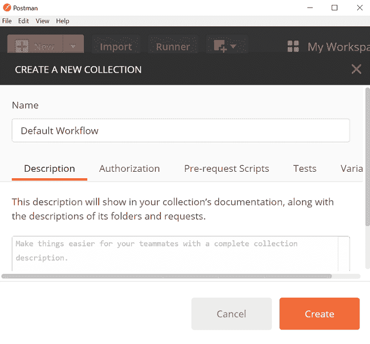
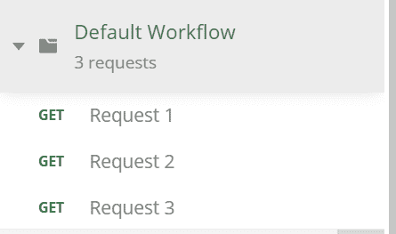
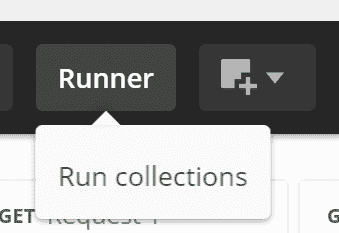
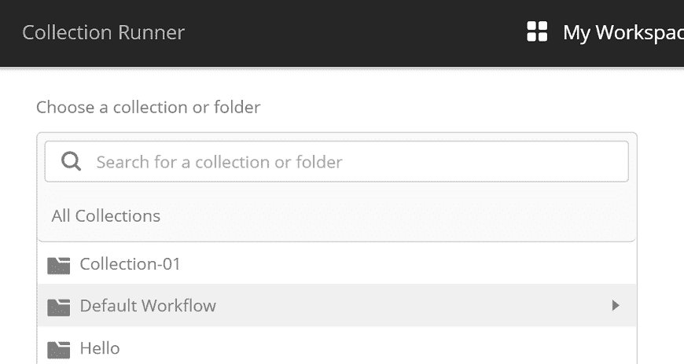
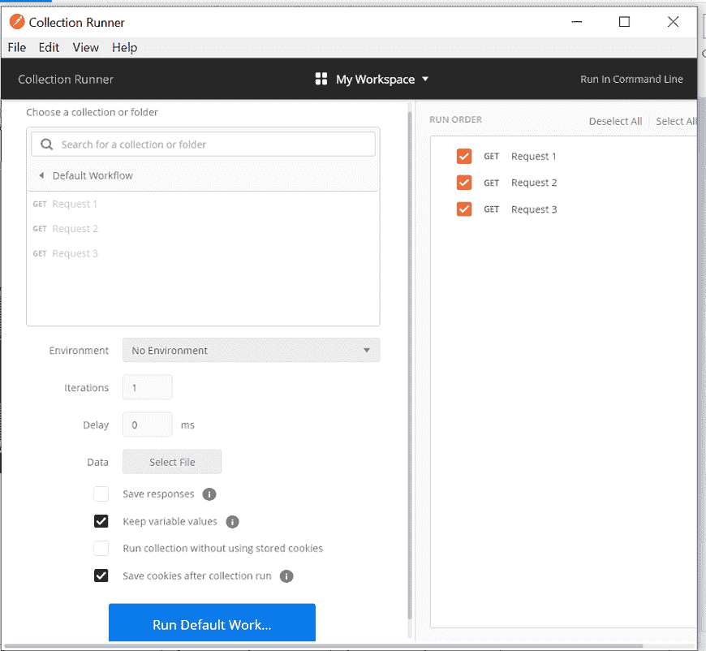
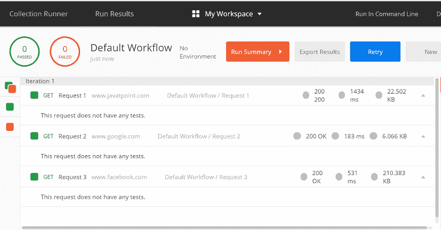

# Postman中的工作流

> 原文：<https://www.javatpoint.com/workflows-in-postman>

POSTMAN 工作流是集合中请求执行的顺序。当您直接运行集合时，请求要么随机执行，要么串行执行。但是我们也可以设置请求的优先级，我们也可以选择请求的执行顺序，这意味着我们可以设置应该在什么时候执行哪个请求。这个特性在Postman中被称为工作流。

Postman 提供了一个功能来控制集合中请求的工作流程，该功能被称为**集合 Runner** ( **或 Runner** )。

一旦集合运行器执行了一个请求，集合中的所有请求都会被执行，但是有一种模式会执行所有请求。[Postman](https://www.javatpoint.com/postman)提供了许多内置算法来决定请求必须以哪种模式运行。

## 收款员的执行顺序

通常，收集运行程序按顺序运行请求。有些 API 要求逐个发送请求；意味着，第二个请求只能在第一个请求完成后执行，第三个请求将等待第二个请求的响应。等等。

在这种情况下，收集运行程序中的默认请求执行没有问题，因为不需要并行运行请求，或者不需要运行随机请求。

但是可能会有一个[API](https://www.javatpoint.com/api-full-form)请求依赖于两个或多个不同的API响应的情况。或者可能存在另一种情况，即位于API请求执行队列中间的特定API请求必须针对不同的请求随机执行。

在这种情况下，在收集运行程序中顺序执行请求将没有用。我们应该创建一个工作流，并通知收集运行程序，请求何时执行。这个任务只能通过调用一个 API 请求来完成。这被称为 API 调用。

**API调用**意味着以用户定义的方式调用API来执行。

## Postman中的默认工作流

让我们看看正常的请求执行工作流在默认情况下是如何运行的。

*   创建一个集合并给出集合的名称。我的收藏名是“默认工作流”

*   在集合中添加三个请求，并将其命名为请求 1、请求 2 和请求 3。

*   三项要求是:

在-中添加以下[网址](https://www.javatpoint.com/url-full-form)

请求 1:[www.javatpoint.com](https://www.javatpoint.com)

请求 2:[www.google.com](https://www.google.com)

请求 3:[www.facebook.com](https://www.facebook.com)

*   现在，一个集合中有三个不同的请求。立即运行收集运行程序。

从Postman窗口顶部选择**转轮(收集转轮)**菜单。它会打开一个新的窗口。

*   选择您的收藏。

*   运行集合以查看所有迭代、订单、环境等。为了收藏。

在上图中，您可以看到请求是按顺序发送的。它从请求 1 开始，然后继续到请求 2，再到请求 3。这意味着它是顺序运行的。

* * *