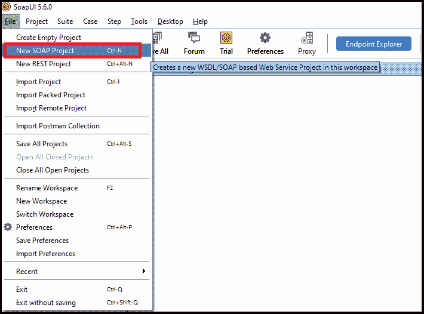
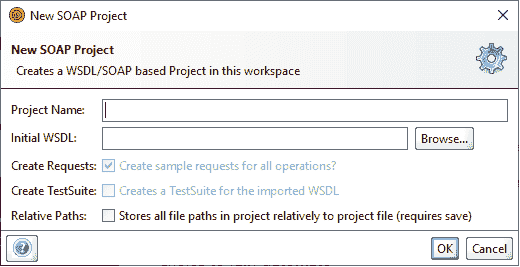
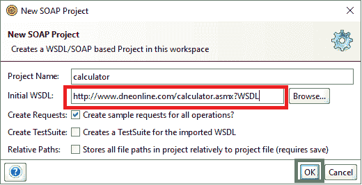
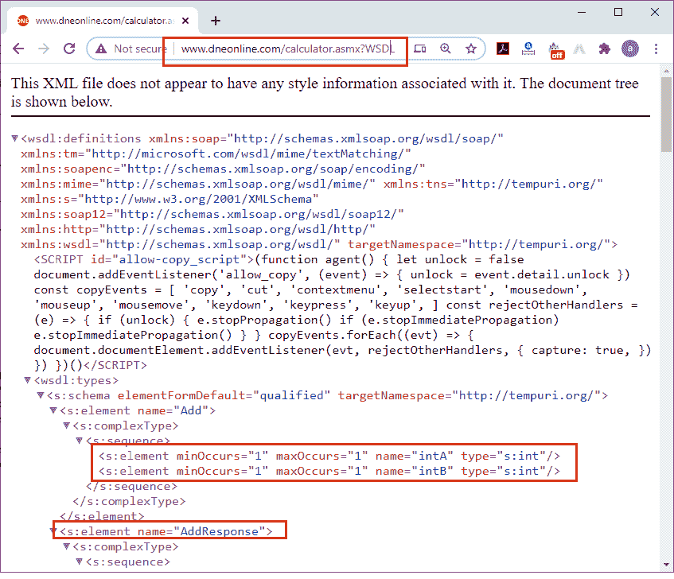
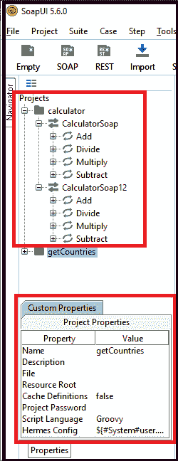
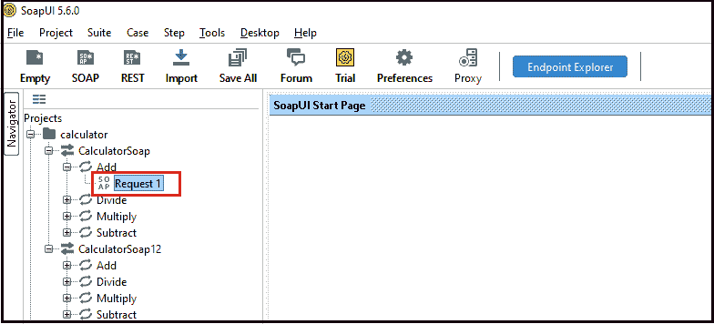
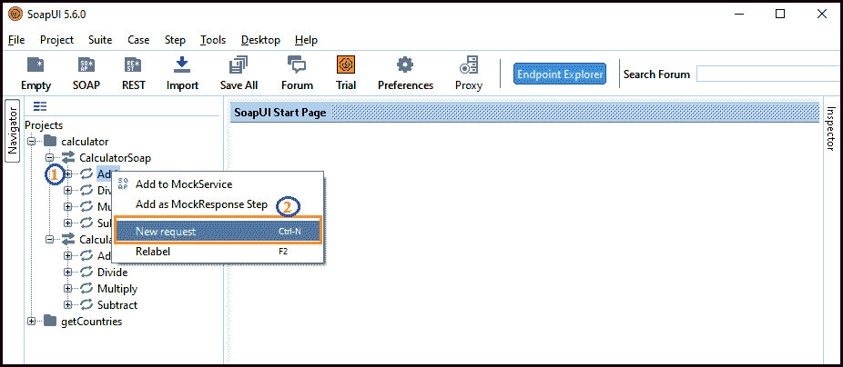
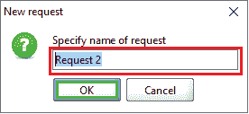
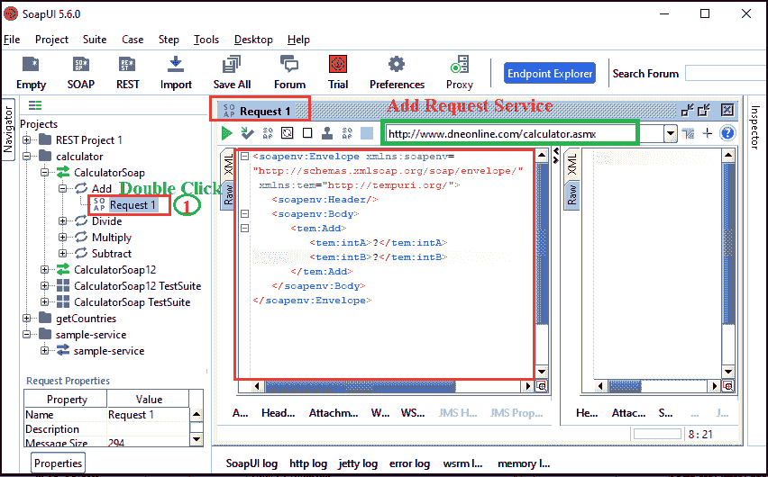
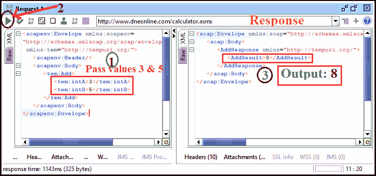

# 在 SoapUI 工具中创建 SOAP 项目

> 原文：<https://www.javatpoint.com/create-soap-project-in-soapui-tool>

简单对象访问协议(SOAP)是网络服务中使用的网络平台，用于在网络上的两台不同机器之间交换或通信数据。它使用 [XML](https://www.javatpoint.com/what-is-xml) 数据格式通过 [HTTP](https://www.javatpoint.com/http) 协议传输消息。我们在一个 SOAP 项目中导入一个 WSDL 文件，其中包含 WSDL 公开的所有请求或端点。同样，我们也可以执行功能和非功能测试、负载测试、WS 安全性、WS 寻址等。使用 SoapUI 工具。

### 创建 SOAP 项目

在 SoapUI 工具中创建一个 [SOAP](https://www.javatpoint.com/soap-web-services) 项目很简单。当创建一个 Soap 项目时，我们需要添加 WSDL 网址。打开[Soap 界面](https://www.javatpoint.com/soapui)应用，并按照说明继续项目。

**第一步:**进入文件菜单，点击新建 SOAP 项目选项，如下图。



除此之外，我们还可以点击 SOAP 图标来创建一个新的 SOAP 项目，如下所示。


执行上述步骤后，它会打开“新建 SOAP 项目”窗口，如下所示。



**第二步:**在初始 WSDL 文本框中输入 WSDL 网址([http://www.dneonline.com/calculator.asmx?WSDL](http://www.dneonline.com/calculator.asmx?WSDL))。它会自动检索项目名称，如下所示。



#### 注意:要检查 WSDL 网址，打开浏览器，在地址栏中粘贴 WSDL 网址，然后按回车键。它显示了计算器基于 XML 的内容，如下所示。



**第三步:**点击确定按钮后，处理 WSDL URL 成功执行，然后显示项目计算器的各种服务和属性，如下图所示。



### 执行服务以检查 SoapUI 中的请求和响应操作

**第四步:**点击+符号展开项目计算器的服务，如下图。



此外，如果我们想在计算器中创建多个请求，右键单击添加服务展开并单击新建请求选项，如下所示。



它会显示一个弹出对话框，如下所示。



**步骤 5:** 双击(+)请求 1 服务后，显示如下画面。



这是请求 1 服务的 XML 文件。

```

<soapenv:Envelope xmlns:soapenv="http://schemas.xmlsoap.org/soap/envelope/" xmlns:tem="http://tempuri.org/">
   <soapenv:Header/>
   <soapenv:Body>
      <tem:Add>
         <tem:intA>?</tem:intA>
         <tem:intB>?</tem:intB>
      </tem:Add>
   </soapenv:Body>

```

**步骤 6:** 输入“IntA”和“IntB”的值，执行添加请求服务，如下所示。



在我们的例子中，我们传递的 IntA 和 IntB 的值分别是 3 和 5。

```

<soapenv:Envelope xmlns:soapenv=
"http://schemas.xmlsoap.org/soap/envelope/" 
 xmlns:tem="http://tempuri.org/">
   <soapenv:Header/>
   <soapenv:Body>
      <tem:Add>
         <tem:intA>3</tem:intA>
         <tem:intB>5</tem:intB>
      </tem:Add>
   </soapenv:Body>
</soapenv:Envelope>

```

**步骤 7:** 插入值后，点击提交响应图标，执行添加请求，如下图所示。


我们得到以下响应输出:


这是响应 XML 文件。

```

<soap:Envelope xmlns:soap= ?http://schemas.xmlsoap.org/soap/envelope/? xmlns:xsi="http://www.w3.org/2001/XMLSchema-instance" xmlns:xsd="http://www.w3.org/2001/XMLSchema">
   <soap:Body>
      <AddResponse >
         <AddResult>8</AddResult>
      </AddResponse>
   </soap:Body>
</soap:Envelope>

```

同样，我们可以在基于 WSDL 网络服务的计算器项目中执行除法、乘法和减法的服务请求。在下一个主题中，我们将学习如何在 SoapUI 测试工具中创建测试套件、测试用例和测试步骤。

* * *