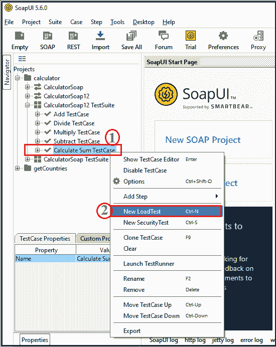
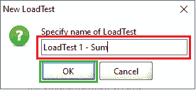
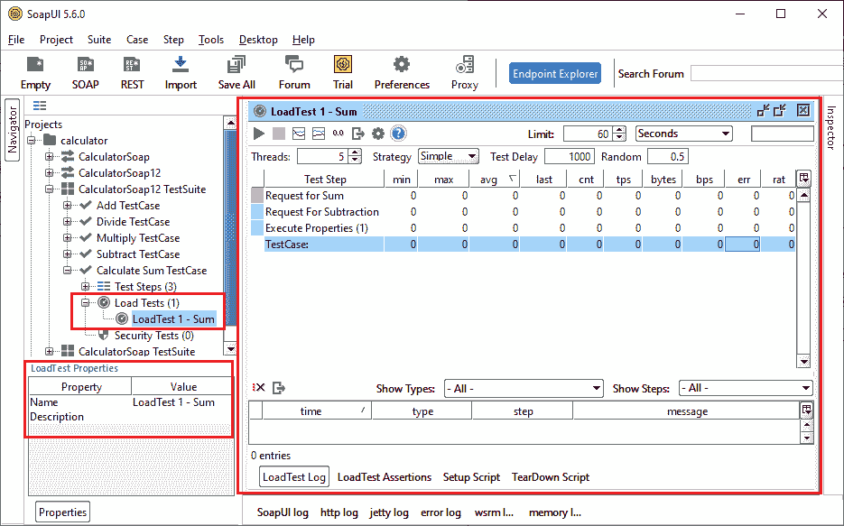
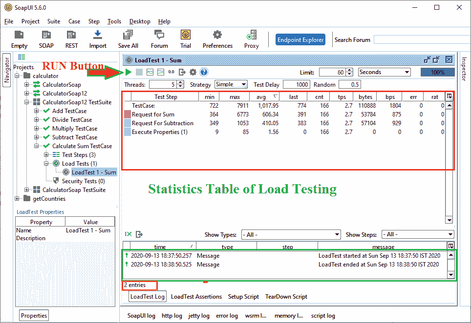
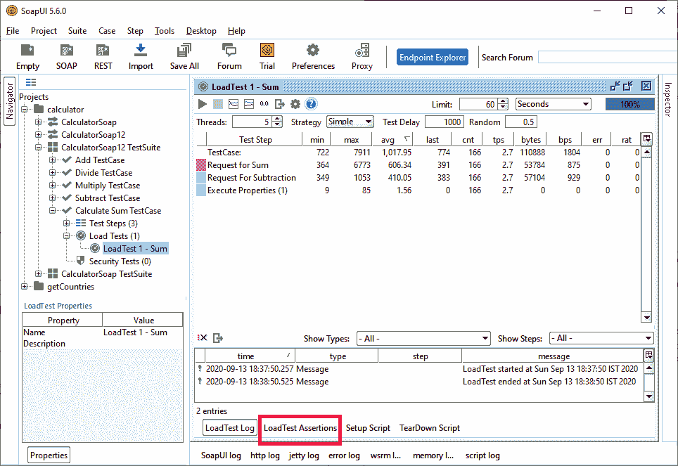
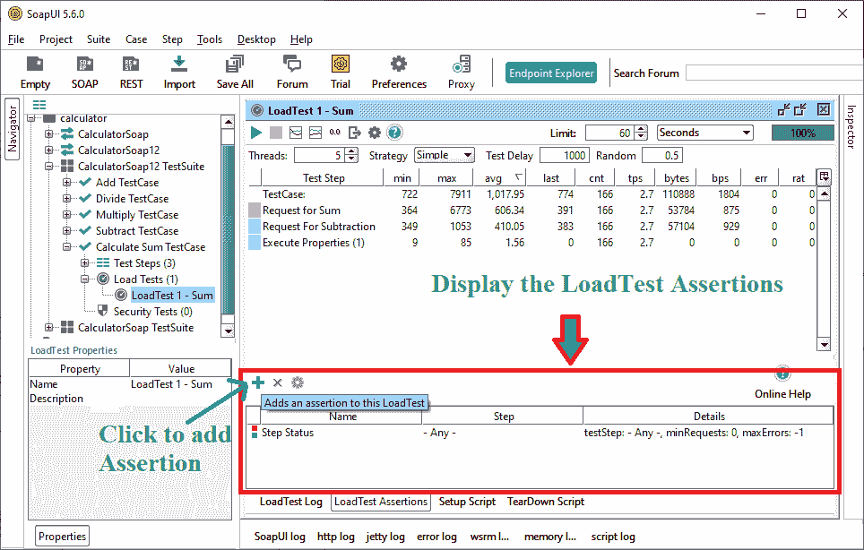
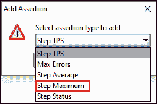
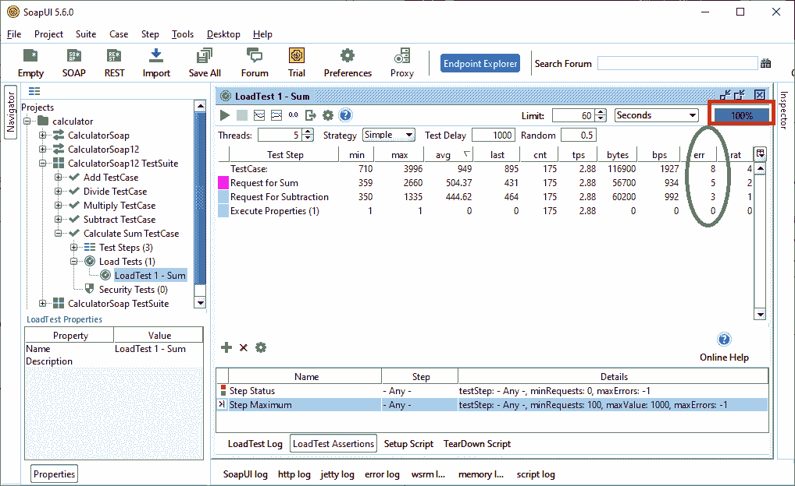

# SoapUI 负载测试

> 原文：<https://www.javatpoint.com/soapui-load-testing>

负载测试是软件性能测试和容量测试的典型形式。它有助于确定系统在特定负载下的行为，识别操作组件的任何瓶颈或缓慢以及 web 服务的最大操作能力。此外，负载测试用于执行所有类型的非功能测试，其中系统加载了多个请求来检查 web 服务的性能。

### 负载测试的要点:

1.  负载测试可以在 SoapUI 中现有功能测试的基础上使用。
2.  在 SoapUI 中使用负载测试，功能测试允许我们快速创建和修改 web 服务的性能测试。
3.  负载测试允许我们使用不同的负载策略来验证 web 服务的性能，并且测试的功能在负载测试下不会被破坏。
4.  负载测试用于检查 web 服务的性能，并检查当负载中的请求数量增加时系统的行为。

## 创建负载测试

要在 [SoapUI](https://www.javatpoint.com/soapui) 中创建负载测试，我们必须遵循下面给出的步骤:

**第一步:**右键点击**计算总和测试用例**，选择新增负载测试选项，如下图所示。

**第二步:**点击新建负荷测试后，弹出对话框输入负荷测试名称，点击确定按钮。

**步骤 3:** 点击确定按钮后，**负荷测试 1？总和'**是在负载测试和'负载测试 1？“Sum”窗口也打开了，如下图所示。

执行负载测试时，统计数据被收集并显示在负载测试的以下标题下。

| [计]选项 | 描述 |
| **测试步骤** | 它用于设置每个线程的启动延迟(毫秒)；设置为 0 将同时启动所有线程。 |
| **分钟** | 它用于表示加载步骤所用的最短时间(以毫秒为单位)。 |
| **最大值** | 它用于表示加载步骤所用的最长时间(以毫秒为单位)。 |
| **最后** | 它以毫秒为单位表示负载测试步骤的最后时间。 |
| **Cnt** | Cnt 头用于计算负载测试步骤中的执行次数。 |
| **Tps** | Tps 头用于表示负载测试步骤中每秒的事务数。 |
| 字节 | 字节头用于在负载测试步骤中处理字节数。 |
| **Bps** | Bps 头用于在负载测试步骤中每秒处理字节数。 |
| **错误** | 它用于表示测试步骤中出现的断言数量。 |
| **老鼠** | 它表示失败的请求比率(失败的请求百分比)。 |

### 负载测试的执行

当在 SoapUI 中加载测试时，默认情况下，它被预配置为使用简单的加载策略，5 个线程运行 60 秒，并且可以根据负载测试中测试属性的要求进行自定义，如下所示。

**步骤 4:** 要运行测试，请单击负载测试的运行图标(线程上方的绿色三角形)。之后，它开始执行负载测试，在该测试中，用户可以查看包含不同标题数据集合的统计表。在 SoapUI 中完成负载测试工作需要 60 秒。

### 在负载测试中使用断言

**第五步:**要验证负载测试，点击**负载测试编辑器**底部的**负载测试断言**选项卡，如下所示。

**第 6 步:**点击 LoadTest 断言选项卡后，显示一个工作区，向 Load Test 添加一个断言，如下图所示。

**第 7 步:**点击(+)图标，将断言添加到负载测试断言菜单栏，然后弹出对话框添加断言。

**第 8 步:**从断言列表中选择**最大步长**选项添加断言，然后单击确定按钮。

**第 9 步:**按下**确定**按钮后，**【最大步断言】**窗口将打开。

在上图中，我们将一秒钟的默认最大响应时间设置为 1000 毫秒，然后点击**确定**按钮，没有任何变化。

**第 10 步:**点击确定按钮后，**步最大**断言将成功添加到**负载测试**编辑器中，如下图所示。

**步骤 11:** 现在，我们必须通过点击**运行**图标再次运行测试。如果负载测试响应花费太多时间，则意味着负载测试有很多错误，这些错误会迅速添加到 **err** 列，如下所示。

因此，我们在 SoapUI 项目中使用负载测试来处理 web 服务的行为。

* * *