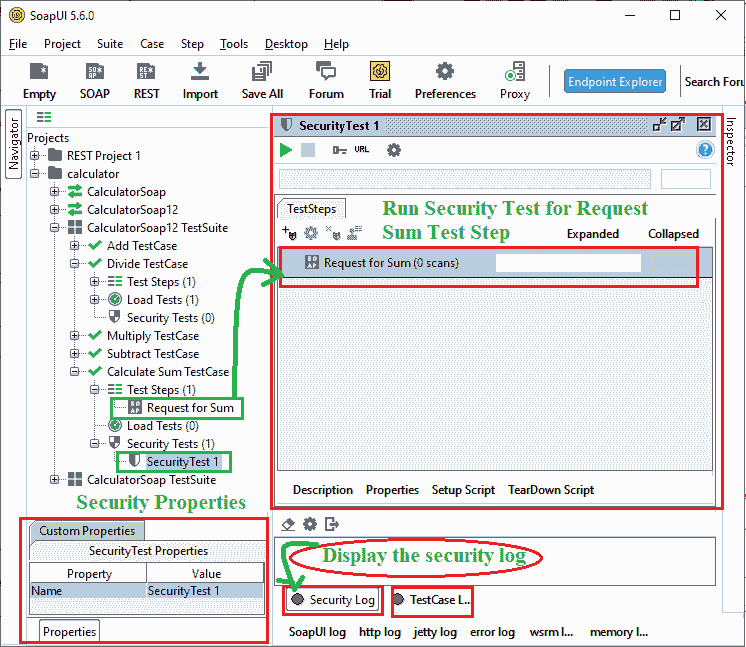
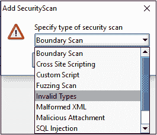
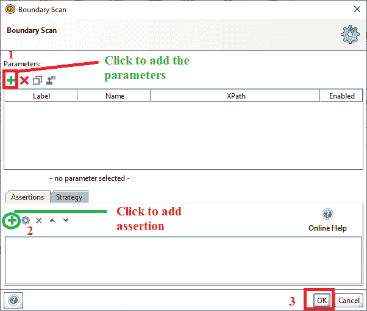
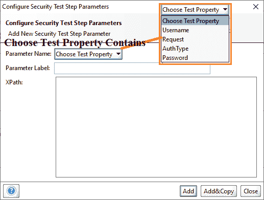
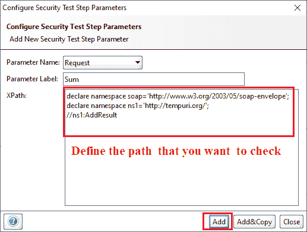
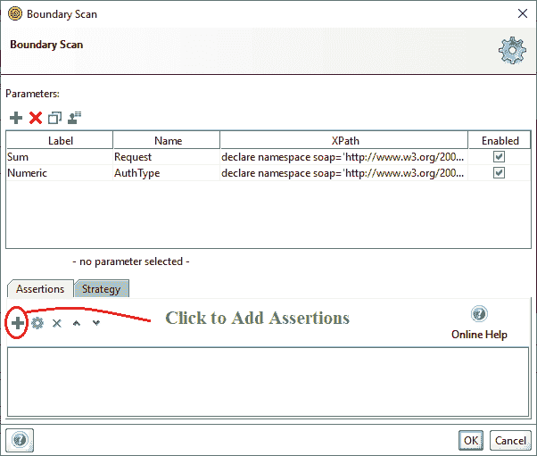
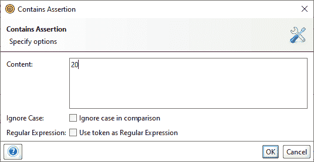
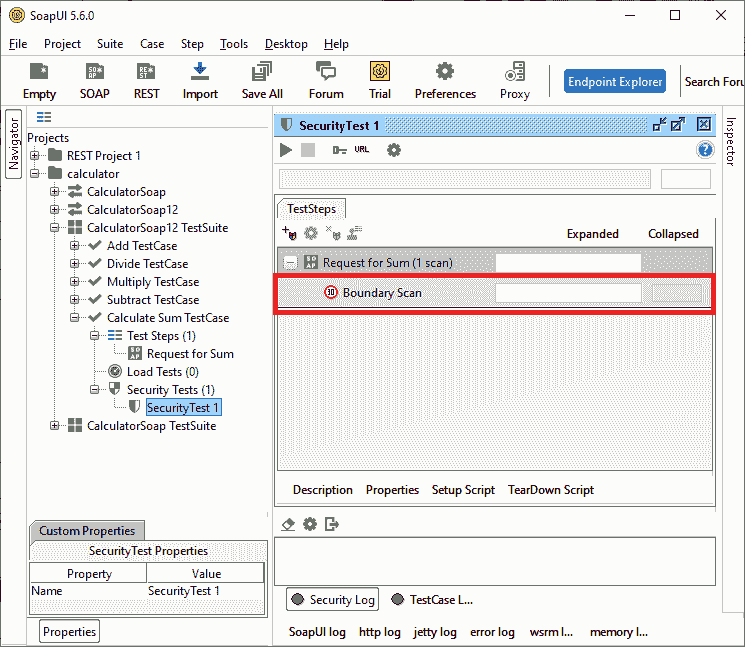
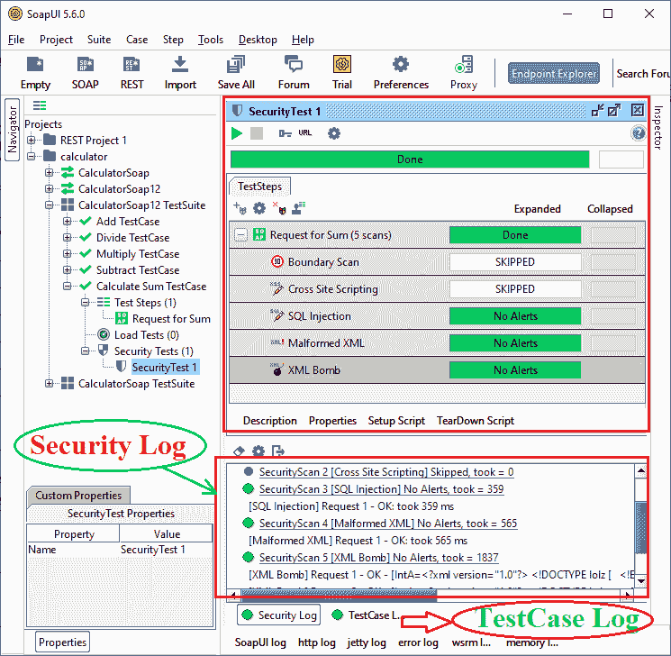

# SoapUI 安全测试

> 原文：<https://www.javatpoint.com/soapui-security-test>

安全测试是一种在 SoapUI 中使用的测试类型，用于测量网络服务或网络应用接口中的潜在风险、威胁和漏洞。它防止黑客或入侵者的恶意攻击。使用安全测试的目的是识别所有可能的漏洞，揭示可能影响数据和网络某些敏感信息的错误和网络服务的弱点。因此，SoapUI 使用安全测试来确保网络服务和网络应用接口的授权和真实性。

## 安全测试的类型

以下是在[Soap界面](https://www.javatpoint.com/soapui)中使用的各种类型的安全测试。

1.  **SQL 注入:**在 SoapUI 中使用 SQL 注入扫描来检测数据库编码的不良集成和任何可能损坏数据库的 SQL 注入。这样，SQL 注入保护了数据库。
2.  **XPath 注入:** XPath 注入在 SoapUI 中使用，以利用 XML 在 web 服务内部的不良处理作为目标。
3.  **无效类型:**顾名思义，无效类型用于检查和利用 web 服务中使用的所有无效输入数据。
4.  **恶意附件:**恶意安全附件用于扫描所有对附件的不良处理。
5.  **边界扫描:**边界扫描安全测试用于检查范围定义之外的 web 服务值的不良处理。
6.  **格式错误的 XML:** 格式错误的 XML 安全扫描用于检查和利用无效 XML 的不良处理，这些无效 XML 可以在网络服务器或网络服务中呈现。
7.  **自定义脚本:**自定义脚本是一种安全扫描类型，允许我们使用脚本创建掩盖值的自定义参数。
8.  **XML Bomb:**XML Bomb 这个术语是一种安全扫描，用于处理恶意的 XML 请求，这些请求可能会破坏服务器上的整个 web 服务或窃取一些敏感信息。
9.  **跨站点脚本编写:**跨站点脚本编写过程中使用的一种安全扫描，用于查找 web 服务器中任何易受攻击的服务参数风险。

### 其他 SoapUI 安全扫描功能

1.  **堆栈溢出:**堆栈溢出是 SoapUI 中使用的一种安全测试，用于扫描和定位消息中的巨大文档，从而导致堆栈溢出。
2.  **救生扫描:**救生扫描是一种在 SoapUI 中使用的安全测试类型，用于执行扫描次数并确保 web 服务和 web APIs 的安全。

## 在 SoapUI 中执行安全测试的步骤

为了创建 Soap 项目的安全性测试，遵循下面给出的步骤。

**第一步:**右键点击**计算总和测试用例**的**安全测试**，如下图。

**第二步:**点击**新增安全测试**，弹出对话框进入安全测试，如下图。

**第三步:**点击确定按钮后，显示**安全测试 1** 的弹出窗口，如下图所示。

在上图中，我们在计算总和测试用例中运行了**“请求总和”**测试步骤的安全性测试。此外，我们还可以通过创建一个新的 Soap 项目来检查登录和注销测试用例的真实性，甚至我们还可以检查 REST 项目的安全性测试。

**步骤 4:** 这里，我们检查**【求和请求】**测试步骤的安全性测试。选择**求和请求**，点击图标，弹出对话框选择安全测试，如图所示。

**第五步:**这里，我们选择**边界扫描**运行安全测试，然后点击**确定**按钮。单击“确定”按钮时，它会显示边界扫描的弹出窗口，如下所示。

**步骤 6:** 现在，点击(+)图标添加显示的参数，弹出对话框设置标签、名称和 XPath 等参数，如图所示。

这里我们选择**请求**为参数名称，标签为**和**，XPath 为 **//ns1:添加结果**，然后点击**确定**，如下图所示。

**步骤 7:** 一旦点击**添加**按钮，安全测试步骤参数将被添加到**边界扫描**窗口，如下图所示。

**第 8 步:**现在点击(+)图标，为每个参数添加断言。按下(+)图标时，它会显示一个弹出窗口来添加断言，如下所示。

**第九步:**点击**确定**按钮设置**包含**的断言，然后点击**确定**按钮继续处理，如图所示。

**步骤 10:** 之后，点击**确定**按钮，添加**边界扫描的**断言。同样，为另一个参数添加一个断言，如下所示。

**步骤 11:** 点击【确定】按钮，在**安全测试 1** 窗口中添加边界扫描，如下图所示。

同样，添加更多类型的安全测试，然后单击运行按钮来测试测试用例的安全性，如下所示。

**步骤 12:** 现在，点击 Run 图标(绿色三角形)执行安全测试，如下图所示。

此外，我们可以通过点击**安全日志**来检查安全测试 1 的状态。

* * *