# SoapUI 模拟服务

> 原文：<https://www.javatpoint.com/soapui-mock-service>

模拟服务是 SoapUI 测试工具的一个重要特性。它创建一个虚拟的 web 服务来模拟对 web 服务请求的响应。模仿服务创建了一个虚拟环境来测试与真实服务类似的 web 服务。它可以在开发和审查 web 服务时测试离线 web 资源。模拟服务可以用于 [SOAP 和 REST web](https://www.javatpoint.com/soap-and-rest-web-services) 项目。

### 嘲讽服务的优势

以下是模拟服务在 [SoapUI](https://www.javatpoint.com/soapui) 中的各种优势。

1.  使用模拟服务，我们可以在实际程序开发时创建尚未实现的测试用例。
2.  它为想要学习在真实的 web 服务或应用上工作的新学习者提供了虚拟平台。
3.  它还为应用中不可用的资源创建演示和测试。
4.  在 web 服务中部署实际操作之前，我们可以测试一个真实的环境。
5.  它允许在需要时隔离 web 服务的子系统特性，并且在执行测试时不影响其他组件。

现在我们将学习如何在 SoapUI 测试工具中创建、编辑和调用 Soap 和 REST 项目的模拟服务。

**SOAP 模拟服务:**我们可以通过从 SOAP 响应消息中创建模拟服务来模拟 SOAP web 服务请求消息。

为了创建 SOAP 模拟服务，我们必须遵循下面给出的步骤，如图所示。

**第一步:**首先选择现有的 SOAP 项目，然后从 Navigator 中选择 Soap 服务。之后，右键点击允许我们选择的服务或者点击**“生成 SOAP 模拟服务”，如下图**。

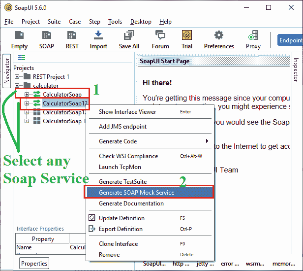

**第二步:**点击 Soap 模拟服务后，会弹出一个对话框，生成一个模拟服务窗口，如下图所示。

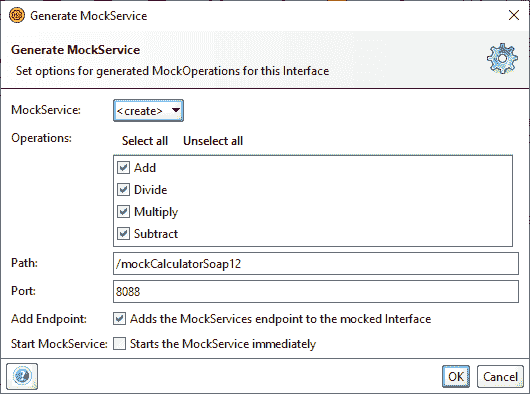

在上面的截图中，它要求包含各种模拟细节，如操作、路径、端口、添加端点和一个复选框，以立即启动 Soap 的模拟服务。之后，单击确定按钮在模拟服务中继续。

**第三步:**点击确定按钮，弹出对话框指定模拟服务的名称或保留默认，如下图。


**第 4 步:**一旦点击了 OK 按钮，它就会创建一个 Soap Mock Service，可以从 Soap 项目的左窗格访问，如下所示。


从左窗格中，可以访问模拟服务，它还显示了上图中右窗格模拟服务窗口的各种操作。

**第 5 步:**当我们双击**添加**操作时，它会显示一个弹出窗口，显示 Soap 模拟服务中存在的添加响应。

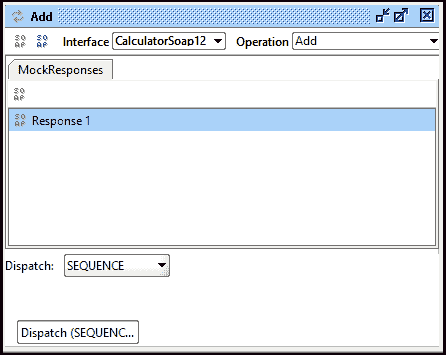

**第六步:**双击**模拟响应**的**“响应 1”**，打开基于 XML 的响应编辑器，与通常的 SoapUI 请求编辑器相同，如下图所示。


**步骤 7:** 现在，我们通过替换“？”的新值来编辑响应编辑器如上图所示。在这里，我们将取代？用**“二零”**，如下图。


### 调用并执行 Soap 模拟服务

**步骤 8:** 现在，我们检查模拟服务是否正常工作。我们必须返回到模拟服务编辑器，然后单击运行按钮来执行服务。它将开始模拟服务的执行，如下所示。

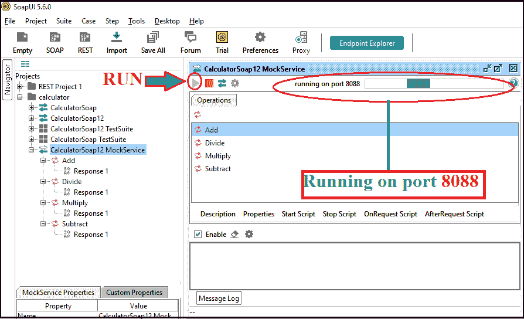

点击**绿色**箭头按钮后，模拟服务在端口 **8088** 上运行。如果我们想停止服务，随时点击红色按钮。

### 创建一个 SOAP 请求

**第 9 步:**现在点击添加操作的**“创建 Soap 请求”**，创建一个发送到模拟服务的请求，如下所示。

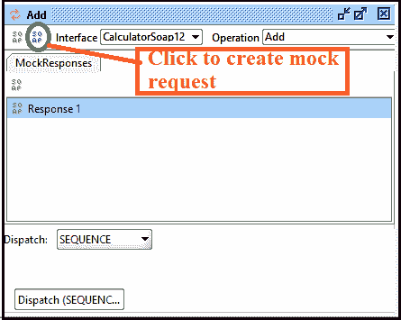

**第十步:**点击创建 Soap 请求后，会弹出对话框选择默认请求或创建新请求，如下图。

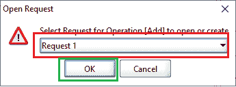

**步骤 11:** 按下**确定**按钮后，显示添加模拟服务的请求窗口，类似于正常的 web 服务请求，如下所示。

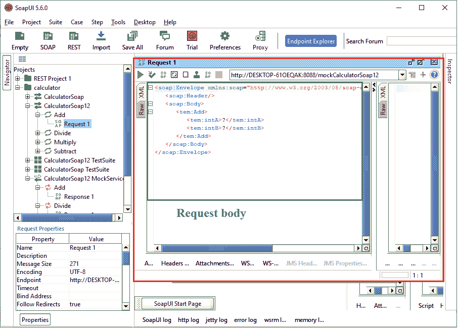

**模拟响应服务**

```

<soap:Envelope xmlns:soap="http://www.w3.org/2003/05/soap-envelope" xmlns:tem="http://tempuri.org/">
   <soap:Header/>
   <soap:Body>
      <tem:Add>
         <tem:intA>?</tem:intA>
         <tem:intB>?</tem:intB>
      </tem:Add>
   </soap:Body>
</soap:Envelope>

```

**步骤 12:** 现在我们点击 Run 图标(绿色三角形)执行模拟服务，该服务将返回我们之前在模拟中配置的 web 响应，如下所示。

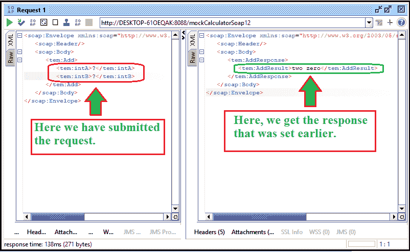

因此，我们已经成功地创建了我们的第一个 soap 模拟服务，并且它已经可以使用了。

### 休息模拟服务

使用 SoapUI 中的 mock 特性，我们可以通过从其 REST 响应消息创建一个 Mock 服务来模拟 [RESTful web 服务](https://www.javatpoint.com/restful-web-services)请求消息，该响应消息可以是类似 [JSON](https://www.javatpoint.com/json-tutorial) 、 [HTML](https://www.javatpoint.com/html-tutorial) 、 [XML](https://www.javatpoint.com/xml-tutorial) 和纯文本的格式。

为了创建 REST 模拟服务，我们必须遵循下面给出的步骤，如图所示。

**第一步:**首先选择已有的 REST 项目，从项目中选择 REST**“https://restcounters . eu”**服务。之后，右键点击允许选择的服务或点击**“生成 REST 模拟服务”**，如下图所示。

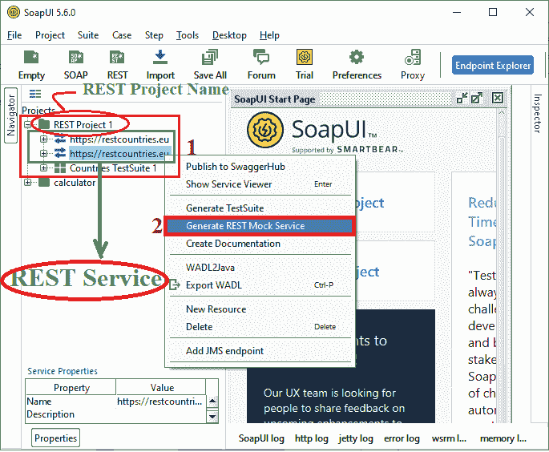

**第二步:**点击【REST 模拟服务】后，弹出对话框生成模拟服务窗口，如下图所示。

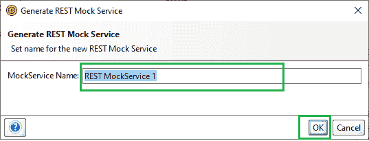

**第三步:**指定模拟服务名称，然后点击**确定**按钮，创建“ **REST 模拟服务 1”**，如下图。

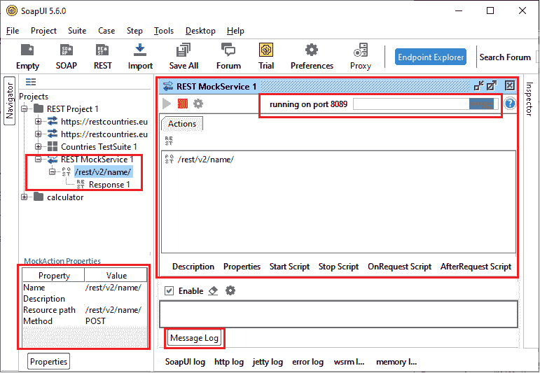

当我们点击确定按钮时，它开始执行**“REST mock service 1”**，如上图所示。

**第四步:**双击 **"/rest/v2/name"** 动作后，显示模拟响应窗口，如下图。

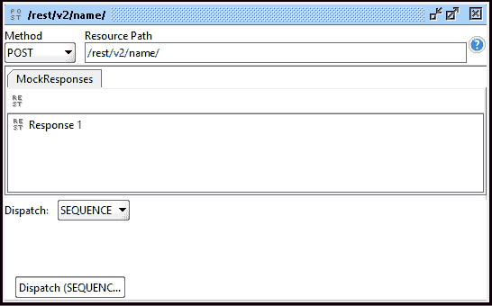

**第五步:**双击**【响应 1】**打开 **REST 响应 1** ，如下图。


HTTP 状态代码 **200** 代表成功响应。它将与编辑器一起出现在上面的图像中。从下拉菜单中选择特定的服务或媒体类型后，我们可以更改客户的请求响应。因此，我们创建了一个 **REST** 模拟服务，并准备使用。

* * *