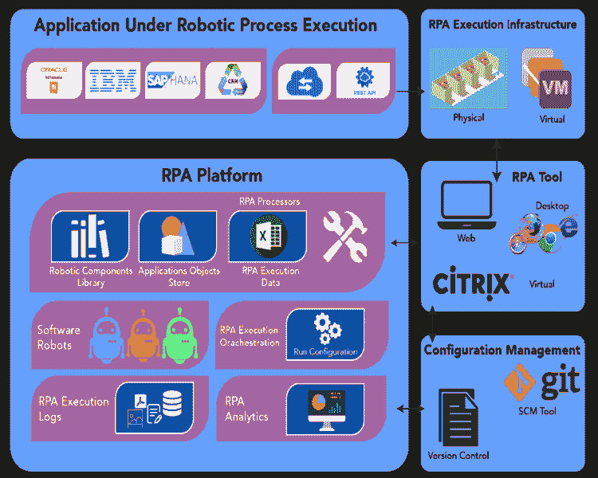

# RPA 架构

> 原文：<https://www.javatpoint.com/rpa-architecture>

机器人过程自动化(RPA)的体系结构包括几个不同的工具、平台和各种基础设施元素。它们共同构成了一个完整的 RPA 工具。要详细了解这一点，请查看下图，该图简要描述了典型的 RPA 解决方案及其体系结构:

让我们尝试详细了解架构图中的每个可用块。

## 机器人流程执行下的应用

RPA 被认为是非常适合企业和企业应用的技术。企业应用可能包括思爱普、西贝或其他记录处理应用，如大型机。这种类型的应用通常是数据密集型的，以数据为中心，并且加载了重复的任务。

## RPA 工具

任何 RPA 工具中常见的功能描述如下:

*   RPA 工具允许在不同的环境(即桌面、网络、思杰等)中自动化各种应用。).
*   RPA 工具允许开发可以通过记录、配置和增强编程逻辑(如循环和条件等)来训练的软件机器人。
*   RPA 工具允许构建可应用于多个机器人的可重用组件，这确保了同时模块化、更快的开发和更容易的维护。
*   RPA 工具允许在执行软件机器人时读写不同的数据源。
*   RPA 工具允许构建共享应用、用户界面对象存储和包含对象定位器的对象存储库。

## RPA 平台

云中的 RPA 软件机器人就像存储在共享存储库中一样，可以在软件机器人库中进一步共享。RPA 平台有助于调度、分发和监控软件机器人的执行。它还提供了开发对软件机器人及其执行统计有意义的见解的能力。

## RPA 执行基础设施

RPA 执行基础架构被定义为包含物理或虚拟实验室机器的银行，这些机器可以根据使用模式进行控制。也可以执行并行增加或减少机器数量以实现任务自动化的过程。这个过程不需要任何进一步的人工交互，因此可以根据需要长时间无人值守。

## 结构管理

配置管理用于说明作为底层应用的 RPA 资产的版本。它有助于开发软件机器人，并将其更新到新版本。这也有助于 RPA 机器人的分支和合并，因为它们可以跨库重用。

因此，RPA 是应用和工具的几个不同层的组合，这些层的组合使它成为一个完整的系统和体系结构。

* * *