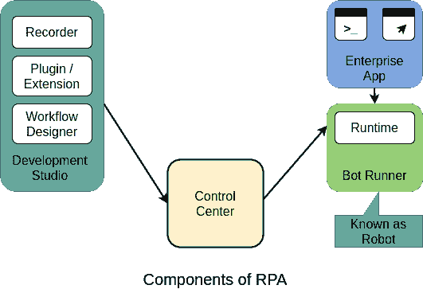

# 卢旺达爱国军的组成部分

> 原文：<https://www.javatpoint.com/components-of-rpa>

机器人过程自动化包括构成 RPA 平台的一些基本组件。这些组件一起有助于自动化重复性和基于规则的流程。

机器人过程自动化的核心组件如下:

*   记录员
*   开发工作室
*   插件/扩展
*   机器人跑步者
*   控制中心

让我们逐一描述这些组件:

## 记录员

记录仪是机器人过程自动化的关键部件之一。它增加了以自然的类似宏的方式自动化 web、桌面和大型机应用的能力，而不需要任何编程、编码或脚本。

机器人自动化中的记录器使用物体记录方法作为主要模式。默认情况下，RPA 机器人会捕获对象属性，包括它们在整个录制过程中的活动元素值。录制完成后，RPA 机器人会找到相同的元素，并重复录制过程。RPA 机器人在脚本执行期间对相同的元素执行点击、悬停、拖动或滚动等操作。RPA 记录器还包括一个修改工作流和手动添加系统操作的选项。这些操作可能包括打开应用、切换到特定窗口、使用剪贴板、操作 Excel 文件等。

## 开发工作室

几乎每个 RPA 工具的核心组件中都包含了 Development Studio。开发工作室帮助设计或开发智能过程自动化工作流。它允许您完全控制自动化。它还允许您安装活动包、向导、记录器和自定义插件。

RPA 开发者工作室的一些典型特性可以解释如下:

*   带**图形用户界面**的仪表板。
*   不同类型的录音机。
*   日志记录和异常处理。
*   集成支持**光学字符识别(光学字符阅读器)**。
*   预构建的拖放模板的集合。
*   通用搜索选项，用于搜索所有自动化资源，如库、活动、项目等。

## 插件/扩展

大多数 RPA 平台由几个插件和扩展组成，以便于开发和执行。RPA 插件是可以与 RPA 工具一起安装的一组程序。这些插件处理不同类型的任务，例如从发票中提取数据，操纵不同数据库的日期，或者转录语音等。RPA 插件是有益的，因为它们减少了开发工作量、错误率和实现时间。它们可以在与 RPA 工具一起安装后直接使用。

## 机器人跑步者

机器人跑步者用于执行开发的软件机器人。它们是运行或执行机器人的机器。多个机器人可以并行组装，以加快执行速度。运行机器人的唯一要求是“运行许可”。机器人还报告执行状态(即执行日志、通过或失败等)。)回到控制中心。一旦开发人员创建了一个软件机器人或任务，并进一步更新了控制室的状态，控制室就会安排并执行机器人运行器上的机器人。bot 执行的顺序通常取决于需求或优先级。

## 控制中心

控制中心是任何 RPA 工具中最重要的组件。这是一个基于网络的平台，用于控制机器人创建者创建的软件机器人。它允许用户计划、管理、控制和扩展大量数字工作人员的活动。它还提供了集中用户管理、自动化部署、源代码控制和仪表板等功能。

* * *