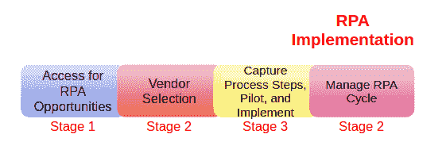

# RPA的实施

> 原文：<https://www.javatpoint.com/rpa-implementation>

RPA 软件为公司和共享服务提供了一个极好的选择。它是传统工艺方法的高效、经济的替代方案。随着时间的推移，由于资金和资源的原因，RPA 实现越来越受欢迎。一旦组织确定要实施 RPA，他们就需要采用分阶段的实施方法。

为了在一个组织中成功地实施 RPA，该组织必须使用经过时间考验的和健壮的方法。RPA 的实现主要取决于组织的要求。它通常包括以下阶段:

## 第 1 阶段-获得 RPA 机会

组织应该在实施 RPA 技术之前找到正确的业务流程。用正确的过程实现对组织是有益的。业务中的每个流程可能都不适合 RPA 实施。因此，组织应该对潜在的流程进行高级别的评估，并选择正确的流程进行自动化。这将帮助他们决定 RPA 是否适合他们的组织。

一旦组织决定实施这项技术，他们就应该设定 RPA 计划的目标。这将是一个很好的选择，以获得执行利益相关者对项目目标的一致意见。

这一初始阶段检查哪些领域将通过切换到 RPA 技术获得最大收益。它还包括由选定的 RPA 供应商进行的技术演示，作为概念验证和知识收集平台。

## 阶段 2 -选择供应商

在这个阶段，组织开始根据组织的技术需求寻找 RPA 供应商。选择过程是 RPA 提供商或供应商展示他们如何满足组织要求和标准的机会。

组织邀请不同的 RPA 供应商参加现场演示，并展示 RPA 如何帮助公司发展。许多供应商同意通过将 RPA 技术应用于所选流程来演示整个演示，以此作为概念证明。

然后，组织选择符合其要求和业务目标的供应商。RPA 供应商可能会提供两种类型的实施:

*   RPA 供应商将为组织进行配置和测试。
*   RPA 供应商将销售 bot 许可证，并教授如何实施它们。

大多数供应商都提供这两种服务。因此，选择这些方式中的任何一种来实现取决于组织的要求。许多企业选择由供应商编写初始试点代码，并开发内部 RPA 专家中心来处理未来的实施。

## 阶段 3 -捕获流程步骤、试点和实施

在此阶段，企业确保人力资源是否经过培训，并准备好执行选定的 RPA 实施计划。此阶段还包括支持和测试信息技术环境所需的活动。所有实施活动都按照规定的标准进行记录、跟踪和完成。

这一阶段还包括为选定的流程领域或用例进行试点。它允许企业实时观察自动化计划和实际流程的有效性和整体性能。

根据试点项目的结果，业务可能包括需要自动化的场景，这些场景展示了 RPA 技术的全部范围。如果有任何问题，那么 RPA 开发团队会分析并解决它。它进一步为即将到来的状态操作模型奠定了基础。

## 阶段 4 -管理 RPA 生命周期

在此阶段，处理 RPA 的初始启动。此阶段还包括通过主动维护来规划 RPA 软件的持续成功。该策略应该结合 RPA 解决方案的治理、运营模式、组织结构和变更管理计划。应该有一个好的变更管理计划来评估流程和系统中变更的影响。因此，企业在进行过程中将能够限制误差幅度。

## 成功实施的关键

在实施 RPA 技术之前，组织应该考虑以下有助于成功实施的关键因素:

*   为内部和外部运营选择合适的项目团队。
*   执行详细的工作计划，以确保没有工作被放弃。
*   与信息技术、控制和采购建立快速联系。
*   估计人员变动的影响。

* * *