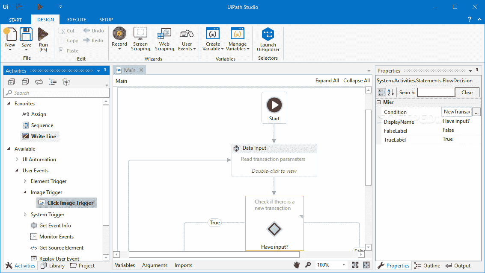
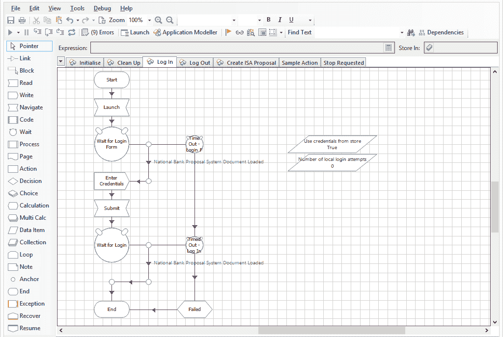
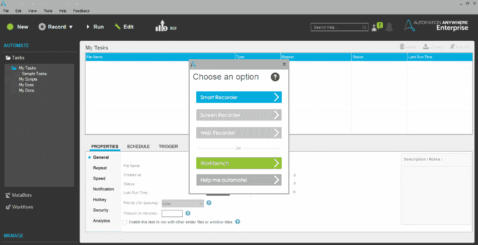
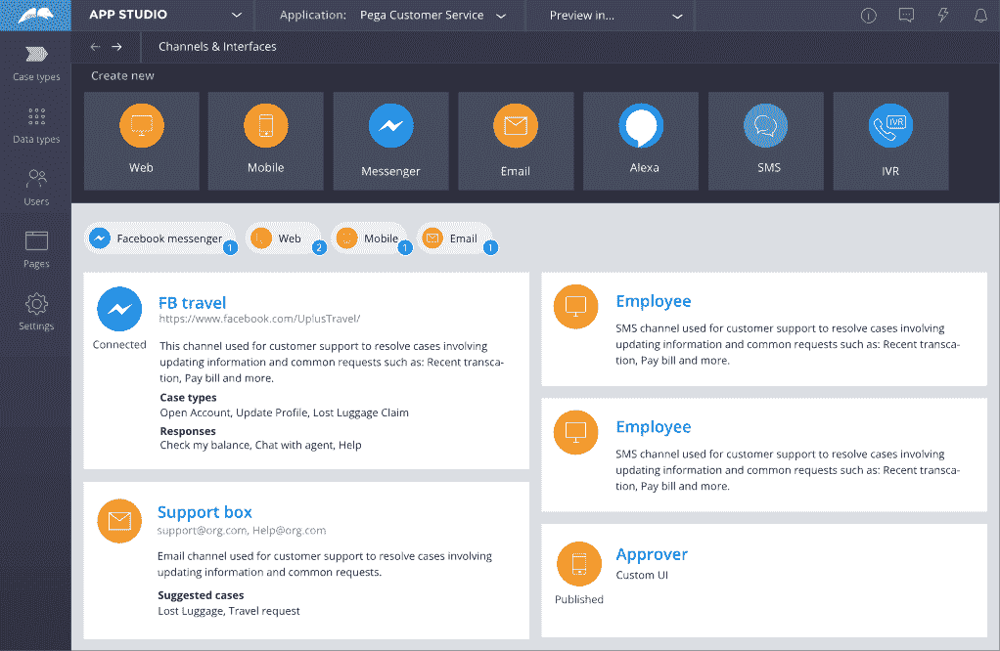
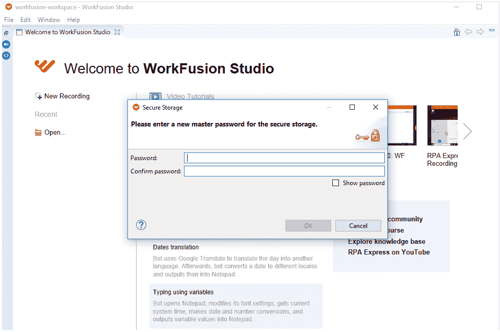
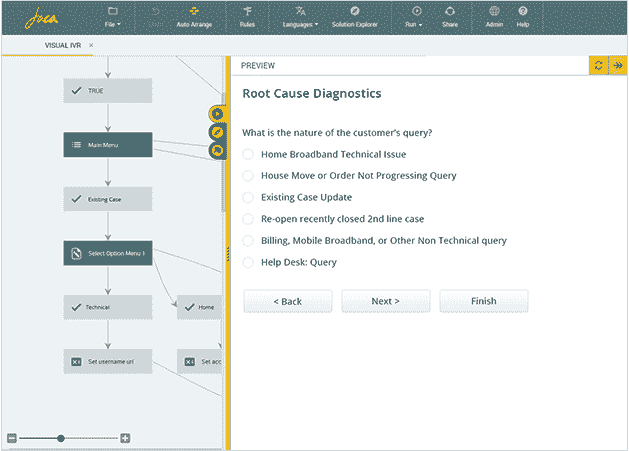
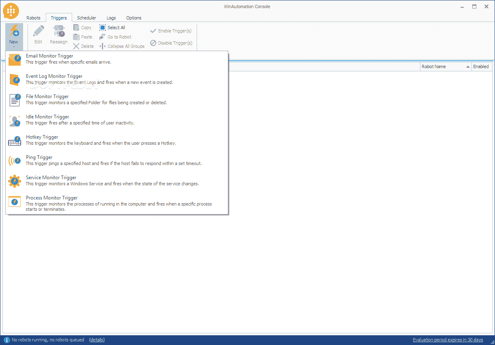
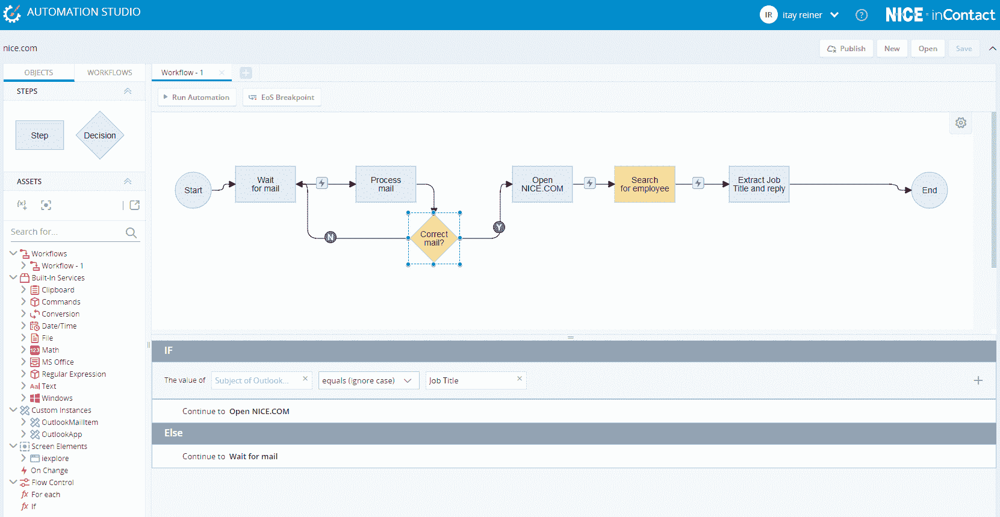

# RPA 工具

> 原文：<https://www.javatpoint.com/rpa-tools>

RPA 工具是帮助用户配置各种任务以实现自动化的软件。大多数组织都有周期性和重复性的任务，如数据输入、数据提取、报告生成等。这些任务由员工在软件上手动执行。在机器人的帮助下，这种重复的任务可以很容易地自动化。利用机器人执行自动化的软件被称为 RPA 工具

一些流行的 RPA 工具描述如下:

## UiPath(路径)

UiPath 是一个高度可扩展的RPA工具，有助于自动化桌面或网络应用。它为全球企业提供了为其组织设计和部署机器人劳动力的机会。

UiPath 最棒的地方在于它包含了一个带有拖放功能的社区版。因此，用户不需要编程知识来使用 UiPath 自动完成任务。社区版对想要学习、实践和实现 RPA 的人是免费的。

### 特征

*   它提供多种托管选项，例如云环境、虚拟机和终端服务。
*   它支持大量的网络和桌面应用。
*   它支持自动登录功能来运行机器人。
*   它包括报废解决方案。Net、Java、Flash、PDF、Legacy、SAP，具有最大的准确性。

## 蓝色棱镜

蓝棱镜是一个 RPA 工具，它为组织提供了一个虚拟劳动力。它帮助组织以敏捷和经济高效的方式自动化手动、重复和基于规则的业务流程。它包括支持任务自动化的拖放功能。

### 特征

*   它是独立于平台的，因此可以在任何平台上使用。
*   它包含强大的功能，如负载平衡、数据加密和端到端审计。因此，每一个变化都被审计。
*   Blue Prism 还支持用大型机、Java、Windows 应用甚至基于 web 的应用编写的代码的自动化。
*   它支持所有主要的云平台，如微软 Azure 和亚马逊 AWS。因此，用户可以集中管理大多数任务。

## 任何地方的自动化

Automation Anywhere 是流行的 RPA 供应商之一，它提供了强大且用户友好的功能来自动化任何复杂的业务流程。这个工具是所有核心功能的组合。它将 RPA 与诸如语言理解和阅读任何非结构化数据等智能元素相结合。

Automation Anywhere 是一个基于网络的管理系统，为公司提供运行和管理端到端自动化业务任务的控制。它允许自动化范围广泛的任务，从基本的 windows 配置步骤到最终的网络和远程数据库过程。

### 特征

*   它提供了与不同平台的轻松集成。
*   它通过身份验证、加密和凭据提供银行级安全性。
*   它将任务分配给多台计算机，并快速自动化复杂的任务。
*   它提供无脚本自动化。

## 派格

Pega 是一种 RPA 工具，可用于自动化工作流中重复的常规任务。它增加了使用现有应用的用户界面自动执行任务的能力。通过自动化用户操作来加速手动任务可能是有益的。

### 特征

*   它提供了基于云的解决方案。
*   它有助于向客户部署解决方案。
*   它捕捉桌面上的洞察。它获取工作如何完成的细节。
*   它不在数据库中存储任何执行数据。一切都存储在内存中。

## 工作融合

WorkFusion 是一个 **SaaS(软件即服务)**云计算平台。它自动监控数据馈送，并帮助您管理来自全球人才市场的众包员工。

WorkFusion 使用统计质量控制来确保工作输出的准确性。

### 特征

*   它可以跨不同的工作站与多个用户协作。
*   它支持快速启动/停止自动化，只需按一个按钮。
*   它还具有拖放功能。
*   它允许组织数字化他们的运营并提高生产力。

## 雅佳迪

Jacada 也是领先的 RPA 工具之一。它有助于桌面自动化，并允许组织自动化耗时、易出错和重复的任务。它支持提高准确性、生产率和客户满意度。

该工具广泛用于创建通信中心和客户服务。

### 特征

*   它包括混合 RPA 功能，将有人值守和无人值守的机器人结合在一起。
*   它为自动化流程处理提供了无与伦比的灵活性。
*   它减少了组织的平均处理时间。
*   它有助于提高首次通话分辨率(或即时分辨率)。

## WinAutomation

WinAutomation 是一个功能强大、健壮且易于使用的基于 windows 的桌面自动化工具，允许开发软件机器人。它提供企业级的安全性和控制。

该工具可以填充 web 表单，提取数据，并将相同的数据从一个应用传输到另一个应用。

### 特征

*   它提供了与领先的第三方应用的轻松集成。
*   它支持测试期间的并行执行。
*   它包括图像和光学字符识别。
*   开发机器人只需要最少的编码。

## 尼斯系统公司

NICE 系统是一个智能 RPA 工具，也被称为 **NEVA (Nice 员工虚拟服务员)**。它在云和内部业务软件上运行。在这个工具的帮助下，各种任务可以独立执行，无需人工干预。它帮助员工执行重复性任务。

它允许企业在结构化和非结构化数据的高级分析的帮助下做出准确的推断。

### 特征

*   它支持有人值守和无人值守的自动化。
*   非常适合银行、金融、人力资源等。
*   它提高了客户满意度和生产效率。
*   它自动执行普通任务，并确保合规性。

## 上下文或

Contextor 是用于机器人自动化过程的IDE。它提供完整的客户视图、在线帮助，并在两个或多个应用之间交换数据。

### 特征

*   它有助于通过拖放和点击方法配置机器人。
*   它可以监控工作站上执行的进程。
*   它可以发现和识别目标应用。
*   它可以维护现有项目并添加新功能。

目前，有更多的供应商提供 RPA 工具。然而，RPA 市场的领先工具是 **UiPath、Blue Prism、**和 **Automation Anywhere** 。这些工具在组织中被广泛用于各种目的。

## RPA 工具的核心功能

以下核心功能应该出现在任何 RPA 工具中:

*   软件机器人应该能够通过屏幕抓取或API集成与其他系统交互。
*   软件机器人应该能够基于从其他系统收集的输入做出决策并确定其动作。
*   软件机器人应该有一个接口来编程其他机器人。

## 选择正确的 RPA 工具

正如我们所看到的，有很多 RPA 工具，但问题是我们应该选择哪个工具。以下是选择 RPA 工具前应考虑的一些参数:

### 技术

RPA 工具必须独立于平台，并且应该支持所有类型的应用，以便组织能够在本地桌面之外执行日常任务。

还有一些其他重要的技术(即屏幕抓取、可扩展性、认知能力等)。)应该可以在 RPA 工具中获得。

### 可量测性

RPA 工具的一个重要参数是可伸缩性。应该有一个选项来根据需求扩大机器人劳动力。RPA 工具应该支持扩展，而不需要额外的费用或者只需要很少的费用。

### 安全

安全性是选择 RPA 工具之前要考虑的一个重要参数。由于软件机器人访问和管理私有数据，组织应该检查工具的所有安全特性。在实施 RPA 之前，他们需要测量所有的安全控制。否则，系统可能会受到外部恶意攻击。它可能会导致机密数据被滥用、隐私问题和其他安全问题。

### 总拥有成本

总拥有成本被认为是在选择 RPA 工具之前应该评估的另一个重要参数。这取决于不同的因素，如初始设置成本、供应商费用、重复许可费用、实施和维护成本等。因为组织通常倾向于从小规模开始，然后再进行扩展，这就是为什么考虑到公司的 RPA 路线图来评估 RPA 工具的成本是必要的。

### 易于实施

根据业务需求，RPA 工具的选择必须包括简单快速的集成。有必要检查与现有遗留系统的兼容性，以实现实施后的平稳过渡。

### 易于使用和控制

RPA 工具应该是灵活的，并且易于执行自动化过程。应该有容易控制的选项。最好使用这样一个 RPA 工具，它需要的培训较少，可以由缺乏编程知识的用户操作。

### 供应商经验

选择有经验的供应商将大大提高实施速度，并减少实施 RPA 软件所需的工作。

### 维护和支持

选择这样的为客户提供强大供应商支持的 RPA 提供商总是好的。良好的供应商支持有助于获得技术创新、更顺畅的部署、更好的培训和认证等。

### 快速部署

RPA 工具应该能够通过与在表示层可用的应用进行交互来帮助用户。它还通过验证、屏幕和业务规则来支持用户，因为它们都是通过虚拟桌面呈现的。

* * *