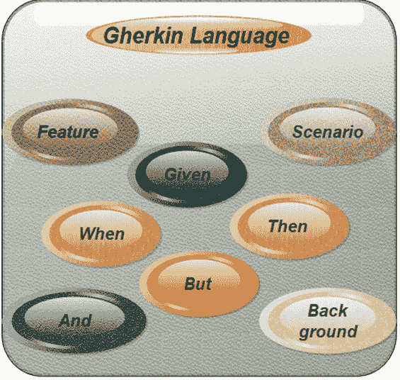

# 小 Cucumber 语言

> 原文：<https://www.javatpoint.com/cucumber-testing-gherkin-language>

正如我们在 Cucumber 测试中了解到的那样，[特征文件](feature-file-in-cucumber-testing)是用可执行的测试脚本创建的。编写这些可执行测试脚本的语言被称为小 Cucumber 语言。

基本上，小 Cucumber 是一种简单的英文文本语言，用于解释和执行测试脚本。

## 当 Cucumber 支持英文文本时，为什么我们需要一个单独的小 Cucumber 语言？

已经讨论过几次 Cucumber 支持纯英文文本，那么为什么我们需要一个单独的小 Cucumber 语言。这个问题的答案在于 [BDD](cucumber-behavior-driven-development) (行为驱动开发)的概念。

我们知道，在准备测试脚本时，BDD 涉及到各种软件行为开发的可能性。这些可能是与开发相关的可能性，也可能是与业务相关的可能性。为了实现这些可能性，在开发测试脚本时，我们需要来自不同社区的成员，如测试人员、开发人员、产品所有者和项目经理。

因为这些成员不属于同一个社区；因此，他们几乎不可能使用同一种语言。因此，测试脚本的概念处于高风险之中。为了降低这种风险，开发了小 Cucumber。

小 Cucumber 在纯英文文本中提供了一组通用的关键词，不同社区的成员可以使用，并且可以从测试脚本中获得相同的输出。

小 Cucumber 提供了以下特定的关键字来编写特征文件中的通用测试脚本:

*   **功能**
*   **场景**
*   **给定**
*   **当**
*   **然后**
*   **但是**
*   **和**
*   **背景**



### 特征

Cucumber 测试的每个特征文件都以一个[特征](feature-in-cucumber-testing)关键字开始。它是要测试的独立单元或功能。例如登录功能、支付转账功能、注册功能等。

**示例:**

```
Feature: Login 
Scenario: Login verification
Given user navigates to the website javatpoint.com
And user logs in through Login Window by using Username as "USER" and Password as "PASSWORD"
Then login must be successful.

```

### 方案

每个特性都包含测试该特性所需的测试次数。每个测试都被命名为场景。

例如，功能登录功能可以包含两种情况，第一种是**成功登录**，第二种是**不成功登录**。

```
Scenario: *Successful Login with Valid entries*
Given user navigates to the website javatpoint.com
And user logs in through Login Window by using Username as "USER" and Password as "PASSWORD"
Then login must be successful.

```

```
Scenario: *Unsuccessful Login with Invalid entries*
Given user navigates to the website javatpoint.com
And user logs in through Login Window by using Username as "USER" and Password as "1234erty"
But user entered wrong username and password
Then login must be unsuccessful.

```

### 考虑到

这个关键字指的是测试的前置条件。例如，要访问任何一个 web 应用，第一个要求或前提是导航到它的主页，因为从主页，我们可以导航到其他链接，如**注册**、**登录**等。

**示例:**

```
Feature: Login 
Scenario: Login verification
Given user navigates to the website javatpoint.com
And user logs in through Login Window by using Username as "USER" and Password as "PASSWORD"
Then login must be successful.

```

### 当...的时候

它通常指用户将要执行的动作。

**示例:**

```
Scenario: Successful Login with Valid entries
Given user navigates to the website javatpoint.com
When User Navigate to Login Page 
And user logs in through Login Window by using Username as "USER" and Password as "PASSWORD"
Then login must be successful.

```

**当**用户在“注册邮件文本框”中填入“ *[【邮件保护】](/cdn-cgi/l/email-protection)* ”时。

### 然后

这个关键词指的是上一步或即将到来的行动的结果。

**示例:**

```
Scenario: Successful Login with Valid entries
Given user navigates to the website javatpoint.com
When User Navigate to Login Page 
And user logs in through Login Window by using Username as "USER" and Password as "PASSWORD"
Then login must be successful.

```

### 但是

此关键字用于添加负面条件。

**示例:**

```
Scenario: *Unsuccessful Login with Invalid entries*
Given user navigates to the website javatpoint.com
And user logs in through Login Window by using Username as "USER" and Password as "1234erty"
But user entered wrong password
Then login must be unsuccessful.

```

### 和

此关键字用于在您的步骤中添加更多条件。

**示例:**

```
Given User is on Home Page
And Login Link is displayed
When User Navigates to Login form
And User enters email and Password
Then Login Successfully will be displayed 
And Logout Link should be displayed

```

### 背景

此关键字用于定义特征文件中所有测试通用的步骤。例如，*导航至首页*、*点击登录*、*输入用户名和密码*、*点击提交按钮*是几乎所有 web 应用中常见的步骤。

* * *