# appium 教程

> 哎哎哎:# t0]https://www . javatppoint . com/appum

Appium 教程提供了 Appium 自动化测试工具的基本和高级概念。我们的 Appium 教程是为初学者和专业人士设计的。

在本教程中，我们将讨论以下主题:

*   [什么是 Appium？](#Whatis)
*   [苹果的特性](#Features)
*   appum 体系结构
*   [Appium 的优势](#Advantages)
*   [Appium 的缺点](#Disadvantages)
*   [Appium 是如何工作的？](#works)
*   [移动应用类型](#MobileApplication)
*   [使用 Appium 的前提条件](#Prerequisite)
*   [在 Windows 操作系统上安装 app ium](#Installation)
*   [Appium 的限制](#Limitation)
*   [Appium 的竞争对手](#Competitors)
    *   appium vs 机器人
    *   阿皮亚对赛琳娜德

* * *

## Appium 是什么？

**Appium** 是一个开源的自动化移动测试工具，用于测试应用。它由**酱料实验室**开发和支持，用于自动运行本地和混合移动应用。它是一个跨平台的移动自动化工具，这意味着它允许在多个平台上运行相同的测试。Appium 可以轻松地并行测试多个设备。

在当今的发展领域，对移动应用的需求很高。目前，人们正在将其网站转换为移动应用。因此，了解移动软件自动化测试技术并与新技术保持联系是非常重要的。 **Appium** 是目前在**移动自动化测试技术**中流行的移动应用测试工具。

Appium 用于自动测试**原生**、**混合**和**网络**应用。它支持模拟器(iOS)和仿真器(安卓)以及物理设备(安卓和 iOS 都支持)上的自动化测试。此前，该工具主要关注仅限于移动应用测试的 IOS 和安卓应用。很少更新回来，Appium 宣布它现在也将支持 windows 桌面应用测试。

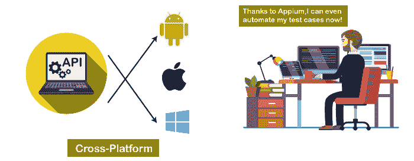

Appium 非常类似于**Selenium WebDriver**测试工具。所以，如果你已经知道 Selenium Webdriver，Appium 变得非常容易学习。Appium 对移动设备操作系统没有**依赖**，因为它有一个框架，可以将 Selenium Webdriver 命令分别转换为 UIAutomator 和 UIAutomation 命令，这取决于设备类型而不是操作系统类型。

它支持几种语言，如 Java、PHP、Objective C、C#、Python、带有 node.js 的 JavaScript 和 Ruby，以及许多其他具有 Selenium 客户端库的语言。Selenium 是 Appium 的后端，为测试需求提供对 Selenium 功能的控制。

## 苹果的特点

*   Appium 不需要应用源代码或库。
*   Appium 提供了一个强大而活跃的社区。
*   Appium 支持多平台，即可以在多个平台上运行相同的测试用例。
*   Appium 允许并行执行测试脚本。
*   在 Appium 中，一个小的更改不需要重新安装应用。
*   Appium 支持各种语言，如 C#、Python、Java、Ruby、PHP、带有 node.js 的 JavaScript，以及许多其他具有 Selenium 客户端库的语言。

## 苹果的优势

*   Appium 是一个开源工具，这意味着它是免费提供的。很容易安装。
*   它允许混合、本地和 web 应用的自动化测试。
*   与其他测试工具不同，您不需要在应用中包含任何额外的代理来使 Appium 与自动化兼容。它测试同一个应用，该应用将在应用商店中上传。
*   Appium 增加了一个额外的功能。现在，它将支持 windows 桌面应用测试以及移动应用测试。
*   Appium 是一个跨平台、免费提供的移动测试工具，它允许我们进行跨平台的移动测试。这意味着您可以在多个平台上进行测试(安卓和 IOS 平台都有单个应用编程接口)。

## 苹果的缺点

除了一些特性和优点，Appium 也有一些缺点，如下

*   缺乏详细的报告。
*   由于测试依赖于远程 web 驱动程序，所以有点慢。
*   这不是限制，而是 Appium 对只支持安卓 SDK、API 16 或更高版本的安卓使用 **UIAutomator** 的一种开销。但是，Appium 支持旧的 API，但不是直接支持。它使用另一个开源库**selenidroid**来支持旧的 API。
*   在 iOS 中，一台 Mac OS 设备上只能运行一个实例(iOS 脚本)，这意味着每台 Mac 一次只能执行一个测试。如果你想同时在多个 iOS 设备上运行你的测试，你需要安排相同数量的 Mac 机器。但是安排各种各样的苹果机器会很贵。

**解决方法:**如果你在酱料实验室的**移动云中运行你的脚本，这个问题就可以解决。目前，它允许脚本同时在多个 iOS 模拟器上运行。**

## 应用架构

Appium 是一个写在 **node.js** 中的 HTTP 服务器。它在设备上启动一个“**测试用例**，该测试用例产生一个服务器，并监听来自主 Appium 服务器的代理命令。测试人员编写测试脚本在设备或仿真器上执行。不同平台(如安卓和 IOS)的几个WebDriver会话是由 Appium 创建和处理的。

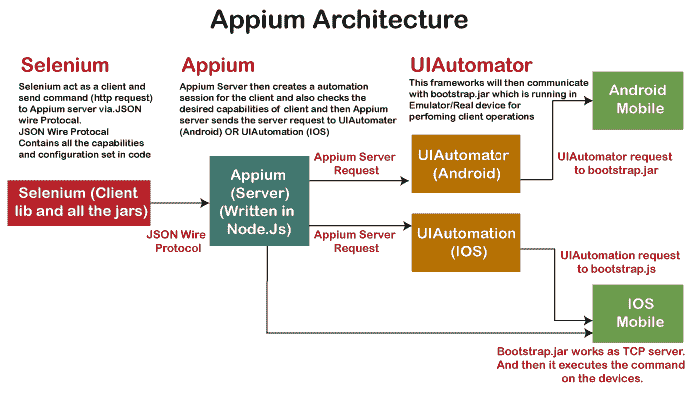

测试人员编写的测试脚本在仿真器或设备上执行，方法是将它们作为请求发送到 Appium 服务器。每个厂商，如 IOS 或 Android，都有不同的方法和机制在设备上执行测试用例。因此，测试用例在监听来自 Appium 服务器的命令后执行。Appium 使用 JSON 有线协议向 Appium 服务器发送命令请求。

## Appium 是如何工作的？

*   当我们安装 Appium 时，我们的机器上也安装了一个服务器，它公开了 REST API。
*   它从客户端接收命令和连接请求，并在 iOS 或安卓等设备上执行该命令。
*   它用 HTTP 响应进行回复。
*   为了执行请求，它使用移动测试自动化框架来运行应用的用户界面。例如-
    *   **苹果**用于 iOS 的仪器
    *   **selenidroid**用于安卓 API 15 以下
    *   **UIAutomator** 用于安卓 API 16 或更高版本

#### 请记住，Appium 使用另一个开源库 Selendroid 来支持旧的 API，因为 UIAutomator 只支持 API 16 或更高版本。

现在我们将讨论 Appium 如何在不同的平台上工作-

### 安卓中的应用

在安卓系统上，Appium 将命令代理到设备上运行的 **UIAutomator** 脚本。UIAutomator 是 Android 的一个原生 UI 自动化框架，允许你使用命令行直接在设备中运行 **Junit** 测试用例。虽然它使用的是 Java 编程语言，但是 Appium 允许从任何 WebDriver 支持的语言运行它。

Android 使用 **bootstrap.jar** ，作为 TCP 服务器工作。它用于发送测试命令，以使用 UIAutomator 在安卓设备上执行操作。

在下图中，可以看到关于安卓自动化的 Appium 架构-

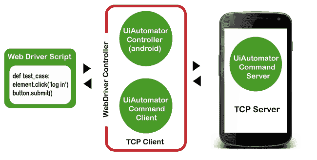

### iOS 中的 Appium

由于安卓使用 UIAutomator，iOS 使用 UIAutomation。与安卓类似，Appium 将命令代理到运行在苹果仪器环境下的 **UIAutomation** 测试用例。苹果提供了这个应用“**工具**，它执行各种活动，如构建、分析和控制 iOS 应用。另一方面，它还有一个自动化组件，您可以在其中用 JavaScript 编写命令。它使用用户界面自动化应用编程接口与应用界面交互。Appium 使用相同的库来自动化 iOS 应用。

在下图中，可以看到与 iOS 自动化相关的 Appium 架构-

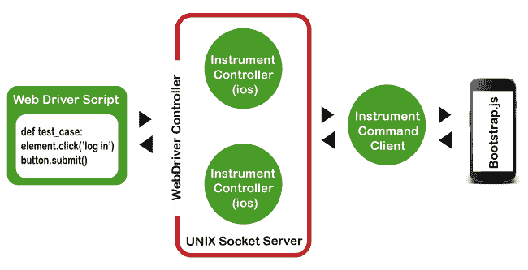

#### 请注意，在上图中，bootstrap.js 被用来代替 bootstrap.jar。它在我们的 AUT(测试中的应用)上执行操作。

## 移动应用的类型

正如我们前面所讨论的，Appium 能够处理各种各样的应用，即原生、混合和 web。让我们详细了解它们-

### 本机应用

本机应用是通过记住某个平台而开发的软件程序。这些应用是使用特定的软件开发工具包开发的。本机应用是为在特定设备上使用而开发的，可以从应用商店安装，如谷歌 Play 商店或苹果的应用商店。他们可以离线工作，也可以使用设备通知系统。

一些原生应用的例子有- Pinterest、Skype、Snapchat 等。

### 网络应用

Web 应用不是真正的应用，它们是运行在浏览器上的网站。这些应用是使用 HTML、CSS 和 JavaScript 以非常低的价格开发的。与安卓和 iOS 应用不同，它们不需要开发人员使用软件开发工具包。Web 应用不是为特定平台开发的。因为 web 应用运行在 web 浏览器上，所以它们不需要任何安装。

一些网络应用的例子有——Flipkart、阿里快递、推特等。

### 混合应用

混合应用是本机应用和 web 应用的组合。像本机应用一样，这些应用可以从应用商店下载，也可以利用设备功能，但实际上它们内部是网络应用。它们是使用网络开发语言开发的——像混合应用一样，允许它们在任何平台上运行。

一些混合应用的例子有- OLA、Instagram、Basecamp 等。

## 使用 Appium 的先决条件

*   安装 **Java** (JDK)
*   安装**安卓工作室**
*   安装附加安卓 **SDK 工具**
*   安装 **Appium jar** 文件
*   js(不需要——默认情况下，只要安装了 Appium 服务器，它就会附带“node.js”和“NPM”。因此，不需要分别安装 node.js 和 NPM。它已经包含在当前版本的 Appium 中。)
*   安装 **Appium 桌面客户端**
*   为 Java 安装 **Eclipse IDE**

## windows 上的应用安装

设置 Appium 不仅仅是安装一个工具或者设置几个变量。Appium 的完整设置需要安装许多其他工具。然后 Appium 开始测试一个应用。本教程主要关注安卓在视窗操作系统上的 Appium 设置。

### 安装和设置 Java

使用 Appium，您需要编写自动化测试脚本，这些脚本可以与您的移动屏幕和控制字段(如文本框、按钮等)进行交互。)在您的移动应用中，并且还可以对它们执行操作。Java 用于编写这些自动化测试脚本。因此，下载最新版本的 JDK 并设置环境变量。

*   [下载最新版本的 Java](https://www.oracle.com/in/java/technologies/javase-downloads.html)
*   设置 Java 环境变量。

### 安装和设置安卓工作室

这是下载和安装安卓工作室最耗时的步骤之一。如果处理不当，可能会导致 Appium 出错。随着安卓工作室的下载，还有许多其他的变化需要设置。在这里，我们建议您下载最新版本的安卓工作室。

*   [下载安卓工作室](http://www.automationtestinghub.com/download-and-install-android/)
    点击以上链接下载**最新版本安卓工作室**。双击下载的**。exe** 文件运行。要完成安装过程，请继续使用所有默认选项并完成安装过程。安卓工作室需要时间安装。
*   **安装附加安卓 SDK 工具**
    安卓 Studio 安装完成后，会看到安卓 Studio 的主面板，如下图截图所示。点击右下角**配置**下拉菜单，选择**软件开发工具包管理器**。
    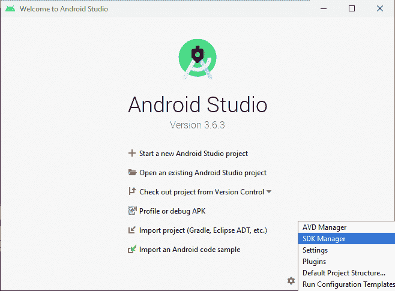
    默认屏幕会用安卓 SDK 打开，在 SDK 平台下，查看安装了最新版本的安卓。如果你使用的是真正的安卓设备，你也可以使用另一个安卓版本。
    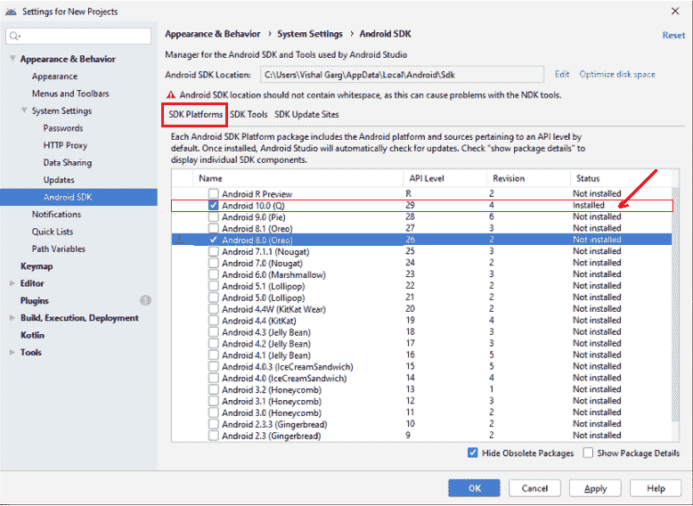
    在同一页面，切换到 **SDK Tools** 检查部分标记的组件是否安装/更新。如果没有，请选中复选框并安装它们。
    
*   **设置安卓环境变量**

### 苹果桌面客户端的分步安装

现在，在安装了 Java 和 Android Studio 并为两者设置了环境变量之后，安装 Appium 桌面客户端。Appium Studio 是一个安装 Appium 服务器的 GUI 应用。它附带了安装和使用 Appium 服务器的所有先决条件。它有一个检查器，用来获取你手机应用的基本信息。在 windows 上安装 Appium 桌面客户端的步骤如下:

**第一步:**进入以下链接[http://appium.io/](http://appium.io/)点击**下载 Appium** 按钮。

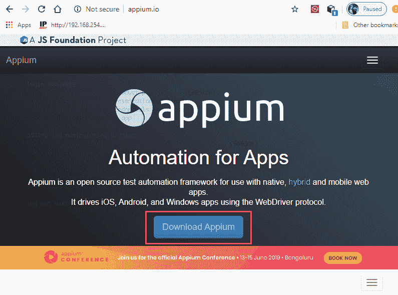

**第二步:**对于 Windows 操作系统，下载 **Appium 桌面设置**的 **exe** 文件。所以，点击文件如下截图所示。

**第三步:**下载 exe 文件后，双击下载的文件运行。

#### 注意:在 window 操作系统上，不需要安装 Appium。它从。而你需要为 Mac 机器安装 dmg。

**第四步:**这里需要选择安装选项。您可以选择所有用户，如果您的系统上有多个用户，否则选择**只有我**作为系统管理员。

选择安装选项后，点击**安装**按钮。

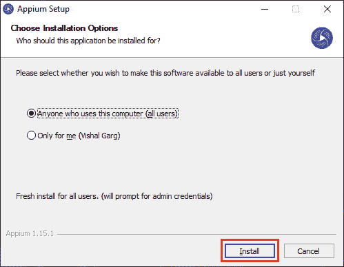

这将开始安装，安装可能需要时间。

**步骤 5:** Appium 已成功安装在您的系统上。要完成 Appium 设置，点击**完成**按钮。

请注意**运行应用**已选中。这将启动苹果桌面。

**第六步:**现在，Appium 桌面 UI 将出现在包含默认**主机**和**端口**的屏幕上，可以更改。

默认主机- 0.0.0.0

默认端口- 4723

点击**启动服务器**按钮，启动 Appium 服务器。

**第 7 步:**新服务器将在上一步中指定的主机和端口上启动。您可以在屏幕顶部看到服务器正在运行的消息。

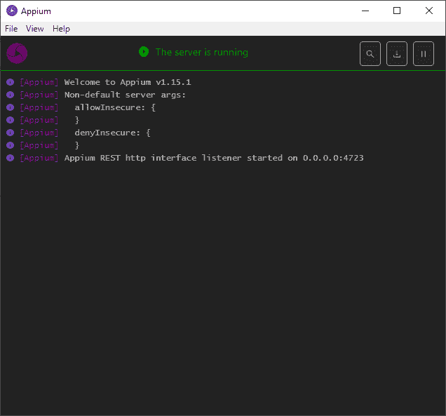

**第 8 步:**转到**文件**并点击**新会话窗口**。

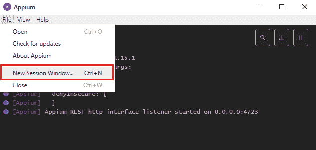

**步骤 9:** 在此提供所有需要的功能，点击**开始会话**按钮开始新的会话。

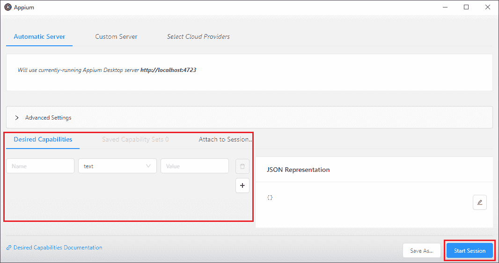

*   [下载 Java 的 Eclipse IDE](https://www.eclipse.org/downloads/eclipse-packages/)
*   安卓手机开启 USB 调试
*   为 Eclipse 下载 Appium Jar 文件
*   在 Eclipse 中为 Appium 创建一个新项目
*   设计测试用例来测试应用，以在安卓设备上启动应用

#### 请注意，微软窗口不支持运行 Appium 检查器。

### Appium 医生

要检查 Appium 安装和依赖关系，可以从[这里](https://github.com/appium/appium-doctor)安装**Appium-医生**。

**Appium-医生**是**验证 Appium 安装**的应用工具。它显示了你需要做的所有缺失的事情。因此，这将是非常有用的运行 appium-doctor 无论何时你有任何问题。它将通过 **npm** 安装。

## 应用的局限性

*   微软视窗不支持运行 Appium 检查器。
*   Appium 不允许测试低于 4.2 的安卓版本。
*   Appium 为测试混合应用提供了有限的支持。例如，应用的切换动作不可能被测试，即网络应用到本地应用，反之亦然。

## Appium 的竞争对手

有几种工具可用于自动测试移动应用，如 Robotium、Appium、Experitest、Selendroid、Kobiton 和 Testdroid 等。他们都是 Appium 的硬汉选手。但赛琳娜机器人公司和机器人公司是 Appium 的顶级竞争对手之一。让我们了解一些差异，看看它们之间有什么不同。

### appium vs 机器人

*   **Appium** 是一款跨平台工具，同时支持 iOS 和安卓。而**机器人世界**只支持安卓。
*   **Appium** 支持多种语言，而 **Robotium** 只支持 Java 编程语言。
*   **Appium** 不需要应用源代码/库，而 **Robotium** 工具需要应用源代码或库。
*   **Appium** 可以用来测试原生、web 和混合移动应用，而 **Robotium** 只能测试原生和混合应用。
*   **Appium** 支持像 Selenium 这样的很多框架。但是**机器人工厂**与Selenium完全不兼容。
*   **在 Appium** 中，你不需要为了一个小小的改动就重新安装应用。但是**机器人工厂**的代码只需一个小小的改动就可以完成重建。

### 阿皮亚对赛琳娜德

*   **Appium** 是同时支持 iOS 和安卓的开源自动化工具，**selenidroid**是只支持安卓的测试自动化框架。
*   在 **Appium** 中，一个小的改动不需要重新安装应用。但是**赛琳娜机器人**需要重新安装应用。
*   **Appium** 有一个强大而活跃的社区，而**selenidroid**没有 Appium 这样强大的社区。
*   **Appium** 支持很多框架和语言。另一方面，**Selenium机器人**兼容詹金和Selenium。
*   **Appium** 不需要应用源代码/库，而**selenidroid**需要应用源代码或库。
*   **Appium** 支持所有安卓 API，有限制。Appium 使用 UIAutomator 进行在 API > =17 上运行的测试，而对于旧的 API，它使用 Selendroid 进行测试。

* * *