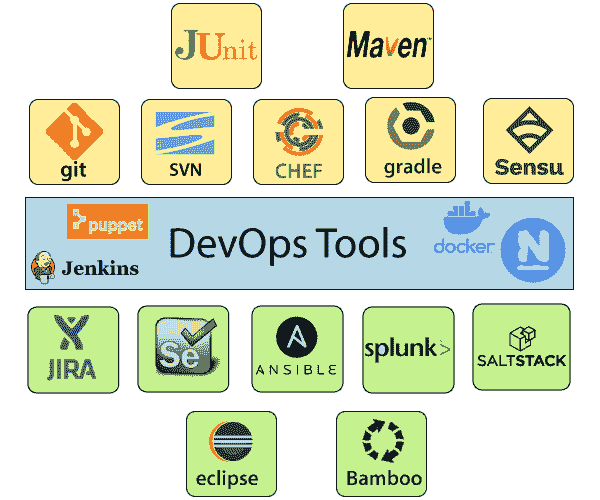

# 开发工具

> 原文：<https://www.javatpoint.com/devops-tools>

以下是一些最受欢迎的 DevOps 工具，并在下图中进行了简要说明，例如:

### 1)Puppet

Puppet 是使用最广泛的 DevOps 工具。它允许技术的交付和发布快速而频繁地变化。它具有版本控制、自动化测试和持续交付的特性。它能够以代码的形式管理整个基础设施，而无需扩大团队规模。

**功能**

*   实时上下文感知报告。
*   建模和管理整个环境。
*   定义并持续实施基础设施。
*   期望的状态冲突检测和补救。
*   它检查并报告跨基础架构运行的包。
*   它消除了软件交付过程中的手动工作。
*   它帮助开发人员快速交付优秀的软件。

### 2)可移植性

Ansible 是一个领先的 DevOps 工具。Ansible 是一个开源的 IT 引擎，可自动执行应用部署、云资源调配、服务内编排和其他 IT 工具。它使 DevOps 团队更容易扩展自动化并加快生产力。

Ansible 易于部署，因为它在客户端不使用任何**代理**或**定制** **安全**基础架构，并将模块推送到客户端。这些模块在客户端本地执行，输出被推回到 Ansible 服务器。

**功能**

*   使用开源部署应用很容易。
*   它有助于避免软件开发过程中的复杂性。
*   它消除了重复的任务。
*   它管理复杂的部署并加快开发过程。

### 3)码头工人

Docker 是一个高端 DevOps 工具，允许在多个系统上构建、发布和运行分布式应用。它还有助于从组件中快速组装应用，并且它通常适用于容器管理。

**功能**

*   它配置系统更加舒适和快速。
*   它提高了生产率。
*   它提供了用于在隔离环境中运行应用的容器。
*   它将对可用节点上已发布端口的传入请求路由到活动容器。即使节点上没有正在运行的任务，此功能也会启用连接。
*   它允许将秘密保存到群体中。

### 4) Nagios

Nagios 是对 DevOps 更有用的工具之一。它可以在网络、基础设施、服务器和日志监控系统的帮助下确定错误并进行纠正。

**功能**

*   它提供了对桌面和服务器操作系统的全面监控。
*   网络分析器有助于识别瓶颈并优化带宽利用率。
*   它有助于监控服务、应用、操作系统和网络协议等组件。
*   它还提供了对 Java 管理扩展的完整监控。

### 5)CHIEF

厨师是实现规模、速度和一致性的有用工具。厨师是一个基于云的系统和开源技术。这项技术使用 Ruby 编码来开发基本的构建模块，如食谱和烹饪书。厨师用于基础设施自动化，有助于减少基础设施管理的手动和重复任务。

Chef 对不同的构建块有自己的约定，这些构建块是管理和自动化基础架构所必需的。

**功能**

*   它保持高可用性。
*   它可以管理多个云环境。
*   它使用流行的 Ruby 语言来创建特定于领域的语言。
*   厨师对节点的当前状态不做任何假设。它使用自己的机制来获取机器的当前状态。

### 6)詹金斯

Jenkins 是一个 DevOps 工具，用于监控重复任务的执行。Jenkins 是一个允许持续集成的软件。Jenkins 将被安装在一个服务器上，在那里将进行中心构建。通过快速发现问题，它有助于更有效地集成项目变更。

**功能**

*   詹金斯增加了自动化的规模。
*   它可以通过网络界面轻松设置和配置。
*   它可以将任务分布在多台机器上，从而提高并发性。
*   它支持持续集成和持续交付。
*   它提供了 400 个插件来支持构建和测试任何项目。
*   它几乎不需要维护，并有一个内置的图形用户界面工具，便于更新。

### 7) Git

Git 是一个开源的分布式版本控制系统，每个人都可以免费使用。它旨在快速高效地处理小到大项目。它是为了协调程序员之间的工作而开发的。版本控制允许您在同一个工作区跟踪团队成员并与其一起工作。它被用作 DevOps 工具的关键分布式版本控制。

**功能**

*   这是一个免费的开源工具。
*   它允许分布式开发。
*   它支持拉取请求。
*   它支持更快的发布周期。
*   Git 是非常可扩展的。
*   它非常安全，完成任务非常快。

### 8)盐堆

Stackify 是一个轻量级的 DevOps 工具。它将实时错误查询、日志等直接显示到工作站中。SALTSTACK 是软件定义的数据中心智能编排的理想解决方案。

**功能**

*   它消除了混乱的配置或数据更改。
*   它可以跟踪所有类型的 web 请求的细节。
*   它允许我们在生产前发现并修复错误。
*   它提供安全访问并配置图像缓存。
*   它通过精细的基于角色的访问控制来保护多租户。
*   灵活的映像管理，使用私有注册表来存储和管理映像。

### 9) Splunk

Splunk 是一个工具，让机器数据对每个人都有用、可访问和有价值。它向 DevOps 团队提供运营情报。它帮助公司变得更加安全、高效和有竞争力。

**功能**

*   它拥有下一代监控和分析解决方案。
*   它提供了不同信息技术服务的单一、统一的视图。
*   使用专门构建的安全解决方案扩展 Splunk 平台。
*   具有可操作洞察力的数据驱动分析。

### 10)Selenium

Selenium 是一个可移植的网络应用软件测试框架。它为开发自动化测试提供了一个简单的界面。

**功能**

*   这是一个免费的开源工具。
*   它支持多平台进行测试，比如安卓和 ios。
*   为WebDriver构建关键字驱动的框架很容易。
*   它创建了健壮的基于浏览器的回归自动化套件和测试。

* * *